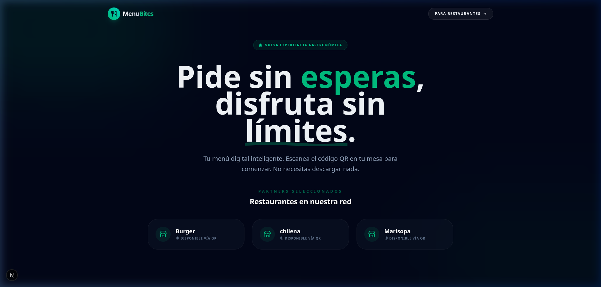
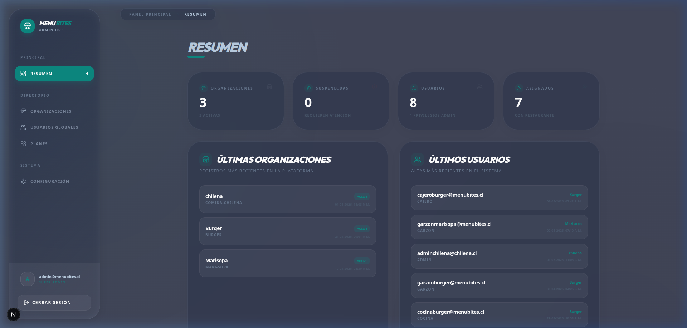
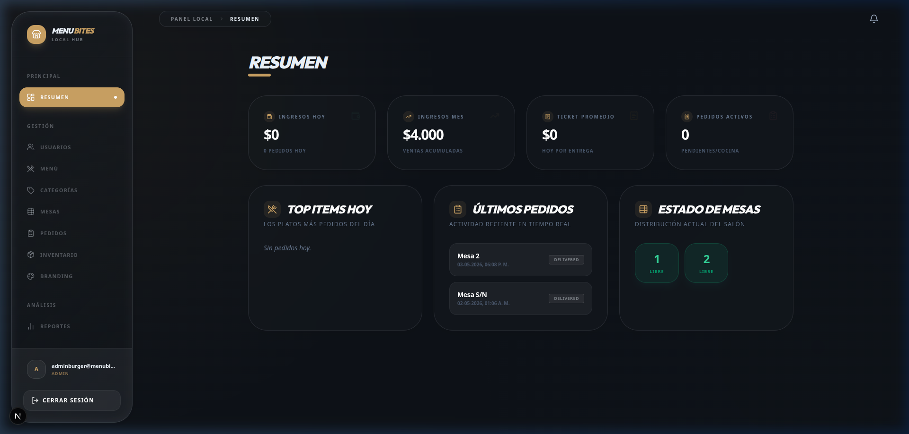
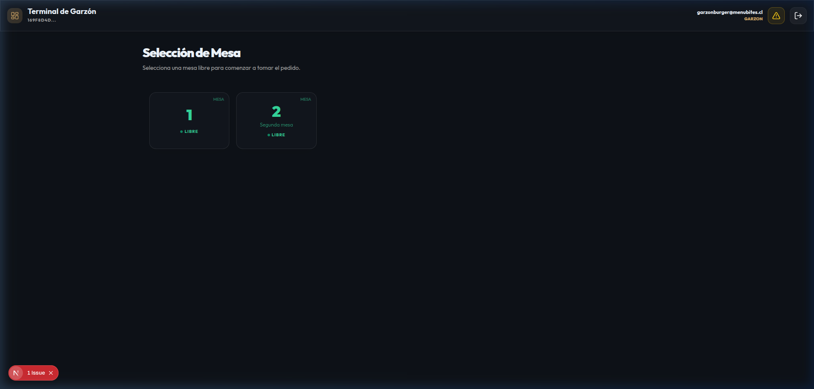
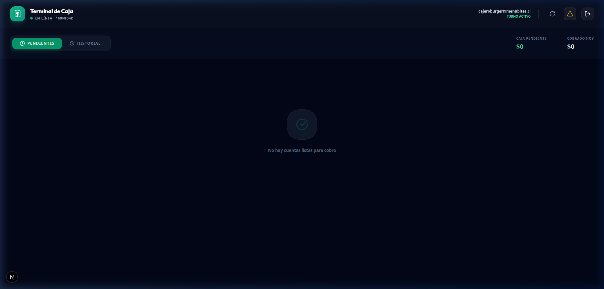

# Ecosistema y Mockups - Menu Bites

## 1. Arquitectura de Servicios (Monorepo)
El sistema opera como un ecosistema de micro-servicios integrados en un monorepo, permitiendo la escalabilidad independiente de cada módulo.

### Portal del Cliente (:3005)
Acceso público para clientes finales. Permite visualizar el menú, realizar pedidos y pagar.

### Admin Dashboard (:3000) - SuperAdmin
Panel central de administración global para dueños de la cadena y SuperAdministradores.

### Dashboard Local (:3003) - Administrador de Local
Gestión específica de un local: inventario, personal y configuración de mesas.

### Terminal de Garzón (:3002) - Operativo
Interfaz optimizada para dispositivos móviles/tablets para la toma de pedidos en mesa.

### Panel de Caja (:3004) - Finanzas
Gestión de cierres de mesa, facturación y medios de pago.

## 2. Flujo de Experiencia UX

