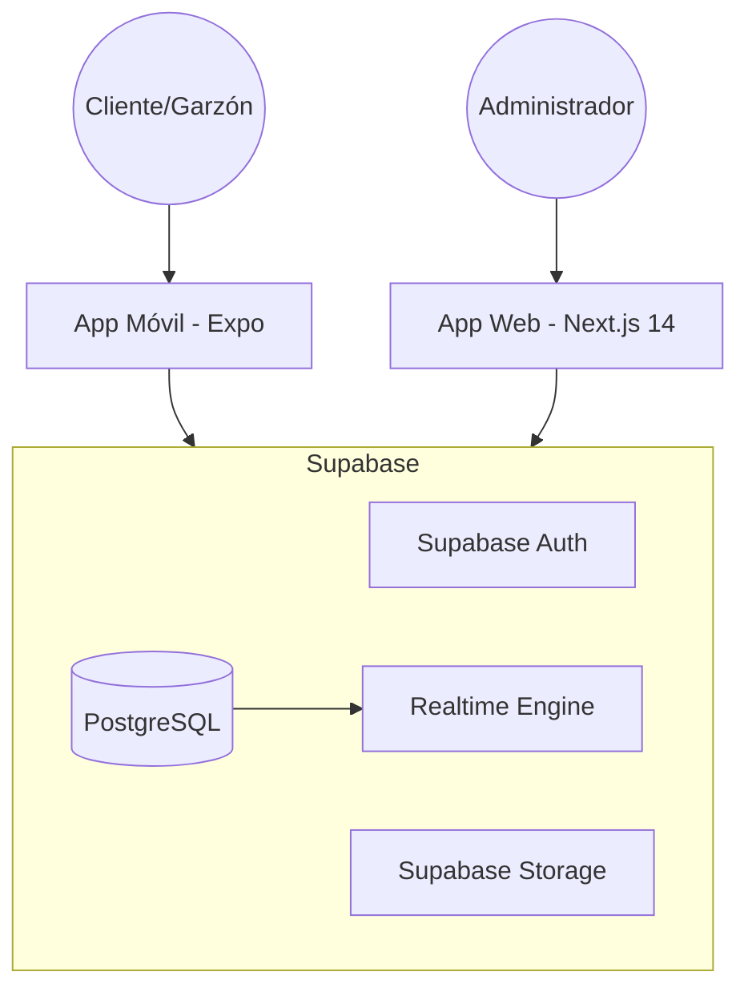
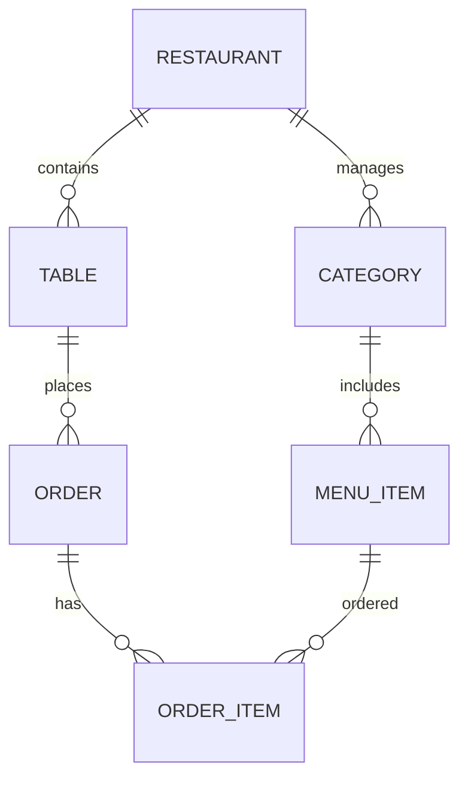
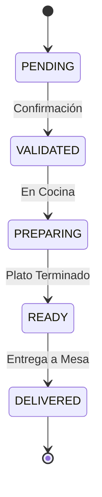
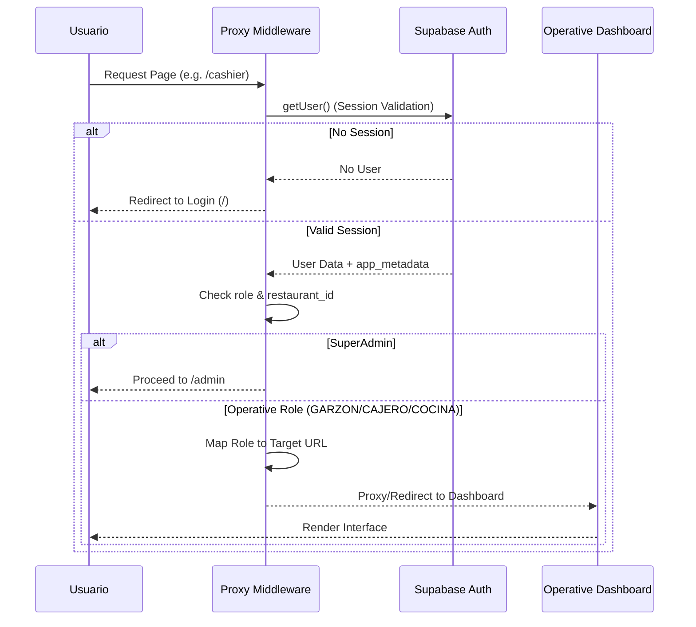
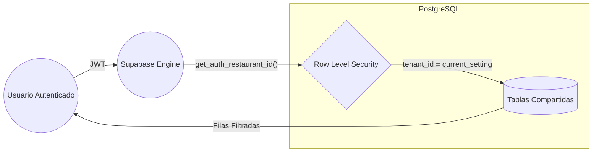

# Documento de Arquitectura de Software (SAD) - Menu Bites

## 1. Resumen Ejecutivo
Menu Bites es una plataforma multitenant diseñada para la digitalización de menús y gestión de pedidos en tiempo real para restaurantes. El sistema permite a múltiples establecimientos (tenants) gestionar su inventario, mesas y pedidos de forma aislada y segura utilizando una arquitectura basada en microservicios gestionados (Supabase) y frontend reactivo (Next.js).

## 2. Objetivos Arquitectónicos
- **Aislamiento Multitenant**: Garantizar que los datos de un restaurante sean inaccesibles para otros.
- **Escalabilidad**: Uso de Serverless (Vercel) y BaaS (Supabase).
- **Realtime**: Sincronización instantánea de pedidos mediante WebSockets.
- **Offline Ready**: Capacidad básica de operación en la App Móvil.

## 3. Stack Tecnológico
- **Frontend Web (Forkit Web)**: Next.js 14 (App Router) + Tailwind CSS + Shadcn/UI.
- **Frontend Mobile (Forkit Mobile)**: React Native + Expo.
- **Backend/Infra**: Supabase (PostgreSQL, Auth, Storage, Realtime).
- **Validación**: Zod + Prisma (ORM para migraciones).

## 4. Diagramas de Arquitectura (Mermaid)

### 4.1 Diagrama de Contenedores (C4)
Visualización del sistema y sus interacciones con los actores principales.

### 4.2 Modelo de Entidad-Relación (ERD)
Estructura de datos optimizada para el aislamiento tenant.

### 4.3 Ciclo de Vida del Pedido (Máquina de Estados)
Estados críticos para la consistencia de la operación.

### 4.4 Flujo de Autenticación y Redirección (Auth Proxy)
Lógica de acceso basada en roles y tenant_id.

### 4.5 Modelo de Aislamiento de Datos (RLS)
Garantía inquebrantable de privacidad entre restaurantes.

## 5. Decisiones Arquitectónicas (ADRs)
1. **Uso de Next.js Proxy**: Para centralizar la autenticación y evitar CORS en subdominios locales.
2. **Supabase Realtime**: Elegido por sobre Socket.io para reducir la complejidad de infraestructura.
3. **RLS Basado en Claims**: Permite que el aislamiento ocurra a nivel de base de datos, no de aplicación, eliminando errores de filtrado manual.
