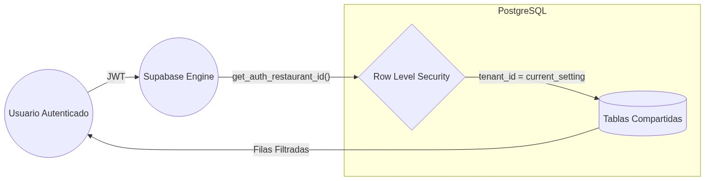
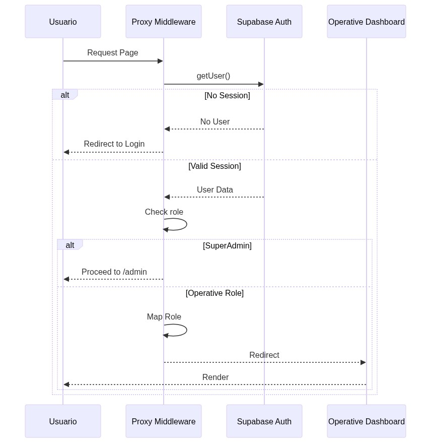

# Arquitectura de Software - Menu Bites

## 1. Diagrama de Contenedores (C4)

## 2. Modelo Relacional de Datos (ERD)

## 3. Seguridad y Aislamiento (RLS)

## 4. Flujo de Autenticación y Autorización

