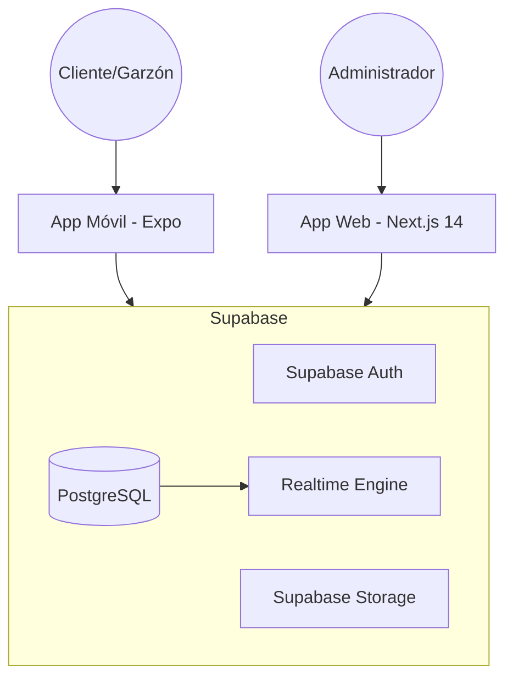
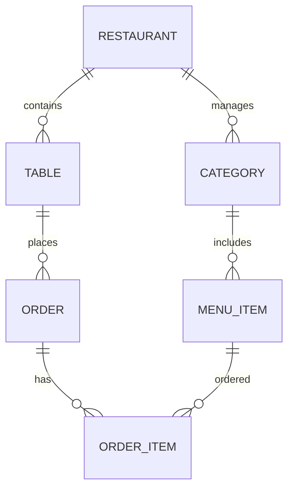
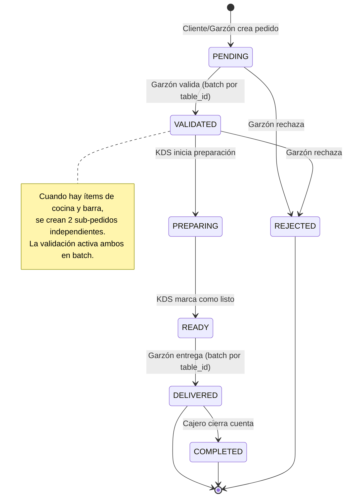
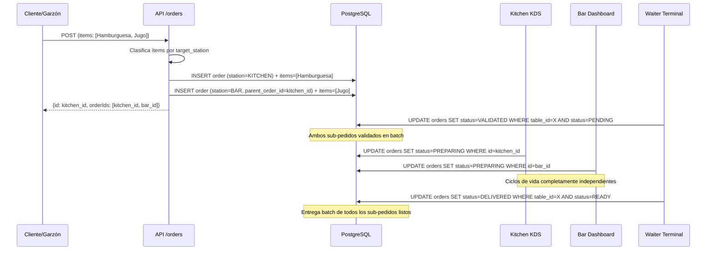
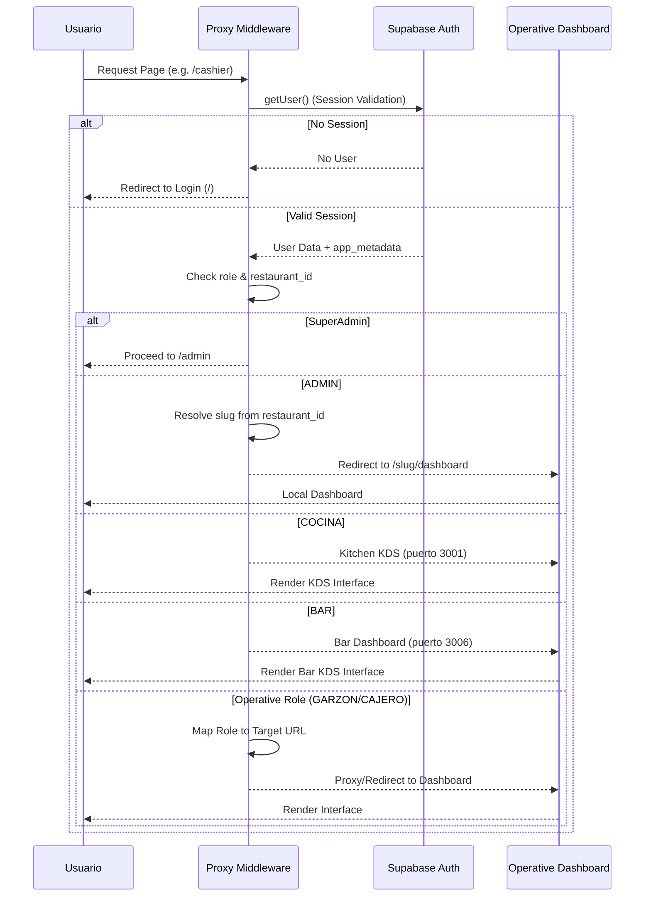
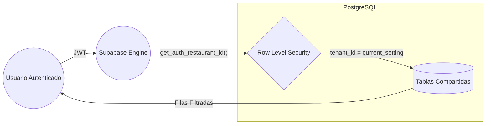

# Documento de Arquitectura de Software (SAD) - Menu Bites
**Versión:** 2.5.0 | **Última actualización:** 2026-05-10

## 1. Resumen Ejecutivo
Menu Bites es una plataforma multitenant diseñada para la digitalización de menús y gestión de pedidos en tiempo real para restaurantes. El sistema permite a múltiples establecimientos (tenants) gestionar su inventario, mesas y pedidos de forma aislada y segura utilizando una arquitectura basada en microservicios gestionados (Supabase) y frontend reactivo (Next.js). La versión 2.5.0 consolida el modelo de **sub-pedidos independientes por estación**: cada pedido pertenece a exactamente una estación (KITCHEN o BAR), eliminando el acoplamiento de estado entre el Kitchen KDS y el Bar Dashboard.

## 2. Objetivos Arquitectónicos
- **Aislamiento Multitenant**: Garantizar que los datos de un restaurante sean inaccesibles para otros.
- **Escalabilidad**: Uso de Serverless (Vercel) y BaaS (Supabase).
- **Realtime**: Sincronización instantánea de pedidos mediante WebSockets.
- **Offline Ready**: Capacidad básica de operación en la App Móvil.

## 3. Stack Tecnológico
- **Frontend Web**: Next.js 16 (App Router) + Tailwind CSS + componentes propios `@menu-bites/ui`.
- **Aplicaciones Web**: admin-dashboard (3000), kitchen-kds (3001), waiter-terminal (3002), local-dashboard (3003), cashier-dashboard (3004), customer-portal (3005), **bar-dashboard (3006)**.
- **Frontend Mobile**: React Native + Expo (en desarrollo).
- **Backend/Infra**: Supabase (PostgreSQL 15+, Auth, Storage, Realtime).
- **Monorepo**: Turborepo + npm Workspaces. Paquetes compartidos: `@menu-bites/ui`, `@menu-bites/auth`, `@menu-bites/store`.
- **Validación y ORM**: Zod + Prisma (migraciones y tipos).

## 4. Diagramas de Arquitectura (Mermaid)

### 4.1 Diagrama de Contenedores (C4)
Visualización del sistema y sus interacciones con los actores principales.

### 4.2 Modelo de Entidad-Relación (ERD)
Estructura de datos optimizada para el aislamiento tenant.

### 4.3 Ciclo de Vida del Pedido (Máquina de Estados)
Estados críticos para la consistencia de la operación. Cada sub-pedido (KITCHEN o BAR) recorre el ciclo de forma **independiente**.

### 4.3b Patrón de Sub-pedidos por Estación

### 4.4 Flujo de Autenticación y Redirección (Auth Proxy)
Lógica de acceso basada en roles y tenant_id.

### 4.5 Modelo de Aislamiento de Datos (RLS)
Garantía inquebrantable de privacidad entre restaurantes.

## 5. Decisiones Arquitectónicas (ADRs)

1. **Uso de Next.js Proxy (`src/proxy.ts`)**: Centraliza la autenticación por app sin duplicar lógica. Cada aplicación tiene su propio proxy que valida exclusivamente el rol correspondiente.
2. **Supabase Realtime**: Elegido por sobre Socket.io para reducir la complejidad de infraestructura.
3. **RLS Basado en Claims**: Permite que el aislamiento ocurra a nivel de base de datos, no de aplicación, eliminando errores de filtrado manual.
4. **Cookies de sesión nominadas por app**: `sb-{app}-session` permite correr múltiples apps en `localhost` sin conflictos de sesión.
5. **Enrutamiento dual-estación por `target_station`**: Las categorías del menú declaran su estación destino (`KITCHEN`/`BAR`). El filtrado ocurre en el hook `useRealtimeOrders` mediante `.or('station.eq.X,station.is.null')`, manteniendo un único canal Realtime por restaurante y reduciendo conexiones WebSocket.
6. **JSON polimórfico en `kds_settings`**: Una sola fila por restaurante con claves `KITCHEN` y `BAR` evita conflictos de escritura concurrente entre las dos apps KDS.
7. **Sub-pedidos independientes por estación (v2.5.0)**: En lugar de un único pedido con flags booleanos de coordinación (`kitchen_ready`, `bar_ready`), cada pedido pertenece a exactamente una estación. Un pedido mixto genera dos registros con el mismo `table_id` y distintos `station`. Esto elimina el acoplamiento de estado entre KDS, simplifica `updateOrderStatus` a un UPDATE directo sin lógica condicional, y permite que cada estación opere con plena autonomía. Compatibilidad hacia atrás garantizada: pedidos con `station IS NULL` se filtran por `target_station` de los ítems.
8. **Agrupamiento en vista del garzón**: La función `groupOrdersByTable` en el hook `useRealtimeWaiterOrders` agrega todos los sub-pedidos de la misma mesa en una sola entrada para el terminal del garzón, combinando sus ítems. Las acciones de validación y entrega operan en batch por `table_id`, manteniendo la coherencia sin exponer la complejidad de los sub-pedidos al personal de sala.
