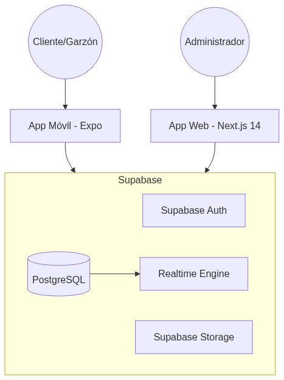
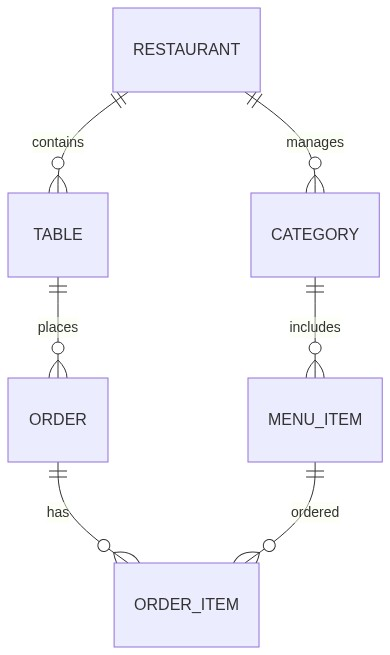

# Informe de Avance 2 - Proyecto Menu Bites

**Integrantes:**
1. Jose Luis Medina Mercado (Líder Técnico)
2. Héctor Robledo (Arquitecto de Datos)
3. Alejandro Placencia Menares (Desarrollador Fullstack)

---

## 1. Propósito del Documento
Este informe resume el estado actual del proyecto **Menu Bites**, consolidando la evidencia de los hitos alcanzados y alineando la documentación del repositorio con la "Fuente de Verdad" en Notion. Se enfoca en la validación del ecosistema multitenant y la operación en tiempo real.

## 2. Roadmap de Desarrollo (Notion Sync)

### 2.1 Hitos Completados (Fase 1: Cimientos)
- **S1 - S3**: Arquitectura Base y Modelado de Datos en Supabase.
- **S4 - S5**: Implementación de RLS (Row Level Security) y Auth Core con Claims personalizados.
- **S6**: Estabilización de la Aplicación Móvil (Forkit Mobile) y autenticación QR.

### 2.2 Fase Actual (Fase 2: Ejecución Real-time) - **60% Progreso**
- **S7**: Motor de Cocina Realtime (KDS) activo y sincronizado.
- **S8**: Terminal de Garzón operativo con gestión de mesas y pedidos.

### 2.3 Próximos Pasos (Fase 3: Expansión y Cierre)
- **S9 - S11**: Gestión de Inventario, Finanzas e Integración de Stripe.
- **S12 - S16**: Pruebas E2E, Auditoría Final de Seguridad y Despliegue en Producción.

## 3. Arquitectura y Modelo de Datos
La arquitectura se basa en un modelo **Monorepo** para el frontend (Next.js) y un backend unificado en **Supabase**.

- **Aislamiento**: Implementado mediante RLS por tabla (`tenant_id`).
- **Realtime**: Motor de eventos de PostgreSQL replicado vía WebSockets.

## 4. Evidencia de Ecosistema (Servicios Activos)
Se ha certificado la operación concurrente de los siguientes módulos:

### 4.1 Operación Multitrabajador
- **Admin Dashboard** (Port 3000): Gestión total del restaurante.
- **Kitchen KDS** (Port 3001): Visualización de pedidos en tiempo real.
- **Waiter Terminal** (Port 3002): Toma de pedidos y gestión de mesas.
- **Cashier Terminal** (Port 3004): Liquidación de cuentas y pagos.
- **Customer Portal** (Port 3005): Pedidos directos desde el cliente.

## 5. Auditoría y Cumplimiento
Tras la auditoría realizada el 2026-05-07, se confirma la **paridad total** entre el repositorio y el workspace de Notion.

- **Documentación SAD**: Actualizada con diagramas Mermaid vivos.
- **Mockups**: Capturados con usuarios reales de Supabase.
- **Branding**: Alineado con los estándares de "Menu Bites / Forkit".

