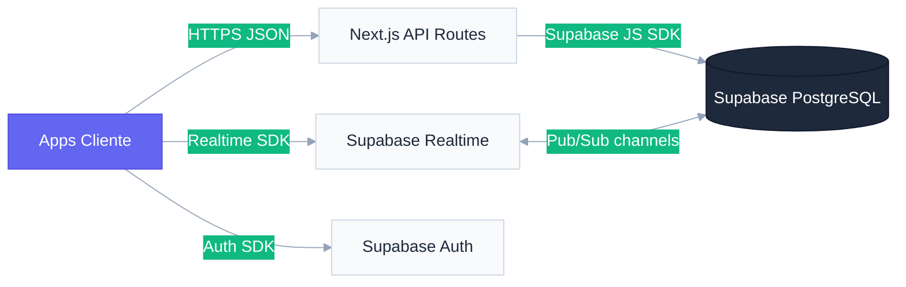

# Especificación Técnica de API — Sistema Menu Bites

**Versión:** 2.2.0 | **Protocolo:** HTTPS | **Formato:** JSON | **Auth:** Supabase Auth (JWT en cookie HttpOnly)

Esta documentación detalla los endpoints de la API interna del sistema Menu Bites, utilizada por las interfaces frontend para comunicarse con la capa de persistencia en Supabase.

**Notas de Estabilización:**
- Se ha optimizado la gestión de estados para evitar condiciones de carrera en el frontend.
- Se han normalizado las respuestas de error en todos los endpoints locales.
- Se recomienda el uso de las constantes de estado definidas en el SDK compartido.

---

## 1. ESTÁNDARES GENERALES

| Parámetro | Valor |
|---|---|
| **Base URL** | `/api` (relativo al dominio de cada app) |
| **Autenticación** | Cookie de sesión de Supabase Auth; el `restaurant_id` y `role` se leen del `app_metadata` del JWT |
| **Formato de fechas** | ISO 8601 con zona horaria (`2024-01-15T10:30:00Z`) |
| **Formato de moneda** | Decimal con 2 decimales (`1990.00`) |
| **IDs** | UUID v4 |

---

## 2. ARQUITECTURA DE COMUNICACIÓN

El sistema usa una arquitectura híbrida: Next.js API Routes orquestan la lógica de negocio y Supabase actúa como motor de datos persistente y en tiempo real.



---

## 3. API DE ADMINISTRACIÓN GLOBAL (Admin Dashboard)

Rutas protegidas exclusivamente para usuarios con rol `SUPER_ADMIN`.

### 3.1 Gestión de Organizaciones

`GET /api/admin/restaurants`
- **Descripción:** Lista completa de restaurantes registrados en la plataforma.
- **Respuesta:** Array de objetos `Restaurant` con `plan` embebido.

`POST /api/admin/restaurants`
- **Descripción:** Registra un nuevo restaurante (tenant).
- **Payload:**
```json
{
  "name": "La Pizzería Napoli",
  "slug": "pizzeria-napoli",
  "plan_id": "uuid-del-plan"
}
```

`PUT /api/admin/restaurants/{id}`
- **Descripción:** Actualiza datos o estado de un restaurante.
- **Payload:** `{ "status": "SUSPENDED" }` (o cualquier campo editable).

`DELETE /api/admin/restaurants/{id}`
- **Descripción:** Elimina el restaurante y todos sus datos en cascada.
- **Precondición:** Requiere confirmación explícita (campo `{ "confirm": true }`).

### 3.2 Gestión de Usuarios Globales

`GET /api/admin/users`
- **Descripción:** Directorio de todos los usuarios de la plataforma.
- **Query params:** `?role=ADMIN&restaurant_id=uuid` (filtros opcionales).

`PUT /api/admin/users/{id}`
- **Descripción:** Actualiza rol o vinculación a restaurante de un usuario.
- **Payload:** `{ "role": "ADMIN", "restaurant_id": "uuid" }`.

### 3.3 Gestión de Planes

`GET /api/admin/plans`
- **Descripción:** Lista todos los planes de suscripción disponibles.

`POST /api/admin/plans`
- **Payload:** `{ "name": "Pro", "price": "$29.900", "period": "/mes", "features": ["Inventario", "Reportes"] }`.

---

## 4. API LOCAL (Local Dashboard)

Rutas contextualizadas al restaurante del usuario autenticado. El `restaurant_id` se obtiene del JWT — nunca se acepta como parámetro de entrada.

### 4.1 Gestión de Pedidos

`GET /api/local/orders`
- **Descripción:** Pedidos del restaurante con items y datos de mesa.
- **Query params:** `?status=PENDING,VALIDATED,PREPARING` (filtro de estados, separados por coma).
- **Respuesta:**
```json
[
  {
    "id": "uuid",
    "status": "PENDING",
    "total_amount": "3990.00",
    "notes": "Sin gluten",
    "table_id": "uuid",
    "tables": { "number": 4, "label": "Ventana" },
    "order_items": [
      {
        "id": "uuid",
        "quantity": 2,
        "unit_price": "1990.00",
        "notes": "Sin cebolla",
        "menu_item_id": "uuid"
      }
    ],
    "createdAt": "2024-01-15T10:30:00Z"
  }
]
```

`PUT /api/local/orders/{id}`
- **Descripción:** Transición de estado del pedido.
- **Payload:** `{ "status": "VALIDATED" }`.
- **Transiciones válidas:** Ver máquina de estados en [TECHNICAL_SAD.md](TECHNICAL_SAD.md).

### 4.2 Gestión de Menú

`GET /api/local/menu`
- **Descripción:** Catálogo completo con categorías embebidas.
- **Respuesta incluye:** URLs de imágenes de Supabase Storage.

`POST /api/local/menu`
- **Payload:**
```json
{
  "name": "Pizza Margarita",
  "description": "Tomate, mozzarella, albahaca",
  "price": 9990,
  "categoryId": "uuid",
  "imageUrl": "https://...supabase.co/storage/..."
}
```

`PUT /api/local/menu/{id}`
- **Descripción:** Edita un item de menú. Para activar/desactivar: `{ "is_active": false }`.

`DELETE /api/local/menu/{id}`

### 4.3 Gestión de Categorías

`GET /api/local/categories`

`POST /api/local/categories`
- **Payload:** `{ "name": "Entradas" }`.

`PUT /api/local/categories/{id}`

`DELETE /api/local/categories/{id}`

### 4.4 Control de Inventario

`GET /api/local/inventory`
- **Descripción:** Lista insumos con niveles de stock.
- **Campos clave:** `name`, `stock`, `unit`.

`POST /api/local/inventory`
- **Payload:** `{ "name": "Harina", "stock": 25.5, "unit": "kg" }`.

`PUT /api/local/inventory/{id}`
- **Descripción:** Actualiza stock o datos del insumo.

`DELETE /api/local/inventory/{id}`

### 4.5 Gestión de Mesas y QR

`GET /api/local/tables`
- **Descripción:** Estado actual de todas las mesas del restaurante.
- **Respuesta incluye:** `status`, `help_requested`, `bill_requested`, `qr_data`.

`POST /api/local/tables`
- **Payload:** `{ "number": 5, "label": "Terraza" }`.
- **Efecto:** Genera automáticamente un `qr_data` único para la mesa.

`PUT /api/local/tables/{id}`
- **Usos comunes:** Cambiar `status`, limpiar `help_requested` o `bill_requested`.

`DELETE /api/local/tables/{id}`

### 4.6 Configuración de Marca (Theme)

`GET /api/local/theme`
- **Descripción:** Recupera el tema activo del restaurante.

`POST /api/local/theme`
- **Descripción:** Guarda un nuevo tema.
- **Payload:**
```json
{
  "name": "Tema Oscuro",
  "primaryColor": "#6366f1",
  "secondaryColor": "#10b981",
  "backgroundColor": "#0f172a",
  "accentColor": "#f59e0b",
  "textColor": "#f8fafc",
  "cardBackground": "#1e293b",
  "fontTitle": "Outfit",
  "fontBody": "Inter"
}
```

`PUT /api/local/theme/{id}/activate`
- **Descripción:** Activa un tema y desactiva el anterior.

### 4.7 Reportes e Inteligencia de Negocio

`GET /api/local/reports/sales`
- **Query params:** `?from=2024-01-01&to=2024-01-31` (rango de fechas en ISO 8601).

`GET /api/local/reports/top-items`
- **Descripción:** Ranking de productos más vendidos.

`GET /api/local/reports/staff`
- **Descripción:** Rendimiento del personal (pedidos por garzón).

`GET /api/local/reports/export`
- **Descripción:** Genera archivo `.xlsx` con el reporte consolidado.
- **Respuesta:** Binario con `Content-Type: application/vnd.openxmlformats-officedocument.spreadsheetml.sheet`.

---

## 5. API WAITER TERMINAL (Terminal de Garzón)

Rutas optimizadas para el flujo de atención de mesa. Rol requerido: `GARZON`.

`GET /api/waiter/tables`
- **Descripción:** Vista rápida del estado de todas las mesas.
- **Respuesta:** `[{ "id", "number", "label", "status", "help_requested", "bill_requested" }]`.

`GET /api/waiter/orders`
- **Descripción:** Pedidos activos asignados al turno actual.
- **Query params:** `?status=PENDING,VALIDATED,READY`.

`POST /api/waiter/orders`
- **Descripción:** Crea un nuevo pedido desde la terminal del garzón.
- **Payload:** Idéntico a `/api/local/orders` POST.

`PUT /api/waiter/orders/{id}`
- **Transiciones permitidas desde GARZON:** `PENDING → VALIDATED`, `PENDING → REJECTED`, `READY → DELIVERED`.

`PUT /api/waiter/tables/{id}/help`
- **Descripción:** Marca o desmarca la solicitud de asistencia de una mesa.
- **Payload:** `{ "help_requested": false }`.

---

## 6. API CASHIER DASHBOARD (Terminal de Caja)

Rutas para el proceso de cobro y cierre de mesa. Rol requerido: `CAJERO`.

`GET /api/cashier/tables`
- **Descripción:** Mesas con `bill_requested = true` (cuentas pendientes de cobro).

`GET /api/cashier/orders/{table_id}`
- **Descripción:** Detalle completo de los pedidos de una mesa para generar el ticket de cobro.
- **Respuesta incluye:** Todos los `order_items` con extras y precios snapshot.

`POST /api/cashier/orders/{id}/close`
- **Descripción:** Cierra el pedido y libera la mesa.
- **Efecto:** Cambia `order.status → DELIVERED`, cambia `table.status → FREE`, resetea `bill_requested = false`.
- **Payload:** `{ "payment_method": "efectivo | tarjeta | transferencia" }`.

`GET /api/cashier/reports/shift`
- **Descripción:** Resumen del turno actual (ventas, pedidos cerrados, métodos de pago).

---

## 7. API CUSTOMER PORTAL (Portal del Cliente)

Rutas públicas o con acceso `anon`. No requieren sesión activa salvo para crear pedidos.

### 7.1 Resolución de Mesa por QR

`GET /api/customer/table`
- **Query param:** `?qr={qr_data}` — el token embebido en el código QR.
- **Descripción:** Resuelve el `qr_data` al `restaurant_id` y `table_id` correspondientes.
- **Respuesta:** `{ "restaurant_id", "table_id", "table_number", "restaurant_slug" }`.

### 7.2 Menú Público

`GET /api/customer/menu`
- **Query param:** `?restaurant_id={uuid}`.
- **Descripción:** Menú activo con categorías e items. Acceso `anon`.
- **Respuesta incluye:** `image_url`, `extras`, `is_active = true` (filtrado por RLS).

### 7.3 Pedidos del Cliente

`POST /api/customer/orders`
- **Descripción:** Crea un pedido desde el portal del cliente.
- **Payload:**
```json
{
  "restaurant_id": "uuid",
  "table_id": "uuid",
  "items": [
    {
      "menu_item_id": "uuid",
      "quantity": 2,
      "notes": "Sin sal",
      "extras": [{ "extra_id": "uuid" }]
    }
  ]
}
```

`GET /api/customer/orders/{id}/status`
- **Descripción:** Consulta el estado de un pedido para el seguimiento en tiempo real.
- **Respuesta:** `{ "status": "PREPARING", "estimated_time": null }`.

### 7.4 Solicitudes de Mesa

`PUT /api/customer/tables/{id}/help`
- **Payload:** `{ "help_requested": true }`.

`PUT /api/customer/tables/{id}/bill`
- **Payload:** `{ "bill_requested": true }`.

### 7.5 Tema del Restaurante (Branding)

`GET /api/customer/theme`
- **Query param:** `?restaurant_id={uuid}`.
- **Descripción:** Tema activo del restaurante para aplicar CSS al portal.

---

## 8. KITCHEN KDS — SUSCRIPCIÓN REALTIME

El KDS no consume endpoints REST tradicionales para actualizaciones. Usa **Supabase Realtime** con suscripciones directas a PostgreSQL Changes.

```typescript
// Patrón de suscripción en kitchen-kds
const channel = supabase
  .channel("kds-orders")
  .on("postgres_changes", {
    event: "INSERT",
    schema: "public",
    table: "orders",
    filter: `restaurant_id=eq.${restaurantId}`
  }, handleNewOrder)
  .on("postgres_changes", {
    event: "UPDATE",
    schema: "public",
    table: "orders",
    filter: `restaurant_id=eq.${restaurantId}`
  }, handleOrderUpdate)
  .subscribe();
```

El único endpoint REST que consume el KDS es para cambiar el estado de un pedido:

`PUT /api/local/orders/{id}`
- **Transiciones permitidas desde COCINA:** `VALIDATED → PREPARING`, `PREPARING → READY`.

---

## 9. MODELOS DE RESPUESTA COMUNES

### Order (Pedido completo)
```json
{
  "id": "uuid",
  "status": "PREPARING",
  "total_amount": "7980.00",
  "notes": null,
  "table_id": "uuid",
  "restaurant_id": "uuid",
  "tables": { "number": 3, "label": null, "status": "OCCUPIED" },
  "order_items": [
    {
      "id": "uuid",
      "quantity": 2,
      "unit_price": "3990.00",
      "notes": "Sin cebolla",
      "menu_item_id": "uuid",
      "order_item_extras": [
        { "extra_id": "uuid", "price": "500.00" }
      ]
    }
  ],
  "createdAt": "2024-01-15T10:30:00Z",
  "updatedAt": "2024-01-15T10:35:00Z"
}
```

### Restaurant (Organización)
```json
{
  "id": "uuid",
  "name": "La Pizzería Napoli",
  "slug": "pizzeria-napoli",
  "status": "ACTIVE",
  "plan_id": "uuid",
  "plan": { "name": "Pro", "features": ["Inventario", "Reportes"] }
}
```

---

## 10. CÓDIGOS DE ESTADO HTTP

| Código | Significado | Contexto |
|---|---|---|
| `200 OK` | Operación exitosa (GET, PUT) | |
| `201 Created` | Recurso creado | POST exitoso |
| `204 No Content` | Operación exitosa sin cuerpo | DELETE exitoso |
| `400 Bad Request` | Payload inválido o campos faltantes | |
| `401 Unauthorized` | Sesión no válida o expirada | |
| `403 Forbidden` | Rol insuficiente para el recurso | |
| `404 Not Found` | El recurso solicitado no existe | |
| `409 Conflict` | Conflicto de unicidad (ej: slug duplicado) | |
| `500 Internal Server Error` | Error no controlado en el servidor | |
| `503 Service Unavailable` | Servicio externo no disponible (ej: VAPID no configurado) | |

---

## 11. ENDPOINTS NUEVOS — WAVES 1-6 (v2.0)

### 11.1 Customer Portal — Nuevos Endpoints

#### `POST /api/orders` (actualizado)
Además de crear la orden, ahora actualiza el estado de la mesa:

```json
// Efecto colateral nuevo (automático):
// tables.status → "OCCUPIED" cuando table_id != null
```

#### `POST /api/bill-request`
Permite al cliente solicitar la cuenta desde el portal.

- **Auth:** Ninguna (anon, usa service role en servidor)
- **Body:** `{ "table_id": "uuid" }`
- **Response 200:** `{ "ok": true }`
- **Efecto:** `tables.bill_requested = true` — dispara badge en Waiter Terminal y Cashier Dashboard via Realtime.

#### `POST /api/reviews`
Registra la calificación del cliente tras el pago.

- **Auth:** Ninguna (anon, usa service role en servidor)
- **Body:**
```json
{
  "order_id":      "uuid",
  "restaurant_id": "uuid",
  "table_id":      "uuid | null",
  "rating":        5,
  "comment":       "Excelente servicio"
}
```
- **Validación:** `rating` entre 1 y 5 (obligatorio). `comment` opcional.
- **Response 200:** `{ "ok": true }`
- **RLS:** INSERT público. SELECT restringido a usuarios del restaurante.

---

### 11.2 Kitchen KDS — Endpoints de Inventario

#### `GET /api/inventory`
Exporta el inventario del restaurante como archivo CSV descargable.

- **Auth:** Cookie de sesión `sb-kds-session` (rol COCINA)
- **Response 200:** `text/csv` con cabecera `Content-Disposition: attachment; filename="inventario.csv"`
- **Formato CSV:**
```
id,nombre,stock_actual,unidad
uuid-1,"Tomates",5.00,kg
uuid-2,"Queso Rallado",0.50,kg
```

#### `POST /api/inventory`
Importa conteos de stock desde un CSV y actualiza únicamente el campo `stock`.

- **Auth:** Cookie de sesión `sb-kds-session` (rol COCINA)
- **Content-Type:** `text/plain; charset=utf-8`
- **Body:** Texto CSV con columnas `id` y `stock_actual` (o `stock`)
- **Response 200:**
```json
{
  "updated":  12,
  "errors":   [],
  "critical": [
    { "name": "Tomates", "stock": 2.0, "unit": "kg" }
  ],
  "criticalThreshold": 5
}
```
- **Regla de negocio:** Solo se actualiza `stock`. `nombre` y `unidad` nunca se sobreescriben desde el CSV.

---

### 11.3 Waiter Terminal — Endpoints de Sesión y Push

#### `POST /api/sessions`
Fusiona varias mesas bajo un `session_id` compartido, asignándolo a todas sus órdenes activas.

- **Auth:** Cookie `sb-waiter-session` (rol GARZON)
- **Body:** `{ "tableIds": ["uuid-a", "uuid-b"] }` — mínimo 2 elementos
- **Response 200:** `{ "sessionId": "uuid-nuevo", "ordersUpdated": 4 }`
- **Efecto:** Cashier Dashboard agrupará estas órdenes como una sola cuenta cobrable.

#### `DELETE /api/sessions`
Separa mesas fusionadas limpiando el `session_id` de sus órdenes activas.

- **Auth:** Cookie `sb-waiter-session` (rol GARZON)
- **Body:** `{ "sessionId": "uuid" }`
- **Response 200:** `{ "ok": true }`

#### `POST /api/push/subscribe`
Registra la suscripción VAPID del browser del garzón en la tabla `push_subscriptions`.

- **Auth:** Cookie `sb-waiter-session` (rol GARZON)
- **Body:** Objeto de suscripción PushSubscription (`{ endpoint, keys: { p256dh, auth } }`)
- **Response 200:** `{ "ok": true }`
- **Comportamiento:** Upsert por `(user_id, restaurant_id)` — solo una suscripción activa por garzón por restaurante.

#### `DELETE /api/push/subscribe`
Elimina la suscripción push del garzón actual.

- **Auth:** Cookie `sb-waiter-session`
- **Response 200:** `{ "ok": true }`

#### `POST /api/push/notify`
Envía una notificación Web Push a todos los garzones del restaurante.

- **Auth:** Interno — llamado desde el propio Waiter Terminal cuando detecta ORDER_READY via Realtime
- **Body:** `{ "restaurantId": "uuid", "tableNumber": 7 }`
- **Response 200:** `{ "sent": 2 }` — número de dispositivos notificados
- **Manejo de errores:** Suscripciones expiradas (HTTP 410/404) se eliminan automáticamente.

---

### 11.4 Cashier Dashboard — Comprobantes Digitales

#### `GET /receipt/table/[tableId]?rid=[restaurantId]`
Página Server Component de comprobante imprimible para una mesa sin fusión.

- **Auth:** Ninguna — acceso público filtrado por `restaurant_id`
- **Parámetros:** `tableId` en ruta, `rid` como query param obligatorio
- **Renders:** HTML imprimible con `@media print` que oculta botones de acción
- **Contenido:** Nombre del restaurante, mesa, fecha/hora, desglose de ítems por pedido, subtotal, propina sugerida 10%, total, referencia de pago

#### `GET /receipt/session/[sessionId]?rid=[restaurantId]`
Comprobante unificado para mesas fusionadas bajo un `session_id`.

- **Auth:** Ninguna — acceso público filtrado por `restaurant_id`
- **Renders:** HTML imprimible con desglose separado por mesa dentro de la sesión y total global

---

### 11.5 Estabilización de Build (Build-Safe Pattern)

Se ha implementado un patrón de inicialización protegida en todos los endpoints de `customer-portal` (`/api/orders`, `/api/reviews`, `/api/help-request`, `/api/bill-request`) para garantizar la compatibilidad con los entornos de CI/CD de Vercel.

**Garantía de Disponibilidad:** Los endpoints ahora manejan la ausencia de variables de entorno de servidor en tiempo de construcción, eliminando errores de referencia global y permitiendo un despliegue sin fricciones en el pipeline de Turborepo.
