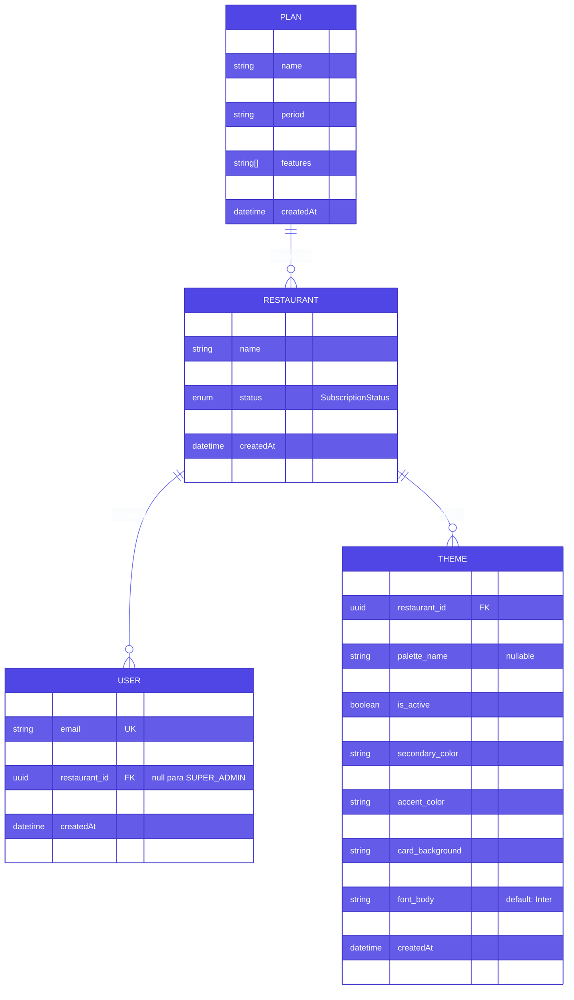
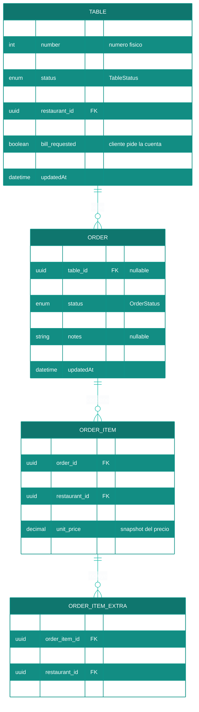
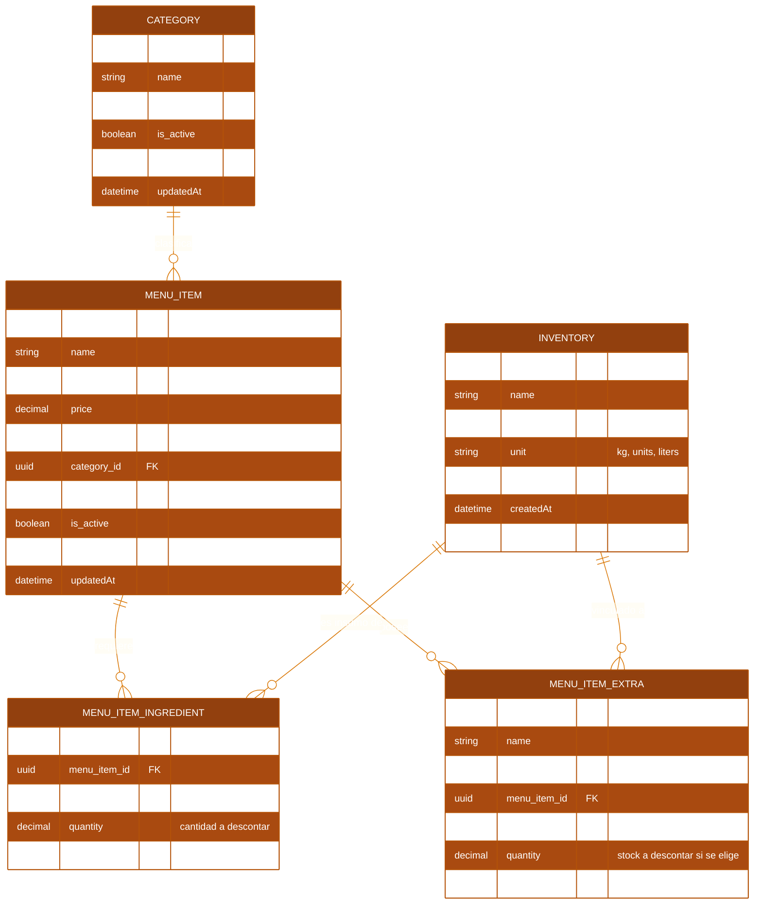
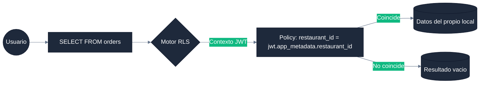

# Documentación de Esquema de Base de Datos — Menu Bites

**Propósito:** Referencia canónica del modelo de datos. Contiene los ERDs por dominio, el diccionario de datos completo, los enums y las restricciones de integridad. Para políticas de seguridad SQL y configuración de roles de BD, ver [DATABASE_TECHNICAL.md](DATABASE_TECHNICAL.md).

La base de datos está implementada en **PostgreSQL 15+** a través de **Supabase**, utilizando **Prisma ORM** como fuente de verdad para el esquema.

---

## 1. DIAGRAMA DE ENTIDAD-RELACIÓN POR DOMINIO

El modelo está dividido en tres dominios para facilitar su lectura. La tabla `restaurants` (Tenant) es el eje transversal de todos ellos.

### ERD-1: Núcleo de Tenant (Suscripción y Configuración)

### ERD-2: Dominio Operativo (Pedidos y Mesas)

### ERD-3: Dominio de Catálogo (Menú e Inventario)

---

## 2. DICCIONARIO DE DATOS

### 2.1 Enumeraciones (Enums)

#### `Role` — Roles de Usuario

| Valor | Descripción | restaurant_id requerido |
|---|---|---|
| `SUPER_ADMIN` | Administrador global de la plataforma SaaS | No (nulo) |
| `ADMIN` | Dueño o gerente de un restaurante específico | Sí |
| `GARZON` | Personal de sala, toma de pedidos | Sí |
| `COCINA` | Personal de cocina, gestión de tickets KDS | Sí |
| `CAJERO` | Personal de caja, cierre de cuentas | Sí |
| `CLIENTE` | Cliente final, acceso solo al Customer Portal | No |

#### `OrderStatus` — Estados de un Pedido

| Valor | Actor que lo asigna | Descripción |
|---|---|---|
| `PENDING` | Sistema (al crear) | Pedido recién ingresado, en espera de validación |
| `VALIDATED` | GARZON | Pedido confirmado, enviado a preparación |
| `PREPARING` | COCINA (KDS) | En proceso de preparación en cocina |
| `READY` | COCINA (KDS) | Listo para ser retirado/entregado |
| `DELIVERED` | GARZON | Entregado al cliente |
| `COMPLETED` | CAJERO | Pago procesado exitosamente (Estado final) |
| `REJECTED` | GARZON | Rechazado (ingrediente no disponible u otro motivo) |

#### `TableStatus` — Estado de una Mesa

| Valor | Descripción |
|---|---|
| `FREE` | Mesa disponible para nuevos clientes |
| `OCCUPIED` | Mesa con clientes activos y pedidos en curso |
| `RESERVED` | Mesa reservada (no disponible para walk-ins) |
| `CLEANING` | Mesa liberada tras el pago, pendiente de limpieza antes de volver a FREE |

> **Ciclo normal:** `FREE → OCCUPIED` (al crear primer pedido) → `CLEANING` (al procesar pago en caja) → `FREE` (garzón confirma limpieza).

#### `SubscriptionStatus` — Estado de Suscripción del Restaurante

| Valor | Efecto en el sistema |
|---|---|
| `ACTIVE` | Acceso completo a la plataforma |
| `SUSPENDED` | Acceso bloqueado; datos conservados |
| `CANCELLED` | Acceso bloqueado; candidato a eliminación de datos |

---

### 2.2 Entidades de Núcleo

#### `plans` (Tabla de Planes SaaS)
Define los tiers de servicio disponibles en la plataforma.

| Campo | Tipo | Descripción |
|---|---|---|
| `id` | UUID PK | Identificador único del plan |
| `name` | String | Nombre del tier (ej: "Básico", "Pro", "Premium") |
| `price` | String | Precio formateado (ej: "$49.900") |
| `period` | String | Recurrencia (default: "/mes") |
| `description` | String? | Descripción opcional del plan |
| `features` | String[] | Array de características incluidas |
| `popular` | Boolean | Flag para destacar el plan en UI |

#### `restaurants` (Tenant Principal)
Eje central del sistema multitenant. Todos los recursos de negocio están filtrados por su `id`.

| Campo | Tipo | Descripción |
|---|---|---|
| `id` | UUID PK | Identificador del tenant |
| `name` | String | Nombre legal del restaurante |
| `slug` | String UK | Identificador URL-friendly (ej: `la-pizzeria`) |
| `status` | SubscriptionStatus | Estado de la suscripción SaaS |
| `plan_id` | UUID? FK | Plan contratado (nullable) |

#### `users` (Usuarios y Roles RBAC)
Extiende el usuario de Supabase Auth con metadatos de negocio.

| Campo | Tipo | Descripción |
|---|---|---|
| `id` | String PK | Mapeado al UUID de `auth.users` |
| `email` | String UK | Correo del usuario |
| `role` | Role | Nivel de acceso en el sistema |
| `restaurant_id` | UUID? FK | Local al que pertenece; nulo para SUPER_ADMIN |
| `push_token` | String? | Token para notificaciones push (mobile) |

#### `restaurant_themes` (Configuración de Marca)
Almacena las variables de branding por restaurante. Puede haber múltiples temas, pero solo uno con `is_active = true` a la vez.

| Campo | Tipo | Descripción |
|---|---|---|
| `id` | UUID PK | |
| `restaurant_id` | UUID FK | Tenant propietario |
| `name` | String | Nombre del tema (ej: "Tema Oscuro") |
| `palette_name` | String? | Nombre de paleta base si es predefinida |
| `is_custom` | Boolean | True si fue editado manualmente |
| `is_active` | Boolean | True = tema actualmente aplicado |
| `primary_color` | String | Color principal (Hex) |
| `secondary_color` | String | Color secundario (Hex) |
| `background_color` | String | Fondo de la aplicación (Hex) |
| `accent_color` | String | Color de acento/highlight (Hex) |
| `text_color` | String | Color del texto principal (Hex) |
| `card_background` | String | Fondo de tarjetas y modales (Hex) |
| `font_title` | String | Fuente para títulos (default: "Outfit") |
| `font_body` | String | Fuente para cuerpo (default: "Inter") |
| `logo_url` | String? | URL del logotipo en Supabase Storage |

---

### 2.3 Entidades Operativas

#### `tables` (Mesas del Restaurante)

| Campo | Tipo | Descripción |
|---|---|---|
| `id` | UUID PK | |
| `number` | Int | Número físico de la mesa |
| `label` | String? | Nombre personalizado (ej: "Mesa VIP") |
| `status` | TableStatus | Estado actual de la mesa |
| `qr_data` | String UK | Token único usado en el QR que genera la URL del Customer Portal |
| `restaurant_id` | UUID FK | |
| `help_requested` | Boolean | True cuando el cliente presiona "Pedir asistencia" |
| `bill_requested` | Boolean | True cuando el cliente presiona "Pedir la cuenta" |

**Constraints:** `UNIQUE(restaurant_id, number)` — no puede haber dos mesas con el mismo número en el mismo restaurante.

#### `orders` y `order_items` (Pedidos y Comandas)

**`orders`:**

| Campo | Tipo | Descripción |
|---|---|---|
| `id` | UUID PK | |
| `table_id` | UUID? FK | Mesa asociada (nullable para pedidos sin mesa) |
| `restaurant_id` | UUID FK | |
| `status` | OrderStatus | Estado actual del pedido |
| `total_amount` | Decimal(10,2) | Monto total calculado |
| `notes` | String? | Notas generales del pedido (ej: alergias) |
| `session_id` | UUID? | ID de sesión compartida para mesas fusionadas. Nulo si la mesa no está fusionada |
| `validated_at` | Timestamptz? | Momento en que el garzón validó el pedido. Usado para medir tiempos de atención |
| `preparing_at` | Timestamptz? | Momento en que cocina inició la preparación |
| `ready_at` | Timestamptz? | Momento en que cocina marcó el pedido como listo |

> **Nota analytics:** `ready_at - validated_at` = tiempo neto de cocina. `validated_at - created_at` = tiempo de validación del garzón. Ambos alimentan el heatmap del Local Dashboard.

**`order_items`:**

| Campo | Tipo | Descripción |
|---|---|---|
| `id` | UUID PK | |
| `order_id` | UUID FK | |
| `menu_item_id` | UUID FK | |
| `restaurant_id` | UUID FK | |
| `quantity` | Int | Cantidad del item |
| `unit_price` | Decimal(10,2) | **Snapshot** del precio al momento de la compra |
| `notes` | String? | Notas del item (ej: "sin cebolla") |

**`order_item_extras`:**

| Campo | Tipo | Descripción |
|---|---|---|
| `order_item_id` | UUID FK | |
| `extra_id` | UUID FK | Referencia a `menu_item_extras` |
| `price` | Decimal(10,2) | **Snapshot** del precio del extra |

---

### 2.4 Entidades de Catálogo

#### `categories` y `menu_items`

**`categories`:** Agrupador de items del menú por restaurante. Constraint `UNIQUE(id, restaurant_id)`.

**`menu_items`:** Cada producto del menú. `image_url` apunta a Supabase Storage (bucket `menu-images`, ruta `{restaurantId}/{fileName}`). Constraint `UNIQUE(id, restaurant_id)` y `UNIQUE(category_id, restaurant_id)` para integridad cruzada.

#### `inventories` (Control de Stock)

| Campo | Tipo | Descripción |
|---|---|---|
| `id` | UUID PK | |
| `name` | String | Nombre del insumo (ej: "Harina", "Tomate") |
| `stock` | Decimal(10,2) | Cantidad disponible actualmente |
| `unit` | String | Unidad de medida: `"kg"`, `"units"`, `"liters"` |
| `restaurant_id` | UUID FK | |

#### `menu_item_ingredients` (Receta de un Plato)

Vincula un `MenuItem` con los `Inventory` que consume. La `quantity` define cuánto stock se descuenta al procesar un pedido.

Constraint: `UNIQUE(menu_item_id, inventory_id)`.

#### `menu_item_extras` (Modificadores Opcionales)

Adiciones opcionales con costo extra (ej: "Extra Queso +$500"). Puede estar vinculado a `inventory_id` para descontar stock cuando es seleccionado.

#### `push_subscriptions` (Suscripciones Web Push)

Almacena los endpoints VAPID del navegador para enviar notificaciones push al Garzón cuando una orden pasa a READY.

| Campo | Tipo | Descripción |
|---|---|---|
| `id` | UUID PK | |
| `user_id` | UUID FK → auth.users | Usuario suscrito (rol GARZON) |
| `restaurant_id` | UUID | Tenant al que pertenece |
| `subscription` | JSONB | Objeto de suscripción del browser: `{ endpoint, keys: { p256dh, auth } }` |
| `created_at` | Timestamptz | |
| `updated_at` | Timestamptz | |

#### `kds_settings` (Configuración del KDS)

Almacena preferencias personalizadas para el Kitchen Display System por restaurante.

| Campo | Tipo | Descripción |
|---|---|---|
| `id` | UUID PK | |
| `restaurant_id` | UUID UK | Tenant propietario (1:1) |
| `settings` | JSONB | Configuración (umbrales de tiempo, sonidos, auto-limpieza) |
| `created_at` | Timestamptz | |
| `updated_at` | Timestamptz | |

**Constraint:** `UNIQUE(user_id, restaurant_id)` — un garzón tiene una sola suscripción activa por restaurante (se actualiza al re-registrarse).

**RLS:** Inserción y lectura propia por el propio usuario. Lectura por roles ADMIN y COCINA (para enviar notificaciones).

#### `reviews` (Calificaciones del Cliente)

Ratings post-pago que el cliente deja desde el Customer Portal cuando su orden pasa a DELIVERED.

| Campo | Tipo | Descripción |
|---|---|---|
| `id` | UUID PK | |
| `order_id` | UUID | Orden calificada |
| `restaurant_id` | UUID FK | |
| `table_id` | UUID? | Mesa desde la que se calificó |
| `session_id` | UUID? | Sesión de fusión de mesas si aplica |
| `rating` | Smallint | Calificación 1–5 estrellas |
| `comment` | Text? | Comentario libre opcional |
| `created_at` | Timestamptz | |

**RLS:** INSERT público (clientes anónimos). SELECT restringido a usuarios autenticados del mismo restaurante.

---

## 3. INTEGRIDAD DE DATOS

### Cascading Deletes

Al eliminar un `Restaurant`, se eliminan en cascada:
- Todos sus `users`, `categories`, `menu_items`, `tables`, `orders`, `inventories`, `themes`.
- Configurado mediante `onDelete: Cascade` en Prisma y restricciones FK en PostgreSQL.

### Unique Constraints

| Tabla | Constraint | Propósito |
|---|---|---|
| `restaurants` | `slug` | URLs únicas globalmente |
| `tables` | `(restaurant_id, number)` | Sin duplicidad de mesas por local |
| `tables` | `qr_data` | Cada QR apunta a una sola mesa |
| `menu_item_ingredients` | `(menu_item_id, inventory_id)` | Sin duplicidad de ingredientes por plato |
| `categories` | `(id, restaurant_id)` | Integridad cruzada con menu_items |

### Snapshots de Precio

Los campos `unit_price` en `order_items` y `price` en `order_item_extras` almacenan el precio **en el momento de la compra**. Esto garantiza que el historial de pedidos sea inmutable frente a cambios futuros de precios en el menú.

### Auditoría

Todas las tablas incluyen `createdAt` y `updatedAt` gestionados automáticamente por Prisma (`@default(now())` y `@updatedAt`). El tipo es `Timestamptz(3)` para almacenamiento con zona horaria.

---

## 4. AISLAMIENTO POR TENANT (RLS — Resumen)

Cada tabla transaccional tiene políticas RLS activas que filtran los datos por el `restaurant_id` del JWT del usuario autenticado. Para el detalle de las políticas SQL y los roles de base de datos (`service_role`, `authenticated`, `anon`), ver [DATABASE_TECHNICAL.md](DATABASE_TECHNICAL.md).

