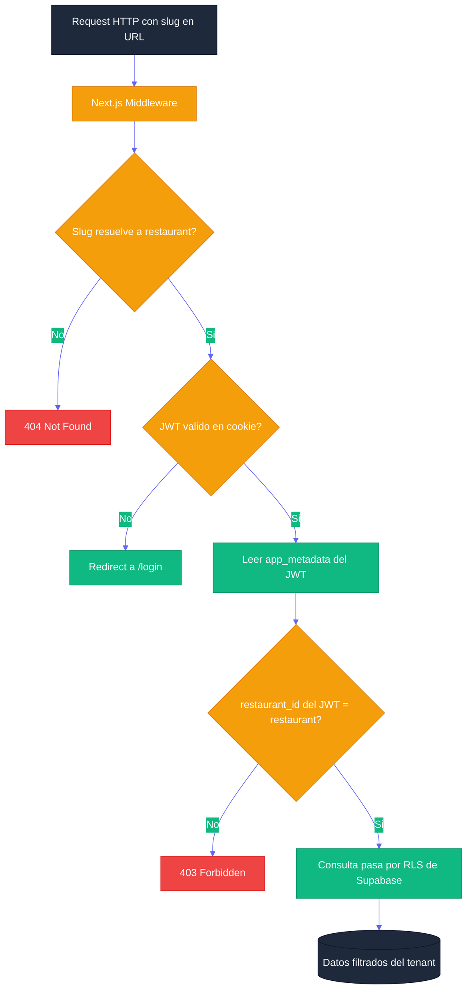

# Documentación Técnica de Base de Datos — Menu Bites

**Propósito:** Implementación técnica de la capa de datos. Cubre arquitectura multi-tenant, políticas RLS con SQL real, índices de rendimiento, roles de base de datos y patrones de acceso desde el cliente. Para el diccionario de datos y los ERDs, ver [DATABASE_SCHEMA.md](DATABASE_SCHEMA.md).

---

## CHANGELOG DE MIGRACIONES

| Versión | Fecha | Descripción |
|---|---|---|
| `0003_schema_extensions` | 2025-05-04 | `TableStatus.CLEANING`; timestamps `validated_at / preparing_at / ready_at` en `orders`; campo `session_id` en `orders`; tablas `push_subscriptions` y `reviews` con sus políticas RLS |

### Detalle de `0003_schema_extensions`

**`TableStatus.CLEANING`:** Nuevo estado intermedio entre el cobro por caja y la habilitación de la mesa. El cajero la deja en `CLEANING` al procesar el pago; el garzón la mueve a `FREE` al terminar la limpieza.

**Timestamps de ciclo de vida en `orders`:** Permiten calcular tiempos reales de operación sin depender de diferencias entre `created_at` y `updated_at`. La función `updateOrderStatus()` en `@menu-bites/auth` los escribe automáticamente al transicionar.

**`session_id` en `orders`:** UUID compartido entre pedidos de mesas físicamente distintas que el garzón fusionó en una única cuenta. Nulo para mesas no fusionadas. Índice parcial `WHERE session_id IS NOT NULL` para eficiencia.

**`push_subscriptions`:** Almacena suscripciones VAPID del browser para notificaciones push nativas (Wave 5.1). RLS permite inserción/lectura propia y lectura por roles con acceso al restaurante.

**`reviews`:** Calificaciones 1–5 del cliente tras el pago (Wave 5.3). RLS permite INSERT anónimo (cliente sin sesión) y SELECT autenticado por restaurant_id.

---

## 1. ARQUITECTURA MULTI-TENANT

El sistema utiliza una arquitectura **shared database, shared schema** con discriminadores de columna. Todos los tenants (restaurantes) conviven en las mismas tablas físicas, aislados lógicamente por el campo `restaurant_id`.

### Ventajas del modelo

- Infraestructura compartida reduce costos operativos.
- Migraciones centralizadas: un solo schema.prisma governa todos los tenants.
- El aislamiento se delega al motor de BD (PostgreSQL RLS), no al código de aplicación.

### Flujo de resolución de tenant



---

## 2. ROW LEVEL SECURITY (RLS) — POLÍTICAS COMPLETAS

RLS está habilitado en todas las tablas transaccionales. La seguridad no reside en el código de la aplicación, sino en el motor de PostgreSQL.

### 2.1 Principio base

```sql
-- Habilitar RLS en una tabla
ALTER TABLE public.orders ENABLE ROW LEVEL SECURITY;

-- Forzar RLS incluso para el propietario de la tabla
ALTER TABLE public.orders FORCE ROW LEVEL SECURITY;
```

### 2.2 Política para tablas operativas (orders, order_items, tables, inventories)

```sql
-- Política: cada usuario solo ve los datos de su restaurante
CREATE POLICY "tenant_isolation_orders"
ON public.orders
FOR ALL
TO authenticated
USING (
    restaurant_id = (
        SELECT restaurant_id
        FROM public.users
        WHERE id = auth.uid()
    )
)
WITH CHECK (
    restaurant_id = (
        SELECT restaurant_id
        FROM public.users
        WHERE id = auth.uid()
    )
);
```

### 2.3 Política para el menú público (Customer Portal — acceso anónimo)

```sql
-- Política: cualquier visitante puede leer el menú activo de un restaurante
CREATE POLICY "public_menu_read"
ON public.menu_items
FOR SELECT
TO anon, authenticated
USING (is_active = true);

CREATE POLICY "public_categories_read"
ON public.categories
FOR SELECT
TO anon, authenticated
USING (is_active = true);
```

### 2.4 Política para temas públicos (Customer Portal — branding)

```sql
-- Política: el Customer Portal puede leer el tema activo sin autenticación
CREATE POLICY "public_theme_read"
ON public.restaurant_themes
FOR SELECT
TO anon, authenticated
USING (is_active = true);
```

### 2.5 Política para SUPER_ADMIN (acceso global)

```sql
-- Los SUPER_ADMIN bypasean el filtro de tenant
CREATE POLICY "super_admin_full_access"
ON public.restaurants
FOR ALL
TO authenticated
USING (
    (SELECT role FROM public.users WHERE id = auth.uid()) = 'SUPER_ADMIN'
);
```

---

## 3. ROLES DE BASE DE DATOS

Supabase gestiona tres roles nativos de PostgreSQL que mapean a diferentes contextos de acceso:

| Rol BD | Contexto de uso | Nivel de acceso |
|---|---|---|
| `anon` | Visitante no autenticado (Customer Portal público) | Solo lectura de menú y temas activos |
| `authenticated` | Usuario con sesión activa de Supabase Auth | Acceso filtrado por RLS según su `restaurant_id` y `role` |
| `service_role` | Backend (Edge Functions, procesos de admin) | Bypass total de RLS — solo para operaciones administrativas confiables |

> El `service_role` key **nunca** debe exponerse al cliente. Vive exclusivamente en variables de entorno del servidor (Vercel).

---

## 4. ÍNDICES DE RENDIMIENTO

Todos los índices están definidos en `schema.prisma` y generados en las migraciones de Prisma:

```sql
-- Índice principal por tenant en todas las tablas operativas
CREATE INDEX idx_orders_restaurant_id ON public.orders(restaurant_id);
CREATE INDEX idx_order_items_restaurant_id ON public.order_items(restaurant_id);
CREATE INDEX idx_menu_items_restaurant_id ON public.menu_items(restaurant_id);
CREATE INDEX idx_inventories_restaurant_id ON public.inventories(restaurant_id);
CREATE INDEX idx_tables_restaurant_id ON public.tables(restaurant_id);

-- Índice compuesto para consultas frecuentes de KDS
CREATE INDEX idx_order_items_order_restaurant ON public.order_items(order_id, restaurant_id);

-- Índice para búsqueda de items por categoría en un tenant
CREATE INDEX idx_menu_items_category_restaurant ON public.menu_items(category_id, restaurant_id);
```

---

## 5. PATRONES DE ACCESO DESDE EL CLIENTE

### 5.1 Acceso autenticado (Supabase JS Client)

```typescript
import { supabase } from "@menu-bites/auth";

// Leer pedidos del restaurante del usuario autenticado
// RLS filtra automáticamente por restaurant_id del JWT
const { data: orders } = await supabase
  .from("orders")
  .select("*, order_items(id, quantity, unit_price)")
  .eq("status", "PENDING")
  .order("createdAt", { ascending: true });
```

### 5.2 Acceso público (Customer Portal — menú)

```typescript
// El cliente anon puede leer el menú sin sesión
const { data: menuItems } = await supabase
  .from("menu_items")
  .select("id, name, description, price, image_url, category_id")
  .eq("restaurant_id", restaurantId)
  .eq("is_active", true);
```

### 5.3 Suscripción Realtime (KDS / Local Dashboard)

```typescript
import { supabase } from "@menu-bites/auth";

useEffect(() => {
  fetchOrders(); // carga inicial

  const channel = supabase
    .channel("orders-realtime")
    .on(
      "postgres_changes",
      { event: "*", schema: "public", table: "orders" },
      () => { fetchOrders(); }
    )
    .subscribe();

  return () => { supabase.removeChannel(channel); };
}, [fetchOrders]);
```

### 5.4 Aliasing camelCase ↔ snake_case

Prisma mapea campos camelCase a columnas snake_case. El cliente REST de Supabase devuelve los nombres de columna de la BD. Para exponer camelCase al frontend:

```typescript
// Solicitar con aliasing en el select de PostgREST
const { data } = await supabase
  .from("menu_items")
  .select("id, name, category_id, unit_price:price, is_active");
```

---

## 6. GESTIÓN DE MIGRACIONES

Las migraciones se generan con Prisma y se aplican a Supabase:

```bash
# Generar migración desde cambios en schema.prisma
npx prisma migrate dev --name "descripcion_del_cambio"

# Aplicar migraciones en producción
npx prisma migrate deploy

# Introspección del schema real de la BD
npx prisma db pull
```

> Las migraciones viven en `Producto/supabase/migrations/`. Son la referencia de los nombres reales de columnas en PostgreSQL (snake_case).
