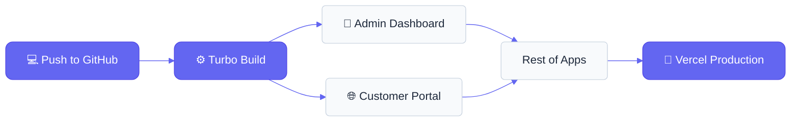

# Manual de Deploy Multitenant — Vercel

**Proyecto:** Software-Restaurantes (Menu Bites)
**Arquitectura:** Monorepo Turbo/npm · 6 apps Next.js · 1 app Expo
**Versión:** 1.0.0 · Fecha: 2026-05-03

---

## Sección 0 — Resumen Ejecutivo

### Flujo de Despliegue (Pipeline)



### Tabla de referencia rápida

| App | Nombre paquete | Root Directory en Vercel | Rol |
|-----|----------------|--------------------------|-----|
| admin-dashboard | `frontend` | `Producto/apps/admin-dashboard` | Auth gateway + Super Admin |
| kitchen-kds | `@menu-bites/kitchen-kds` | `Producto/apps/kitchen-kds` | Cocina |
| waiter-terminal | `@menu-bites/waiter-terminal` | `Producto/apps/waiter-terminal` | Garzón |
| local-dashboard | `local-dashboard` | `Producto/apps/local-dashboard` | Admin local |
| cashier-dashboard | `@menu-bites/cashier-dashboard` | `Producto/apps/cashier-dashboard` | Cajero |
| customer-portal | `customer-portal` | `Producto/apps/customer-portal` | Cliente (público) |

### Orden obligatorio de deploy

```
Paso 1: admin-dashboard     ← auth gateway; su URL es dependencia de todas las demás
Paso 2: customer-portal     ← standalone; no depende del workspace
Paso 3: kitchen-kds   }
        waiter-terminal}     ← pueden desplegarse en paralelo entre sí
        cashier-dashboard}
Paso 4: local-dashboard     ← depende de conocer las URLs de las apps anteriores
Paso 5: Actualizar env vars en admin-dashboard con las URLs reales → Redeploy
```

### Flujo de autenticación cross-app

```
Usuario abre kitchen-kds
  → proxy.ts no encuentra cookie "sb-kds-session"
  → redirect a NEXT_PUBLIC_AUTH_URL (admin-dashboard)
  → usuario hace login
  → admin-dashboard detecta rol COCINA
  → window.location.replace(
      `${NEXT_PUBLIC_KITCHEN_URL}/auth/callback#access_token=...&refresh_token=...`
    )
  → kitchen-kds/auth/callback/page.tsx llama supabase.auth.setSession()
  → cookie "sb-kds-session" creada en el dominio de kitchen-kds
  → proxy.ts permite acceso
```

---

## Sección 1 — Prerequisitos

### 1.1 Cuentas y accesos

- **Cuenta Vercel** con acceso al team o scope del proyecto
- **Token de Vercel** (para uso con CLI): generarlo en `vercel.com/account/tokens`
- **Proyecto Supabase de producción** (distinto al de desarrollo local)
- **Repositorio GitHub** conectado a Vercel

### 1.2 Herramientas locales

```bash
node --version      # requiere >= 18
npm --version       # requiere >= 10.2.4 (packageManager del monorepo)
npx vercel --version
```

Instalar Vercel CLI si no está disponible:

```bash
npm install -g vercel
```

### 1.3 Credenciales de Supabase producción necesarias

Tener a mano antes de comenzar:

| Credencial | Dónde obtenerla |
|------------|-----------------|
| `NEXT_PUBLIC_SUPABASE_URL` | Supabase Dashboard → Project Settings → API → Project URL |
| `NEXT_PUBLIC_SUPABASE_ANON_KEY` | Supabase Dashboard → Project Settings → API → anon/public |
| `SUPABASE_SERVICE_ROLE_KEY` | Supabase Dashboard → Project Settings → API → service_role |
| `DATABASE_URL` | Supabase Dashboard → Project Settings → Database → Connection string (Transaction pooler) |
| `DIRECT_URL` | Supabase Dashboard → Project Settings → Database → Connection string (Direct) |

> **Advertencia:** No usar las credenciales del entorno de desarrollo local en producción. Son proyectos Supabase separados.

---

## Sección 2 — Arquitectura Multitenant y su Impacto en el Deploy

### 2.1 Por qué admin-dashboard se despliega primero

`admin-dashboard` es el auth gateway centralizado. Todas las demás apps tienen en su `proxy.ts` una lógica equivalente a:

```typescript
// Cada app redirige al admin-dashboard cuando no hay sesión
redirect(`${process.env.NEXT_PUBLIC_AUTH_URL}/`)
```

Si se despliega cualquier otra app antes que `admin-dashboard`, la variable `NEXT_PUBLIC_AUTH_URL` apuntará a `http://localhost:3000` y los redirects al login fallarán en producción.

### 2.2 El flujo de tokens cross-domain

El login en `admin-dashboard/src/app/page.tsx` envía los tokens de sesión a la app destino mediante el hash de la URL:

```typescript
window.location.replace(
  `${targetAppUrl}/auth/callback#access_token=${access_token}&refresh_token=${refresh_token}&next=${redirectPath}`
)
```

Cada app tiene su propio `/auth/callback/page.tsx` que llama `supabase.auth.setSession()` para establecer la sesión local.

**Consecuencia para el deploy:** Las variables `NEXT_PUBLIC_*_URL` deben apuntar exactamente a los dominios de Vercel asignados. Un carácter de diferencia rompe el flujo.

### 2.3 Cookies de sesión por dominio

Cada app escribe su cookie con un nombre distinto (configurado en `NEXT_PUBLIC_APP_KEY`):

| App | Cookie name |
|-----|-------------|
| admin-dashboard | `sb-default-session` |
| kitchen-kds | `sb-kds-session` |
| waiter-terminal | `sb-waiter-session` |
| local-dashboard | `sb-local-session` |
| cashier-dashboard | `sb-cashier-session` |
| customer-portal | Sin cookie de sesión (acceso público con anon key) |

En producción cada app vive en un dominio Vercel distinto, por lo que las cookies están naturalmente aisladas. Este naming sigue siendo necesario porque el `proxy.ts` de cada app valida su propia cookie por nombre.

### 2.4 Slug dinámico en customer-portal y local-dashboard

- `customer-portal`: rutas `/{restaurantSlug}/menu`, `/{restaurantSlug}/cart`, etc.
- `local-dashboard`: rutas `/{slug}/dashboard/...`

Vercel maneja el slug dinámico nativamente con Next.js App Router. No se necesitan rewrites adicionales en `vercel.json`.

### 2.5 customer-portal es standalone

`customer-portal` es la única app que **no** depende de los paquetes del workspace (`@menu-bites/auth`, `@menu-bites/store`, `@menu-bites/ui`). Su build puede correr de forma independiente. Esto simplifica su deploy pero también significa que no se beneficia de actualizaciones en los paquetes compartidos de forma automática.

---

## Sección 3 — Estrategia Monorepo en Vercel

### 3.1 Un proyecto Vercel por app

La estrategia correcta para este monorepo es crear **un proyecto Vercel independiente por cada app**, apuntando todos al mismo repositorio Git pero con "Root Directory" diferente.

No se usa el modo "Vercel Monorepo" automático para todo el repositorio porque eso desplegaría todas las apps bajo un único dominio con prefijos de path, lo cual rompe el modelo de auth por dominio independiente.

### 3.2 Configuración en la UI de Vercel al crear cada proyecto

Al hacer "Import Git Repository" en `vercel.com/new`:

| Campo | Valor para cada app |
|-------|---------------------|
| Framework Preset | Next.js (detección automática) |
| Root Directory | Ver tabla de la Sección 0 |
| Build Command | Dejar en blanco → el `vercel.json` lo provee |
| Output Directory | Dejar en blanco → el `vercel.json` lo provee |
| Install Command | Dejar en blanco → el `vercel.json` lo provee |

> El `vercel.json` dentro de cada app define automáticamente los comandos. No sobrescribir en la UI.

### 3.3 Por qué los buildCommands no usan el script npm raíz

El script `build` del `package.json` raíz usa `dotenv`:

```json
"build": "dotenv -e .env -- turbo build"
```

En el runner de Vercel no existe el archivo `.env` físico (las variables se inyectan por la plataforma). Usar ese script causaría `Error: .env file not found`.

Por eso los `vercel.json` invocan `npx turbo run build --filter=...` directamente, sin pasar por el script npm.

---

## Sección 4 — Archivos vercel.json

Estos archivos ya están creados en el repositorio. Se listan aquí como referencia.

### admin-dashboard

**`Producto/apps/admin-dashboard/vercel.json`**

```json
{
  "framework": "nextjs",
  "buildCommand": "cd ../.. && npx turbo run build --filter=frontend",
  "installCommand": "cd ../.. && npm install",
  "outputDirectory": ".next"
}
```

### kitchen-kds

**`Producto/apps/kitchen-kds/vercel.json`**

```json
{
  "framework": "nextjs",
  "buildCommand": "cd ../.. && npx turbo run build --filter=@menu-bites/kitchen-kds",
  "installCommand": "cd ../.. && npm install",
  "outputDirectory": ".next"
}
```

### waiter-terminal

**`Producto/apps/waiter-terminal/vercel.json`**

```json
{
  "framework": "nextjs",
  "buildCommand": "cd ../.. && npx turbo run build --filter=@menu-bites/waiter-terminal",
  "installCommand": "cd ../.. && npm install",
  "outputDirectory": ".next"
}
```

### local-dashboard

**`Producto/apps/local-dashboard/vercel.json`**

```json
{
  "framework": "nextjs",
  "buildCommand": "cd ../.. && npx turbo run build --filter=local-dashboard",
  "installCommand": "cd ../.. && npm install",
  "outputDirectory": ".next"
}
```

### cashier-dashboard

**`Producto/apps/cashier-dashboard/vercel.json`**

```json
{
  "framework": "nextjs",
  "buildCommand": "cd ../.. && npx turbo run build --filter=@menu-bites/cashier-dashboard",
  "installCommand": "cd ../.. && npm install",
  "outputDirectory": ".next"
}
```

### customer-portal

`customer-portal` no tiene `vercel.json` porque no necesita contexto del monorepo. Vercel detecta Next.js automáticamente y ejecuta `npm install` + `npm run build` desde `Producto/apps/customer-portal`.

---

## Sección 5 — Variables de Entorno en Vercel

Configurar en cada proyecto: **Settings → Environment Variables**.

> Para secrets (`SUPABASE_SERVICE_ROLE_KEY`), marcar la opción "Sensitive" en la UI de Vercel para que el valor no sea visible tras guardarlo.

### 5.1 Variables comunes a todas las apps

| Variable | Valor | Environments |
|----------|-------|-------------|
| `NEXT_PUBLIC_SUPABASE_URL` | URL del proyecto Supabase producción | Production, Preview |
| `NEXT_PUBLIC_SUPABASE_ANON_KEY` | Anon key de Supabase producción | Production, Preview |
| `NEXT_PUBLIC_MOCK_MODE` | `false` | Production |

### 5.2 Variables por app

**admin-dashboard** (además de las comunes):

| Variable | Valor |
|----------|-------|
| `NEXT_PUBLIC_AUTH_URL` | `https://{dominio-admin}.vercel.app` (su propio dominio) |
| `NEXT_PUBLIC_KITCHEN_URL` | `https://{dominio-kitchen}.vercel.app` |
| `NEXT_PUBLIC_WAITER_URL` | `https://{dominio-waiter}.vercel.app` |
| `NEXT_PUBLIC_LOCAL_DASHBOARD_URL` | `https://{dominio-local}.vercel.app` |
| `NEXT_PUBLIC_CASHIER_URL` | `https://{dominio-cashier}.vercel.app` |
| `NEXT_PUBLIC_CUSTOMER_PORTAL_URL` | `https://{dominio-customer}.vercel.app` |
| `SUPABASE_SERVICE_ROLE_KEY` | Service role key (Sensitive) |

**kitchen-kds** (además de las comunes):

| Variable | Valor |
|----------|-------|
| `NEXT_PUBLIC_AUTH_URL` | `https://{dominio-admin}.vercel.app` |

**waiter-terminal** (además de las comunes):

| Variable | Valor |
|----------|-------|
| `NEXT_PUBLIC_AUTH_URL` | `https://{dominio-admin}.vercel.app` |

**cashier-dashboard** (además de las comunes):

| Variable | Valor |
|----------|-------|
| `NEXT_PUBLIC_AUTH_URL` | `https://{dominio-admin}.vercel.app` |

**local-dashboard** (además de las comunes):

| Variable | Valor |
|----------|-------|
| `NEXT_PUBLIC_AUTH_URL` | `https://{dominio-admin}.vercel.app` |

**customer-portal** (además de las comunes):

| Variable | Valor |
|----------|-------|
| `SUPABASE_SERVICE_ROLE_KEY` | Service role key (Sensitive) — usada en `/api/orders/route.ts` |

### 5.3 El problema del "pollo y huevo" — cómo resolverlo

`admin-dashboard` necesita saber las URLs de todas las demás apps para configurarlas como variables de entorno. Pero esas URLs no existen hasta que esas apps estén desplegadas.

**Procedimiento para resolver la dependencia circular:**

1. Desplegar `admin-dashboard` con las URLs de las otras apps en **placeholder temporal**: `https://placeholder.vercel.app`
2. Desplegar las demás 5 apps. Anotar las URLs finales que asigna Vercel.
3. Volver a `admin-dashboard` → Settings → Environment Variables → actualizar cada URL con el valor real.
4. Hacer redeploy de `admin-dashboard`: ir a Deployments → seleccionar el último deploy → menú de tres puntos → "Redeploy".

---

## Sección 6 — Configuración de Supabase para Producción

### 6.1 URLs de redirect permitidas

En Supabase Dashboard → Authentication → URL Configuration:

**Site URL:**

```
https://{dominio-admin}.vercel.app
```

**Redirect URLs (agregar todas):**

```
https://{dominio-admin}.vercel.app/**
https://{dominio-kitchen}.vercel.app/**
https://{dominio-waiter}.vercel.app/**
https://{dominio-local}.vercel.app/**
https://{dominio-cashier}.vercel.app/**
https://{dominio-customer}.vercel.app/**
```

Si se usan dominios personalizados (ver Sección 9), reemplazar los `*.vercel.app` por los dominios finales.

### 6.2 Verificar RLS habilitado

La migración `0001_initial_security.sql` ya habilita RLS en todas las tablas. Verificar que está aplicada en el proyecto Supabase de producción:

```sql
-- Ejecutar en Supabase SQL Editor
SELECT tablename, rowsecurity
FROM pg_tables
WHERE schemaname = 'public'
ORDER BY tablename;
-- Todas las tablas deben mostrar rowsecurity = true
```

### 6.3 Política pública para customer-portal

`customer-portal` accede a datos con el cliente anon (sin sesión de usuario). La política RLS por defecto requiere `restaurant_id` en el JWT, que no existe para usuarios anon.

Es necesaria una política de lectura pública para las tablas que el customer-portal consulta:

```sql
-- Restaurantes activos visibles públicamente
CREATE POLICY public_read_restaurants ON restaurants
  FOR SELECT USING (status = 'ACTIVE');

-- Categorías del menú visibles públicamente
CREATE POLICY public_read_categories ON categories
  FOR SELECT USING (true);

-- Items del menú visibles públicamente
CREATE POLICY public_read_menu_items ON menu_items
  FOR SELECT USING (is_active = true);

-- Mesas visibles públicamente (necesario para el flujo QR)
CREATE POLICY public_read_tables ON tables
  FOR SELECT USING (true);

-- Temas/branding visibles públicamente
CREATE POLICY public_read_themes ON restaurant_themes
  FOR SELECT USING (true);
```

> Esta política puede existir ya si el proyecto Supabase fue configurado manualmente. El SQL anterior es idempotente si se usa `CREATE POLICY IF NOT EXISTS`.

### 6.4 Service Role Key — solo en server-side

`SUPABASE_SERVICE_ROLE_KEY` bypasea RLS completamente. Está configurada **sin** el prefijo `NEXT_PUBLIC_` y solo se usa en:

- `admin-dashboard` → `src/lib/adminApi.ts` (Route Handlers server-side)
- `customer-portal` → `src/app/api/orders/route.ts` (Route Handler server-side)

Nunca debe aparecer en código de cliente (componentes React). Vercel nunca la expone al navegador si no tiene prefijo `NEXT_PUBLIC_`.

---

## Sección 7 — Proceso de Deploy Paso a Paso

### 7.1 Autenticación en Vercel CLI

```bash
# Con login interactivo (abre el navegador)
vercel login

# Con token (para CI/CD o entornos sin navegador)
export VERCEL_TOKEN=your_token_here
vercel login --token $VERCEL_TOKEN
```

El token se genera en: `https://vercel.com/account/tokens`

### 7.2 Paso 1 — Deploy de admin-dashboard

**Vía CLI:**

```bash
cd /ruta/al/repo/Producto/apps/admin-dashboard

vercel --prod
# Wizard:
# - Set up and deploy? Y
# - Which scope? [seleccionar el team/cuenta]
# - Link to existing project? N (primera vez)
# - Project name: menubites-admin (o el nombre acordado)
# - In which directory is your code? ./
# Vercel detecta Next.js automáticamente
```

**Vía UI:**

1. `vercel.com/new` → Import Git Repository → seleccionar el repo
2. **Root Directory:** `Producto/apps/admin-dashboard` → clic en "Edit"
3. Framework: Next.js (detección automática)
4. Build/Install/Output: dejar en blanco (los toma del `vercel.json`)
5. Agregar variables de entorno (Sección 5.2) — usar `https://placeholder.vercel.app` para las URLs de otras apps
6. **Deploy**

Anotar la URL asignada, por ejemplo: `menubites-admin.vercel.app`

### 7.3 Paso 2 — Deploy de customer-portal

```bash
cd /ruta/al/repo/Producto/apps/customer-portal

vercel --prod
# Root Directory ya está correcto al ejecutar desde aquí
# Project name: menubites-customer
```

Anotar la URL: `menubites-customer.vercel.app`

### 7.4 Paso 3 — Deploy de kitchen-kds, waiter-terminal, cashier-dashboard (paralelo)

Estos tres se pueden desplegar simultáneamente en terminales separadas o en la UI de Vercel en pestañas distintas.

```bash
# Terminal 1
cd /ruta/al/repo/Producto/apps/kitchen-kds
vercel --prod
# Project name: menubites-kitchen

# Terminal 2
cd /ruta/al/repo/Producto/apps/waiter-terminal
vercel --prod
# Project name: menubites-waiter

# Terminal 3
cd /ruta/al/repo/Producto/apps/cashier-dashboard
vercel --prod
# Project name: menubites-cashier
```

Anotar las tres URLs resultantes.

### 7.5 Paso 4 — Deploy de local-dashboard

```bash
cd /ruta/al/repo/Producto/apps/local-dashboard
vercel --prod
# Project name: menubites-local
```

Anotar la URL: `menubites-local.vercel.app`

### 7.6 Paso 5 — Actualizar URLs en admin-dashboard y Redeploy

Con todas las URLs reales anotadas, actualizar las variables de entorno en el proyecto `menubites-admin`:

```bash
# Con CLI (reemplazar con las URLs reales)
vercel env add NEXT_PUBLIC_KITCHEN_URL production
# Ingresar: https://menubites-kitchen.vercel.app

vercel env add NEXT_PUBLIC_WAITER_URL production
vercel env add NEXT_PUBLIC_LOCAL_DASHBOARD_URL production
vercel env add NEXT_PUBLIC_CASHIER_URL production
vercel env add NEXT_PUBLIC_CUSTOMER_PORTAL_URL production
vercel env add NEXT_PUBLIC_AUTH_URL production
# Para AUTH_URL ingresar la URL del propio admin: https://menubites-admin.vercel.app
```

Luego forzar un redeploy:

```bash
cd /ruta/al/repo/Producto/apps/admin-dashboard
vercel --prod --force
```

### 7.7 Verificación del flujo completo

Checklist de smoke test post-deploy:

- [ ] `https://menubites-admin.vercel.app/` muestra la pantalla de login de Menu Bites
- [ ] Login con un usuario COCINA → redirige a `menubites-kitchen.vercel.app/auth/callback#...` → aterriza en el KDS
- [ ] Login con usuario ADMIN con restaurante asignado → redirige a `menubites-local.vercel.app/auth/callback#...` → aterriza en `/{slug}/dashboard`
- [ ] Login con usuario GARZON → redirige a `menubites-waiter.vercel.app/auth/callback#...` → aterriza en la terminal
- [ ] `https://menubites-customer.vercel.app/{slug}` muestra el menú del restaurante
- [ ] Pedido creado en customer-portal aparece en Supabase Table Editor (tabla `orders`)
- [ ] Pedido aparece en kitchen-kds en tiempo real

---

## Sección 8 — CI/CD: Auto-deploys desde Git

### 8.1 Comportamiento por defecto de Vercel

Por defecto, Vercel despliega automáticamente en cada push a la rama conectada (generalmente `main`). El problema en un monorepo es que cualquier cambio en cualquier archivo triggerea el build de **todos** los proyectos Vercel, incluso si no les afecta.

### 8.2 Ignored Build Step con turbo-ignore

Para que Vercel solo reconstruya un proyecto cuando hay cambios relevantes, configurar en cada proyecto:

**Vercel → Settings → Git → Ignored Build Step**

| Proyecto | Ignored Build Step |
|----------|-------------------|
| menubites-admin | `npx turbo-ignore frontend` |
| menubites-kitchen | `npx turbo-ignore @menu-bites/kitchen-kds` |
| menubites-waiter | `npx turbo-ignore @menu-bites/waiter-terminal` |
| menubites-local | `npx turbo-ignore local-dashboard` |
| menubites-cashier | `npx turbo-ignore @menu-bites/cashier-dashboard` |
| menubites-customer | `npx turbo-ignore customer-portal` |

`turbo-ignore` retorna exit code 1 (cancelar build) si no hubo cambios en el paquete ni en sus dependencias del workspace.

### 8.3 Preview Deployments

Cada Pull Request genera automáticamente una Preview URL con el patrón `{proyecto}-git-{branch}.vercel.app`. Las variables de entorno de Production no aplican a Preview por defecto.

Para que el flujo cross-app funcione en Preview, cada proyecto necesita las mismas URLs inter-app configuradas también para el environment "Preview" (no solo "Production"). Dado que las URLs de Preview cambian en cada PR, esto no es práctico para pruebas del flujo completo. Se recomienda hacer el smoke test siempre contra Production.

---

## Sección 9 — Dominios Personalizados (Opcional)

### 9.1 Patrón de subdominios recomendado

Si el proyecto tiene dominio propio (ej. `menubites.com`):

| App | Subdominio sugerido |
|-----|---------------------|
| admin-dashboard | `admin.menubites.com` |
| kitchen-kds | `cocina.menubites.com` |
| waiter-terminal | `garzon.menubites.com` |
| local-dashboard | `local.menubites.com` |
| cashier-dashboard | `caja.menubites.com` |
| customer-portal | `menu.menubites.com` |

### 9.2 Configurar en Vercel

1. Proyecto → Settings → Domains → Add Domain
2. Ingresar el subdominio deseado
3. Vercel mostrará los registros DNS a configurar en el proveedor del dominio:
   - Tipo `CNAME` apuntando a `cname.vercel-dns.com`

### 9.3 Actualizar variables de entorno tras cambio de dominio

Después de configurar los dominios personalizados, actualizar todas las variables `NEXT_PUBLIC_*_URL` en cada proyecto Vercel con los nuevos dominios y hacer redeploy.

También actualizar las Redirect URLs en Supabase Authentication (Sección 6.1).

### 9.4 customer-portal con wildcard (mejora futura)

Para el patrón `{restaurante}.menubites.com` (cada restaurante en su propio subdominio) en lugar de `menu.menubites.com/{slug}`:

- Requiere un wildcard DNS: `*.menubites.com → menubites-customer.vercel.app`
- Requiere modificar `customer-portal` para leer el slug del header `Host` en lugar del path param
- Esta modificación está fuera del scope del deploy actual. Documentada como mejora futura.

---

## Sección 10 — Troubleshooting

### Error 1: Build falla con "Cannot find module '@menu-bites/ui'"

**Causa:** Vercel ejecutó `npm install` desde el directorio de la app, sin el contexto del monorepo. Los paquetes del workspace no se resolvieron.

**Solución:** Verificar que el `vercel.json` de la app existe y tiene:

```json
"installCommand": "cd ../.. && npm install"
```

Si el `vercel.json` existe pero el error persiste, verificar en Vercel UI → Settings → General → Build & Development Settings que los campos Build/Install/Output están en blanco (el `vercel.json` debe tener prioridad).

---

### Error 2: Login redirige a `localhost:3000` en producción

**Causa:** La variable `NEXT_PUBLIC_AUTH_URL` no fue configurada en Vercel, o quedó con el valor del `.env.example` local.

**Solución:** Vercel → proyecto `kitchen-kds` (o la app afectada) → Settings → Environment Variables → agregar `NEXT_PUBLIC_AUTH_URL=https://menubites-admin.vercel.app` → Redeploy.

---

### Error 3: `/auth/callback` redirige de vuelta al login en bucle infinito

**Causa posible A:** Los tokens en el hash están expirados (el link de login tiene menos de 1 hora de vida; si el usuario tardó más, los tokens son inválidos).

**Causa posible B:** `NEXT_PUBLIC_SUPABASE_URL` o `NEXT_PUBLIC_SUPABASE_ANON_KEY` difieren entre la app que generó el token (admin-dashboard) y la que lo consume (kitchen-kds, etc.). Esto ocurre si se mezclaron credenciales de dev y prod.

**Solución:** Verificar que todas las apps usan exactamente las mismas credenciales de Supabase producción. Pedir al usuario que intente el login nuevamente (tokens frescos).

---

### Error 4: customer-portal muestra "restaurante no encontrado" para slugs que existen

**Causa:** Falta la política RLS pública para `SELECT` en la tabla `restaurants`. El cliente anon no puede leer filas sin una política explícita.

**Solución:** Ejecutar el SQL de la Sección 6.3 en Supabase SQL Editor del proyecto de producción.

---

### Error 5: API Routes fallan con error de Service Role Key

**Causa:** `SUPABASE_SERVICE_ROLE_KEY` tiene el prefijo `NEXT_PUBLIC_` (lo que la expone al cliente y además la variable del servidor queda vacía), o no está configurada en el proyecto Vercel correcto.

**Solución:** Verificar en `admin-dashboard` y `customer-portal` que la variable existe sin prefijo `NEXT_PUBLIC_` en Settings → Environment Variables.

---

### Error 6: Build de Turbo falla con "dotenv: .env file not found"

**Causa:** El `buildCommand` usa el script npm raíz que tiene `dotenv -e .env -- turbo build`, pero el archivo `.env` no existe en el runner de Vercel.

**Solución:** El `vercel.json` debe invocar `npx turbo run build --filter=...` directamente. Revisar que el `vercel.json` no apunte al script `npm run build` del `package.json` raíz.

---

### Error 7: Cookies de sesión no se escriben tras `/auth/callback`

**Causa probable:** El cliente Supabase SSR está configurado con un `cookieOptions.domain` que no coincide con el dominio de Vercel. O bien, la respuesta del `setSession()` no está siendo procesada (error silencioso en el catch).

**Diagnóstico:** Abrir DevTools → Network → buscar la petición a `auth/callback` → verificar que la respuesta incluye `Set-Cookie`. Si no hay `Set-Cookie`, el `supabase.auth.setSession()` falló.

**Solución:** Revisar los logs del servidor en Vercel → Functions → `/auth/callback` para ver el error real.

---

### Error 8: Vercel despliega pero da 404 en todas las rutas

**Causa:** `outputDirectory` incorrecto. Next.js App Router genera el output en `.next`, no en `out` (que es el output de `next export` para sitios estáticos).

**Solución:** Confirmar `"outputDirectory": ".next"` en el `vercel.json` de la app afectada.

---

## Sección 11 — Checklist de Deploy Final

### Pre-deploy

- [ ] Los 5 `vercel.json` existen en el repositorio y están commiteados
- [ ] `npx turbo run build --filter=frontend` corre sin errores desde `Producto/` localmente
- [ ] Las políticas RLS de Supabase producción están aplicadas (Sección 6.2 y 6.3)
- [ ] Las Redirect URLs en Supabase Auth incluyen todos los dominios de producción (Sección 6.1)
- [ ] Las variables de entorno están configuradas en todos los proyectos Vercel (Sección 5)
- [ ] `SUPABASE_SERVICE_ROLE_KEY` está configurada como Sensitive y sin prefijo `NEXT_PUBLIC_`

### Post-deploy

- [ ] `admin-dashboard` muestra el login (smoke test básico)
- [ ] Flujo de login para rol COCINA → aterriza en kitchen-kds
- [ ] Flujo de login para rol GARZON → aterriza en waiter-terminal
- [ ] Flujo de login para rol CAJERO → aterriza en cashier-dashboard
- [ ] Flujo de login para rol ADMIN con restaurante → aterriza en local-dashboard
- [ ] Flujo de login para SUPER_ADMIN → aterriza en admin-dashboard/dashboard
- [ ] `customer-portal/{slug}` muestra el menú del restaurante (acceso público)
- [ ] Pedido creado en customer-portal aparece en Supabase (tabla `orders`)
- [ ] Pedido aparece en kitchen-kds en tiempo real (Supabase Realtime)
- [ ] DevTools → Application → Cookies confirma que la cookie de sesión se escribe en el dominio correcto

---

## Apéndice A — Verificación local sin credenciales de Vercel

Los `vercel.json` se pueden validar localmente simulando exactamente lo que Vercel ejecutaría:

```bash
# Simular el deploy de admin-dashboard
cd /ruta/al/repo/Producto

# Simular installCommand (desde el root del monorepo):
npm install

# Simular buildCommand (sin dotenv, igual que en Vercel):
npx turbo run build --filter=frontend
```

Si este comando completa sin errores, el deploy en Vercel también funcionará. Las variables de entorno en local pueden exportarse temporalmente:

```bash
export NEXT_PUBLIC_SUPABASE_URL="https://..."
export NEXT_PUBLIC_SUPABASE_ANON_KEY="..."
export NEXT_PUBLIC_AUTH_URL="http://localhost:3000"
# ... resto de variables
npx turbo run build --filter=frontend
```

El servidor de desarrollo local sigue funcionando igual con `npm run dev` desde `Producto/`. Los `vercel.json` solo afectan el contexto de Vercel, no el entorno local.

---
