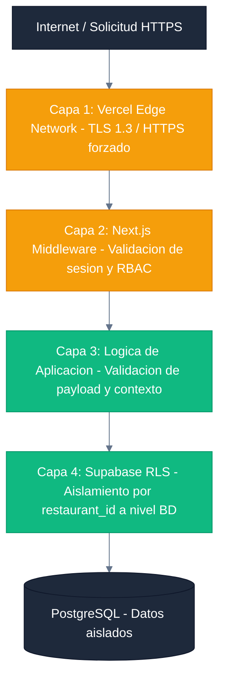
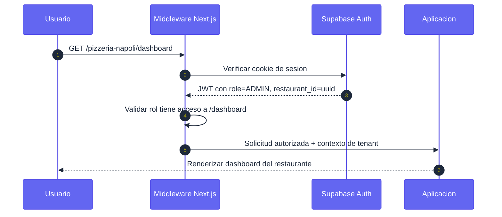

# Documentación de Seguridad — Sistema Menu Bites

**Versión:** 2.0.0 | **Modelo:** Defensa en profundidad (Edge → Middleware → RLS → BD)

Este documento detalla la arquitectura de seguridad y las medidas de protección implementadas en el sistema Menu Bites para garantizar la integridad, confidencialidad y disponibilidad de los datos de los restaurantes y sus clientes.

---

## 1. ARQUITECTURA DE SEGURIDAD (Capas de Defensa)

Menu Bites implementa seguridad en cuatro capas independientes. La vulneración de una capa no compromete las capas inferiores.



### Resumen de responsabilidades por capa

| Capa | Componente | Responsabilidad |
|---|---|---|
| **1 - Edge** | Vercel / Supabase CDN | TLS, HTTPS obligatorio, protección DDoS básica |
| **2 - Middleware** | `middleware.ts` de Next.js | Validar sesión JWT, verificar rol RBAC, resolver tenant por slug |
| **3 - Aplicación** | API Routes de Next.js | Sanitizar inputs, aplicar lógica de negocio, manejar errores sin exponer internals |
| **4 - Base de Datos** | PostgreSQL RLS de Supabase | Filtrar datos por `restaurant_id` a nivel de motor; última línea de defensa |

---

## 2. AISLAMIENTO MULTI-TENANT

### 2.1 Row Level Security (RLS)

Cada tabla transaccional tiene políticas RLS activas que filtran los datos según el `restaurant_id` del JWT del usuario autenticado. Esto garantiza que **un usuario del Restaurante A nunca pueda ver ni modificar datos del Restaurante B**, incluso si la lógica de aplicación falla.

Para el SQL completo de las políticas, ver [DATABASE_TECHNICAL.md](DATABASE_TECHNICAL.md).

**Ejemplo de política activa:**
```sql
CREATE POLICY "tenant_isolation"
ON public.orders FOR ALL TO authenticated
USING (
    restaurant_id = (SELECT restaurant_id FROM users WHERE id = auth.uid())
);
```

### 2.2 Aislamiento de Almacenamiento

Las imágenes del menú y logotipos se almacenan en **Supabase Storage** con la siguiente estructura:

```
bucket: menu-images/
└── {restaurant_id}/
    ├── logo.png
    └── items/
        └── {item_id}.jpg
```

Las políticas de Storage restringen la escritura al propietario del local, y la lectura pública solo está habilitada para archivos dentro del bucket `menu-images` (acceso de lectura anónimo para el Customer Portal).

---

## 3. AUTENTICACIÓN Y AUTORIZACIÓN

### 3.1 Gestión de Identidad (Supabase Auth)

- **Proveedor:** Supabase Auth (basado en GoTrue), compatible con OAuth 2.0.
- **Tokens:** JWT firmados con clave secreta de Supabase. TTL de sesión configurable.
- **Cookies:** Las sesiones se almacenan en cookies `HttpOnly` + `SameSite=Lax` + `Secure`, inaccesibles desde JavaScript del cliente.
- **Metadata:** El `restaurant_id` y el `role` se almacenan en `app_metadata` del JWT (campo del servidor, no editable por el cliente).

```typescript
// Lectura segura del contexto del usuario en el servidor
const session = await getSession();
const restaurantId = session?.user?.app_metadata?.restaurant_id;
const role = session?.user?.app_metadata?.role;
```

### 3.2 Control de Acceso Basado en Roles (RBAC)

El middleware de Next.js valida el rol antes de que la solicitud llegue a la lógica de negocio:

| Rol | Acceso permitido |
|---|---|
| `SUPER_ADMIN` | `/admin/*` — gestión global de la plataforma |
| `ADMIN` | `/[slug]/dashboard/*` — panel completo del restaurante |
| `GARZON` | `/[slug]/waiter/*` — terminal de garzón |
| `COCINA` | `/[slug]/kds/*` — Kitchen KDS |
| `CAJERO` | `/[slug]/cashier/*` — terminal de caja |
| `CLIENTE` | `/{slug}/*` — Customer Portal público |

Cualquier intento de acceder a una ruta fuera del alcance del rol resulta en una redirección a `/unauthorized` o a la ruta asignada al rol.

### 3.3 Flujo de Autenticación



---

## 4. SEGURIDAD EN EL MIDDLEWARE (EDGE)

### 4.1 Guardias de Ruta

El archivo `middleware.ts` implementa los siguientes controles en el borde (Edge Runtime):

1. **Verificación de sesión:** Toda ruta bajo `/dashboard`, `/kds`, `/waiter`, `/cashier` requiere sesión activa. Sin sesión → redirect a `/login`.
2. **Resolución de tenant:** El slug en la URL se resuelve al `restaurant_id` del restaurante. Si el slug no existe → 404.
3. **Validación de tenant del usuario:** El `restaurant_id` del JWT debe coincidir con el slug de la URL. Un ADMIN de "Pizzería A" no puede acceder al dashboard de "Pizzería B".
4. **Control de ruta por rol:** El middleware mapea roles a rutas permitidas y redirige si hay conflicto.

### 4.2 Protección contra Ataques Comunes

| Amenaza | Mecanismo de defensa |
|---|---|
| **XSS** | React escapa todo el contenido dinámico. Inputs sanitizados antes de persistir. Headers `Content-Security-Policy` configurados en Vercel. |
| **CSRF** | Cookies `SameSite=Lax` + tokens de sesión seguros. Las API Routes validan el origen de la solicitud. |
| **SQL Injection** | Prisma ORM usa queries parametrizadas; el SDK de Supabase nunca construye SQL crudo desde inputs de usuario. |
| **Tenant Leakage** | RLS en BD + validación de `restaurant_id` en middleware como doble garantía. |
| **Fuerza bruta** | Supabase Auth implementa rate limiting nativo en endpoints de login. |
| **IDOR** | Los IDs de recursos siempre se filtran con el `restaurant_id` del JWT, no con parámetros de la URL. |

---

## 5. GESTIÓN DE SECRETOS

### 5.1 Variables de Entorno

| Variable | Exposición | Descripción |
|---|---|---|
| `NEXT_PUBLIC_SUPABASE_URL` | Cliente (pública) | URL del proyecto Supabase |
| `NEXT_PUBLIC_SUPABASE_ANON_KEY` | Cliente (pública) | Clave anónima; segura por RLS |
| `SUPABASE_SERVICE_ROLE_KEY` | Solo servidor | Bypass de RLS — NUNCA exponer al cliente |
| `DATABASE_URL` | Solo servidor (build) | URL de conexión directa a PostgreSQL para migraciones |

**Regla fundamental:** Ninguna clave secreta (`SERVICE_ROLE_KEY`, `DATABASE_URL`) debe aparecer en código fuente ni ser accesible desde el navegador. Se gestionan exclusivamente en Vercel Environment Variables con acceso restringido a entornos específicos (`production`, `preview`).

### 5.2 Prohibición de Hardcoding

El código fuente no contiene secretos. La revisión de PRs incluye verificación automática de patrones de credenciales (`.env` no versionado, sin claves en código).

---

## 6. SEGURIDAD EN EL CUSTOMER PORTAL Y CÓDIGOS QR

### 6.1 Diseño del Código QR

Los códigos QR no contienen datos sensibles. El campo `qr_data` de la tabla `tables` almacena un token opaco único (UUID o hash) que el Customer Portal resuelve mediante `GET /api/customer/table?qr={token}`.

**Lo que el QR contiene:** Un token no predecible (ej: `550e8400-e29b-41d4-a716-446655440000`).
**Lo que el QR NO contiene:** `restaurant_id`, `table_id`, número de mesa ni ningún dato directamente explotable.

### 6.2 Prevención de Suplantación de Mesa

El backend valida que el `qr_data` recibido corresponde efectivamente a una mesa del restaurante en cuestión. Un cliente no puede fabricar un QR para acceder a la mesa de otro restaurante.

### 6.3 Acceso Anónimo Controlado

El Customer Portal opera con el rol `anon` de Supabase para lectura del menú y tema. La creación de pedidos requiere al menos identificación de sesión temporal (o sesión anónima de Supabase Auth para trazabilidad).

---

## 7. NUEVAS POLÍTICAS DE SEGURIDAD — v2.0

### 7.1 Tabla `reviews` — INSERT Público Controlado

La tabla `reviews` permite inserción anónima para que clientes sin sesión puedan calificar su experiencia. El riesgo de spam se mitiga mediante:

- La `order_id` debe existir en el sistema (FK implícita validada en servidor).
- El campo `rating` es validado server-side (1–5, obligatorio).
- La lectura (`SELECT`) está restringida a usuarios autenticados del mismo restaurante.

```sql
-- Política activa:
CREATE POLICY "reviews_insert_public" ON "reviews"
  FOR INSERT WITH CHECK (true);

CREATE POLICY "reviews_read_admin" ON "reviews"
  FOR SELECT USING (
    EXISTS (
      SELECT 1 FROM auth.users u
      WHERE u.id = auth.uid()
        AND (u.raw_app_meta_data->>'restaurant_id')::uuid = restaurant_id
    )
  );
```

### 7.2 Tabla `push_subscriptions` — Aislamiento por Usuario

Cada garzón solo puede leer y modificar su propia suscripción. Los administradores y el rol COCINA pueden leer todas las suscripciones del restaurante para poder enviar notificaciones.

```sql
-- Política de propiedad:
CREATE POLICY "push_sub_own" ON "push_subscriptions"
  FOR ALL USING (auth.uid() = user_id)
  WITH CHECK (auth.uid() = user_id);

-- Lectura por admin/cocina para envío de push:
CREATE POLICY "push_sub_admin_read" ON "push_subscriptions"
  FOR SELECT USING (
    EXISTS (
      SELECT 1 FROM auth.users u
      WHERE u.id = auth.uid()
        AND (u.raw_app_meta_data->>'restaurant_id')::uuid = restaurant_id
        AND u.raw_app_meta_data->>'role' IN ('ADMIN', 'COCINA')
    )
  );
```

### 7.3 Claves VAPID — Gestión Segura

| Clave | Ubicación | Exposición |
|---|---|---|
| `NEXT_PUBLIC_VAPID_PUBLIC_KEY` | `.env` + browser | Pública — seguro exponer |
| `VAPID_PRIVATE_KEY` | `.env` solo servidor | **Nunca** al cliente |
| `VAPID_EMAIL` | `.env` solo servidor | Contacto técnico |

Las claves VAPID deben rotarse si se filtran. Al rotar, todas las suscripciones existentes se invalidan y los garzones deben reabrir el terminal para re-suscribirse.

### 7.4 Endpoint `/api/bill-request` — Acceso Anónimo Controlado

Permite al cliente solicitar la cuenta sin autenticación. El riesgo de abuso es bajo porque:
- Requiere `table_id` válido (UUID real de la DB).
- Solo setea `bill_requested = true` (no crea ni elimina datos).
- El campo se resetea a `false` automáticamente al procesar el pago.
- No expone datos sensibles en la respuesta.

### 7.5 Comprobantes Digitales — Acceso Público Filtrado

Las páginas `/receipt/table/[id]` y `/receipt/session/[id]` son accesibles sin autenticación pero requieren el parámetro `?rid=[restaurantId]`. El servidor verifica que el `tableId` o `sessionId` pertenece al `restaurantId` proporcionado antes de retornar datos.

---

## 8. MONITOREO Y AUDITORÍA

- **Logs de acceso:** Vercel registra todas las solicitudes HTTP con timestamps, IPs y códigos de respuesta.
- **Auditoría de datos:** Todas las tablas incluyen `createdAt` y `updatedAt` con Timestamptz para trazabilidad temporal.
- **Alertas de Supabase:** El dashboard de Supabase expone métricas de queries lentas, errores de RLS y uso de Auth.
- **Recomendación futura:** Implementar tabla `audit_log` para registrar cambios críticos (cambios de rol, eliminación de restaurante, cambios de precio de menú).
