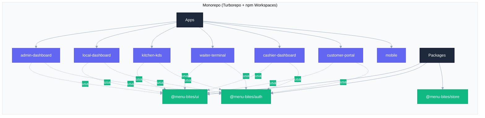
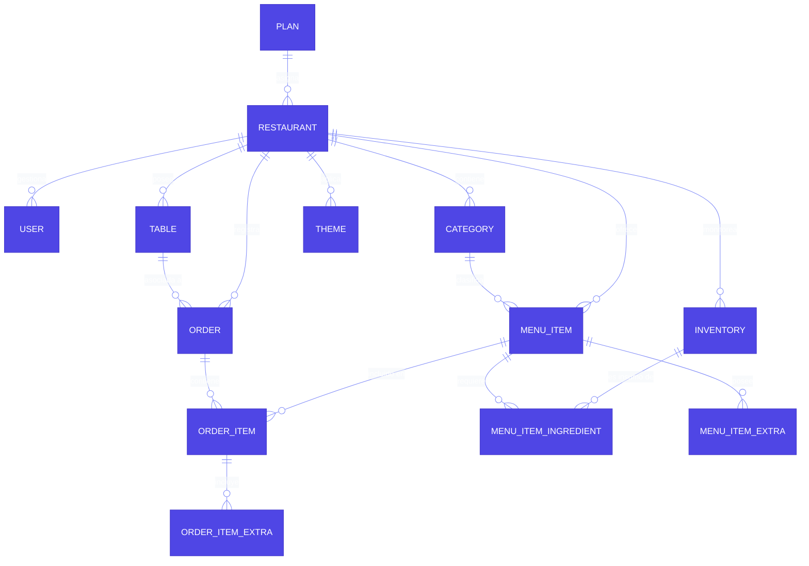
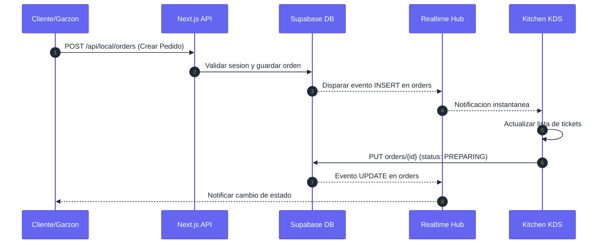
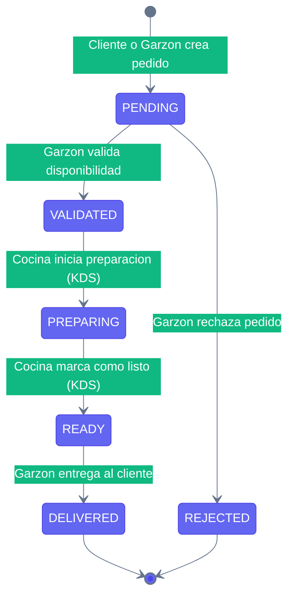
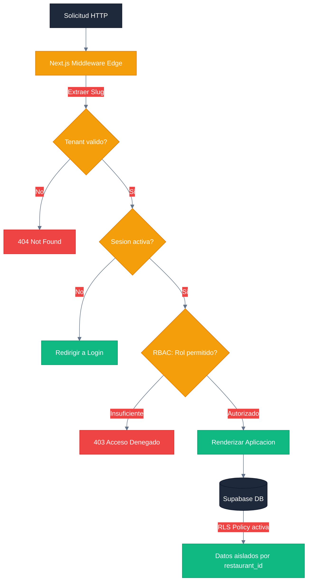
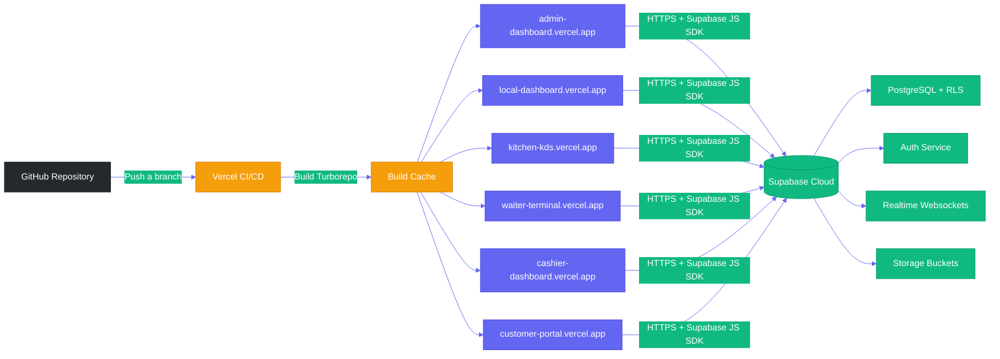

# Documento de Arquitectura de Software (SAD) — Menu Bites
**Versión:** 2.0.0 | **Alcance:** Arquitectura técnica, patrones de diseño e infraestructura del sistema de gestión de restaurantes Menu Bites.

---

## 1. VISIÓN GENERAL DEL SISTEMA

Menu Bites es una plataforma SaaS (Software as a Service) multitenant diseñada para digitalizar la operación de restaurantes. El sistema abarca desde la gestión administrativa global hasta la interacción directa del cliente mediante menús digitales con acceso vía QR.

### Principios de Diseño

- **Multitenancy por discriminador de columna:** Todos los recursos de negocio están vinculados a un `restaurant_id`, aislando los datos de cada local a nivel de base de datos.
- **Single source of truth:** `schema.prisma` es la fuente de verdad para todos los tipos y relaciones.
- **Realtime first:** Las vistas operativas (KDS, Waiter, Local Dashboard) usan suscripciones Supabase Realtime en lugar de polling.
- **Edge security:** La validación de sesión y roles ocurre en el middleware de Next.js antes de que la solicitud llegue a la lógica de negocio.

---

## 2. ARQUITECTURA DE SOFTWARE

### 2.1 Estructura de Monorepo

El proyecto utiliza una arquitectura de monorepo gestionada con **Turborepo** y **Workspaces de npm**, permitiendo compartir lógica, componentes y configuración entre las diferentes aplicaciones.

#### Aplicaciones (`apps/`):

| App | Rol | Usuario Destino |
|---|---|---|
| `admin-dashboard` | Panel de administración global de la plataforma SaaS | SUPER_ADMIN |
| `local-dashboard` | Panel operativo por restaurante: menú, pedidos, reportes, branding | ADMIN |
| `kitchen-kds` | Pantalla de cocina para gestión de tickets en tiempo real | COCINA |
| `waiter-terminal` | Terminal móvil para toma de pedidos y gestión de mesas | GARZON |
| `cashier-dashboard` | Panel de caja para cierre de cuentas y cobro | CAJERO |
| `customer-portal` | Portal web del cliente final, accedido vía código QR de mesa | CLIENTE |
| `mobile` | Aplicación móvil (en desarrollo) | GARZON / CLIENTE |

#### Paquetes Compartidos (`packages/`):

| Paquete | Descripción |
|---|---|
| `@menu-bites/ui` | Biblioteca de componentes React compartidos (`Button`, `Modal`, `Table`, `Badge`, `OrderTicket`, `Card`, `cn`, etc.) |
| `@menu-bites/auth` | Cliente Supabase instanciado y helpers de sesión (`getSession`, `signOut`, `supabase`) |
| `@menu-bites/store` | Estado global compartido (Zustand o similar) para datos cross-app |

#### Diagrama de Estructura del Monorepo



---

## 3. MODELO DE DATOS (ERD — Resumen)

La persistencia se basa en un esquema relacional en PostgreSQL, gestionado con Prisma ORM. La tabla `restaurants` actúa como eje central (Tenant) de todas las operaciones. Para el ERD completo con campos detallados, ver [DATABASE_SCHEMA.md](DATABASE_SCHEMA.md).



---

## 4. STACK TECNOLÓGICO

### Frontend y Framework

| Tecnología | Versión | Uso |
|---|---|---|
| **Next.js** | 14+ | App Router, SSR/CSR híbrido, middleware de Edge, API Routes |
| **React** | 18+ | Motor de UI |
| **TypeScript** | 5+ | Seguridad de tipos en todo el monorepo |
| **Tailwind CSS** | 3+ | Framework de estilos, glassmorphism, responsividad |

### Backend y Servicios

| Tecnología | Uso |
|---|---|
| **Supabase PostgreSQL** | Base de datos relacional con RLS habilitado |
| **Supabase Auth** | Gestión de identidad, JWT, sesiones, app_metadata (role, restaurant_id) |
| **Supabase Realtime** | Suscripciones a cambios en tablas (`orders`, `tables`) para actualizaciones instantáneas |
| **Supabase Storage** | Almacenamiento de imágenes de menú y logotipos (bucket `menu-images`) |
| **Prisma ORM** | Definición de tipos, migraciones y validación de esquema |

### Infraestructura y Tooling

| Herramienta | Uso |
|---|---|
| **Turborepo** | Orquestación de build del monorepo con cache distribuido |
| **Vercel** | Hosting y CI/CD de todas las apps |
| **npm Workspaces** | Gestión de dependencias inter-paquetes |

---

## 5. FLUJO DE DATOS Y ESTADOS

### 5.1 Ciclo de Vida de un Pedido



### 5.2 Máquina de Estados del Pedido



### 5.3 Gestión de Seguridad y Aislamiento (Multi-tenancy)



### 5.4 Motor de Marca Dinámica (Branding Engine)

```mermaid
%%{init: {
  'theme': 'base',
  'themeVariables': {
    'primaryColor': '#ffffff',
    'primaryTextColor': '#1e293b',
    'primaryBorderColor': '#e2e8f0',
    'lineColor': '#6366f1',
    'secondaryColor': '#6366f1',
    'tertiaryColor': '#f8fafc',
    'fontFamily': 'Inter, sans-serif'
  }
}}%%
graph LR
    classDef dbNode fill:#1e293b,stroke:#0f172a,color:#fff;
    classDef uiNode fill:#6366f1,stroke:#4f46e5,color:#fff;
    classDef processNode fill:#f8fafc,stroke:#e2e8f0,color:#1e293b;

    subgraph "Configuracion (Admin / Local Dashboard)"
        S[Guardar Tema en Branding Lab]:::uiNode
    end

    subgraph "Propagacion a Aplicaciones Cliente"
        L[Cargar config de Supabase]:::processNode --> P[Procesar colores a HSL]:::processNode
        P --> I[Inyectar CSS Custom Properties]:::processNode
        I --> U[UI actualizada en tiempo real]:::uiNode
    end

    S -->|Escritura en restaurant_themes| DB[(Supabase DB)]:::dbNode
    DB -->|Lectura al iniciar app| L
```



---

## 6. INFRAESTRUCTURA Y DESPLIEGUE

### 6.1 Diagrama de Despliegue



### 6.2 Estrategia de CI/CD

- **Vercel:** Plataforma de hosting para todas las aplicaciones del monorepo. El despliegue automático se activa con cada push a las ramas configuradas (`main` → producción, `develop` → staging).
- **Turborepo Build Cache:** Turborepo detecta qué paquetes cambiaron y solo recompila los afectados, reduciendo tiempos de build hasta en un 80%.
- **Variables de Entorno:** Cada aplicación tiene sus propias variables de entorno en Vercel (`NEXT_PUBLIC_SUPABASE_URL`, `NEXT_PUBLIC_SUPABASE_ANON_KEY`). El `SUPABASE_SERVICE_ROLE_KEY` nunca se expone al cliente.

### 6.3 Estrategia de Dominios (sin cambios)

---

## 7. ACTUALIZACIONES ARQUITECTÓNICAS — v2.0 (Waves 1–6)

### 7.1 Patrón de Componentes `_components/`

A partir de la Wave 6 se adoptó el patrón de extracción de sub-componentes dentro de cada app. Cada directorio `src/app/_components/` contiene componentes autónomos (solo reciben props, sin acceso a estado global):

| App | Componentes |
|---|---|
| `cashier-dashboard` | `AlertModal`, `OrderGroupCard`, `PaymentSlideOver` |
| `waiter-terminal` | `PendingOrderCard`, `ReadyOrdersBanner`, `TableMergeBar` |
| `customer-portal` | `OrderTracker`, `RatingModal`, `CuentaSheet`, `MenuItemCard` |

**Criterio de extracción:** Un bloque JSX se extrae cuando supera 50 líneas, tiene responsabilidad única y es reutilizable o testeable de forma independiente.

### 7.2 Paquete Compartido `@menu-bites/auth` — Extensiones

El paquete `packages/auth` ahora exporta dos módulos adicionales:

**`src/utils.ts` — Utilidades de negocio:**

| Función | Descripción |
|---|---|
| `formatCLP(n)` | Formatea número como moneda CLP |
| `timeAgo(iso)` | Tiempo relativo legible ("5 min", "1h") |
| `formatDateTime(iso)` | Fecha y hora formateada en es-CL |
| `orderItemTotal(item)` | Calcula subtotal de un ítem de orden |
| `diffMinutes(a, b)` | Diferencia en minutos entre dos timestamps |
| `pluralize(n, s, p?)` | Pluralización simple en español |

**`src/constants.ts` — Constantes operacionales:**

| Constante | Valor | Uso |
|---|---|---|
| `LOW_STOCK_THRESHOLD` | `5` | Umbral de stock bajo en inventario |
| `CRITICAL_STOCK_THRESHOLD` | `5` | Umbral crítico en API del KDS |
| `STALE_ORDER_MINUTES` | `3` | Minutos sin validar antes de escalación |
| `ORDER_STATUS_LABEL` | Record | Etiquetas en español por estado de orden |
| `TABLE_STATUS_LABEL` | Record | Etiquetas en español por estado de mesa |

### 7.3 Service Workers

Dos Service Workers registrados para resiliencia offline:

**KDS (`apps/kitchen-kds/public/sw.js`):**
- Estrategia Cache-First para `_next/static/`
- Estrategia Network-First con fallback para páginas
- En modo offline: sirve última carga cacheada; sincroniza al reconectar
- Registrado desde `layout.tsx` vía `window.load`

**Waiter Terminal (`apps/waiter-terminal/public/sw.js`):**
- Maneja eventos `push` del navegador para Web Push ORDER_READY
- Muestra notificación nativa del OS con título, cuerpo y vibración
- Maneja click en notificación: enfoca la pestaña o abre nueva

### 7.4 Arquitectura Web Push

```
[KDS actualiza orden a READY]
        ↓ Supabase Realtime
[Waiter Terminal detecta nuevo READY]
        ↓ fetch POST /api/push/notify
[Servidor lee push_subscriptions del restaurante]
        ↓ web-push + VAPID
[Servicios push (Google FCM / Mozilla)]
        ↓ protocolo Web Push
[Service Worker del garzón]
        ↓ showNotification()
[Notificación nativa del OS]
```

Las claves VAPID se configuran en `.env` bajo `NEXT_PUBLIC_VAPID_PUBLIC_KEY`, `VAPID_PRIVATE_KEY` y `VAPID_EMAIL`. La clave privada nunca llega al browser.

### 7.5 Ciclo de Vida de Mesa (actualizado)

```
FREE → OCCUPIED (al crear primer pedido)
     → CLEANING  (al procesar pago en caja)
     → FREE      (garzón confirma limpieza)
```

El campo `bill_requested` es un overlay booleano independiente del status. Una mesa puede estar `OCCUPIED + bill_requested=true` simultáneamente.

### 7.6 Timestamps de Ciclo de Vida en Órdenes

La función `updateOrderStatus()` en `@menu-bites/auth` escribe automáticamente:

| Transición | Campo escrito |
|---|---|
| `→ VALIDATED` | `validated_at` |
| `→ PREPARING` | `preparing_at` |
| `→ READY` | `ready_at` |

Estos timestamps habilitan el cálculo de KPIs operacionales sin instrumentación adicional.

### 6.3 Estrategia de Dominios

El sistema utiliza subrutas o subdominios para diferenciar organizaciones, orquestado mediante el middleware de Next.js:

```
app.menubites.com/{slug}/dashboard       → Local Dashboard del restaurante
app.menubites.com/{slug}/kds             → Kitchen KDS
app.menubites.com/{slug}/waiter          → Waiter Terminal
app.menubites.com/{slug}/cashier         → Cashier Dashboard
menu.menubites.com/{slug}                → Customer Portal (público)
```
