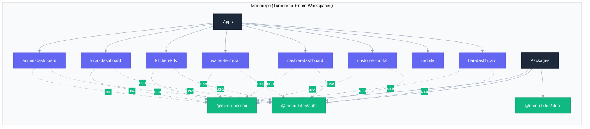
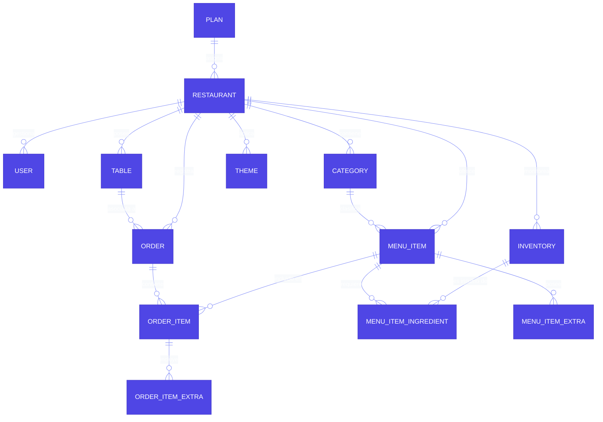
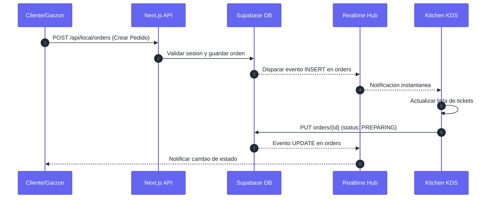
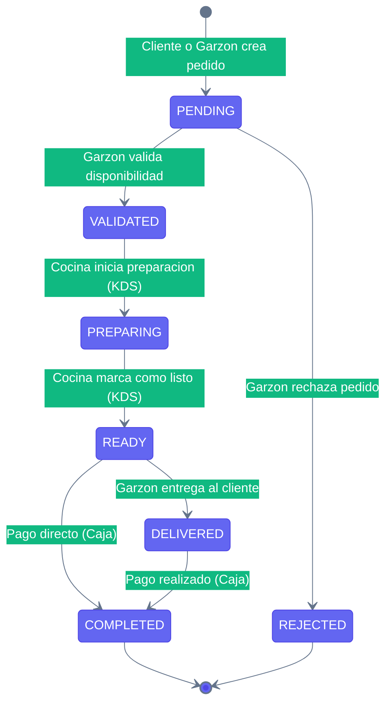
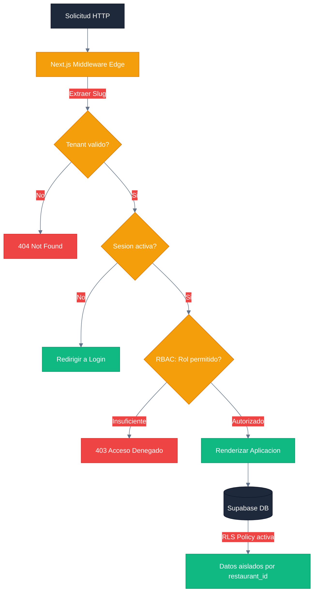
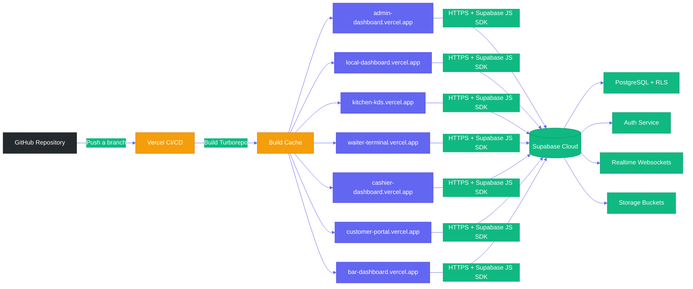

# Documento de Arquitectura de Software (SAD) — Menu Bites
**Versión:** 2.5.0 | **Alcance:** Arquitectura técnica, patrones de diseño e infraestructura del sistema de gestión de restaurantes Menu Bites.

---

## 1. VISIÓN GENERAL DEL SISTEMA

Menu Bites es una plataforma SaaS (Software as a Service) multitenant diseñada para digitalizar la operación de restaurantes. El sistema abarca desde la gestión administrativa global hasta la interacción directa del cliente mediante menús digitales con acceso vía QR.

### Principios de Diseño

- **Multitenancy por discriminador de columna:** Todos los recursos de negocio están vinculados a un `restaurant_id`, aislando los datos de cada local a nivel de base de datos.
- **Single source of truth:** `schema.prisma` es la fuente de verdad para todos los tipos y relaciones.
- **Realtime first:** Las vistas operativas (KDS, Waiter, Local Dashboard) usan suscripciones Supabase Realtime en lugar de polling.
- **Edge security:** La validación de sesión y roles ocurre en el middleware de Next.js antes de que la solicitud llegue a la lógica de negocio.

---

## 2. ARQUITECTURA DE SOFTWARE

### 2.1 Estructura de Monorepo

El proyecto utiliza una arquitectura de monorepo gestionada con **Turborepo** y **Workspaces de npm**, permitiendo compartir lógica, componentes y configuración entre las diferentes aplicaciones.

#### Aplicaciones (`apps/`):

| App | Puerto Dev | Rol | Usuario Destino |
|---|---|---|---|
| `admin-dashboard` | 3000 | SUPER_ADMIN | Panel de administración global de la plataforma SaaS |
| `local-dashboard` | 3003 | ADMIN | Panel operativo por restaurante: menú, pedidos, reportes, branding |
| `kitchen-kds` | 3001 | COCINA | Pantalla de cocina para gestión de tickets en tiempo real |
| `waiter-terminal` | 3002 | GARZON | Terminal móvil para toma de pedidos y gestión de mesas |
| `cashier-dashboard` | 3004 | CAJERO | Panel de caja para cierre de cuentas y cobro |
| `customer-portal` | 3005 | CLIENTE | Portal web del cliente final, accedido vía código QR de mesa |
| `bar-dashboard` | 3006 | BAR | KDS dedicado para la estación de barra (bebidas y cócteles) |
| `mobile` | — | GARZON / CLIENTE | Aplicación móvil (en desarrollo) |

#### Paquetes Compartidos (`packages/`):

| Paquete | Descripción |
|---|---|
| `@menu-bites/ui` | Biblioteca de componentes React compartidos: primitivos (`Button`, `Card`, `Badge`, `Input`), componentes del dashboard (`KpiGrid`, `LiveFlowMonitor`, `KDSColumn`, `OrderGroupCard`, `PaymentSlideOver`, `TableStatusBoard`), componentes del terminal (`PendingOrderCard`, `TableCard`, `TableMergeBar`), componentes del portal (`PortalMenuItemCard`, `PortalPrimaryButton`, `PortalHeading`, `PortalText`, `PortalCard`), `RestaurantThemeProvider` y `DynamicThemeWrapper`. |
| `@menu-bites/auth` | Cliente Supabase (`createBrowserClient`), helpers de sesión (`getSession`, `signOut`, `updateOrderStatus`, `sendAlert`, `getRestaurantTheme`), todos los hooks Realtime (`useRealtimeSync`, `useRealtimeOrders`, `useKitchenOrders`, `useBarOrders`, `useTables`, `useMenu`, `useRealtimeAlerts`, `useCashierOrders`, `useThemeSync`, `useRealtimeWaiterOrders`, `useCustomerPortal`, `useCustomerOrderTracker`) y todos los tipos del modelo de datos. |
| `@menu-bites/store` | Store Zustand `useAuthStore` con persistencia AES-encriptada en localStorage. La clave de cifrado se deriva de `hostname + userAgent` para prevenir extracción directa del token. |

#### Diagrama de Estructura del Monorepo



---

## 3. MODELO DE DATOS (ERD — Resumen)

La persistencia se basa en un esquema relacional en PostgreSQL, gestionado con Prisma ORM. La tabla `restaurants` actúa como eje central (Tenant) de todas las operaciones. Para el ERD completo con campos detallados, ver [DATABASE_SCHEMA.md](DATABASE_SCHEMA.md).



---

## 4. STACK TECNOLÓGICO

### Frontend y Framework

| Tecnología | Versión | Uso |
|---|---|---|
| **Next.js** | 16+ | App Router, SSR/CSR híbrido, middleware de Edge, API Routes |
| **React** | 19+ | Motor de UI |
| **TypeScript** | 5+ | Seguridad de tipos en todo el monorepo |
| **Tailwind CSS** | 4+ | Framework de estilos, glassmorphism, responsividad |

### Backend y Servicios

| Tecnología | Uso |
|---|---|
| **Supabase PostgreSQL** | Base de datos relacional con RLS habilitado |
| **Supabase Auth** | Gestión de identidad, JWT, sesiones, app_metadata (role, restaurant_id) |
| **Supabase Realtime** | Suscripciones a cambios en tablas (`orders`, `tables`) para actualizaciones instantáneas |
| **Supabase Storage** | Almacenamiento de imágenes de menú y logotipos (bucket `menu-images`) |
| **Prisma ORM** | Definición de tipos, migraciones y validación de esquema |

### Infraestructura y Tooling

| Herramienta | Uso |
|---|---|
| **Turborepo** | Orquestación de build del monorepo con cache distribuido |
| **Vercel** | Hosting y CI/CD de todas las apps |
| **npm Workspaces** | Gestión de dependencias inter-paquetes |

---

## 5. FLUJO DE DATOS Y ESTADOS

### 5.1 Ciclo de Vida de un Pedido



### 5.2 Máquina de Estados del Pedido



### 5.3 Gestión de Seguridad y Aislamiento (Multi-tenancy)



### 5.4 Motor de Marca Dinámica (Branding Engine)

```mermaid
%%{init: {
  'theme': 'base',
  'themeVariables': {
    'primaryColor': '#ffffff',
    'primaryTextColor': '#1e293b',
    'primaryBorderColor': '#e2e8f0',
    'lineColor': '#6366f1',
    'secondaryColor': '#6366f1',
    'tertiaryColor': '#f8fafc',
    'fontFamily': 'Inter, sans-serif'
  }
}}%%
graph LR
    classDef dbNode fill:#1e293b,stroke:#0f172a,color:#fff;
    classDef uiNode fill:#6366f1,stroke:#4f46e5,color:#fff;
    classDef processNode fill:#f8fafc,stroke:#e2e8f0,color:#1e293b;

    subgraph "Configuracion (Admin / Local Dashboard)"
        S[Guardar Tema en Branding Lab]:::uiNode
    end

    subgraph "Propagacion a Aplicaciones Cliente"
        L[Cargar config de Supabase]:::processNode --> P[Procesar colores a HSL]:::processNode
        P --> I[Inyectar CSS Custom Properties]:::processNode
        I --> U[UI actualizada en tiempo real]:::uiNode
    end

    S -->|Escritura en restaurant_themes| DB[(Supabase DB)]:::dbNode
    DB -->|Lectura al iniciar app| L
```



---

## 6. INFRAESTRUCTURA Y DESPLIEGUE

### 6.1 Diagrama de Despliegue



### 6.2 Estrategia de CI/CD

- **Vercel:** Plataforma de hosting para todas las aplicaciones del monorepo. El despliegue automático se activa con cada push a las ramas configuradas (`main` → producción, `develop` → staging).
- **Turborepo Build Cache:** Turborepo detecta qué paquetes cambiaron y solo recompila los afectados, reduciendo tiempos de build hasta en un 80%.
- **Variables de Entorno:** Cada aplicación tiene sus propias variables de entorno en Vercel (`NEXT_PUBLIC_SUPABASE_URL`, `NEXT_PUBLIC_SUPABASE_ANON_KEY`). El `SUPABASE_SERVICE_ROLE_KEY` nunca se expone al cliente.

### 6.3 Estrategia de Dominios (sin cambios)

---

## 7. ACTUALIZACIONES ARQUITECTÓNICAS — v2.0 (Waves 1–6)

### 7.1 Patrón de Componentes `_components/`

A partir de la Wave 6 se adoptó el patrón de extracción de sub-componentes dentro de cada app. Cada directorio `src/app/_components/` contiene componentes autónomos (solo reciben props, sin acceso a estado global):

| App | Componentes |
|---|---|
| `cashier-dashboard` | `AlertModal`, `OrderGroupCard`, `PaymentSlideOver` |
| `waiter-terminal` | `PendingOrderCard`, `ReadyOrdersBanner`, `TableMergeBar` |
| `customer-portal` | `OrderTracker`, `RatingModal`, `CuentaSheet`, `MenuItemCard` |

**Criterio de extracción:** Un bloque JSX se extrae cuando supera 50 líneas, tiene responsabilidad única y es reutilizable o testeable de forma independiente.

### 7.2 Paquete Compartido `@menu-bites/auth` — Extensiones

El paquete `packages/auth` ahora exporta dos módulos adicionales:

**`src/utils.ts` — Utilidades de negocio:**

| Función | Descripción |
|---|---|
| `formatCLP(n)` | Formatea número como moneda CLP |
| `timeAgo(iso)` | Tiempo relativo legible ("5 min", "1h") |
| `formatDateTime(iso)` | Fecha y hora formateada en es-CL |
| `orderItemTotal(item)` | Calcula subtotal de un ítem de orden |
| `diffMinutes(a, b)` | Diferencia en minutos entre dos timestamps |
| `pluralize(n, s, p?)` | Pluralización simple en español |

**`src/constants.ts` — Constantes operacionales:**

| Constante | Valor | Uso |
|---|---|---|
| `LOW_STOCK_THRESHOLD` | `5` | Umbral de stock bajo en inventario |
| `CRITICAL_STOCK_THRESHOLD` | `5` | Umbral crítico en API del KDS |
| `STALE_ORDER_MINUTES` | `3` | Minutos sin validar antes de escalación |
| `ORDER_STATUS_LABEL` | Record | Etiquetas en español por estado de orden |
| `TABLE_STATUS_LABEL` | Record | Etiquetas en español por estado de mesa |

### 7.3 Service Workers

Dos Service Workers registrados para resiliencia offline:

**KDS (`apps/kitchen-kds/public/sw.js`):**
- Estrategia Cache-First para `_next/static/`
- Estrategia Network-First con fallback para páginas
- En modo offline: sirve última carga cacheada; sincroniza al reconectar
- Registrado desde `layout.tsx` vía `window.load`

**Waiter Terminal (`apps/waiter-terminal/public/sw.js`):**
- Maneja eventos `push` del navegador para Web Push ORDER_READY
- Muestra notificación nativa del OS con título, cuerpo y vibración
- Maneja click en notificación: enfoca la pestaña o abre nueva

### 7.4 Arquitectura Web Push

```
[KDS actualiza orden a READY]
        ↓ Supabase Realtime
[Waiter Terminal detecta nuevo READY]
        ↓ fetch POST /api/push/notify
[Servidor lee push_subscriptions del restaurante]
        ↓ web-push + VAPID
[Servicios push (Google FCM / Mozilla)]
        ↓ protocolo Web Push
[Service Worker del garzón]
        ↓ showNotification()
[Notificación nativa del OS]
```

Las claves VAPID se configuran en `.env` bajo `NEXT_PUBLIC_VAPID_PUBLIC_KEY`, `VAPID_PRIVATE_KEY` y `VAPID_EMAIL`. La clave privada nunca llega al browser.

### 7.5 Ciclo de Vida de Mesa (actualizado)

```
FREE → OCCUPIED (al crear primer pedido)
     → CLEANING  (al procesar pago en caja)
     → FREE      (garzón confirma limpieza)
```

El campo `bill_requested` es un overlay booleano independiente del status. Una mesa puede estar `OCCUPIED + bill_requested=true` simultáneamente.

### 7.6 Timestamps de Ciclo de Vida en Órdenes

La función `updateOrderStatus()` en `@menu-bites/auth` escribe automáticamente:

| Transición | Campo escrito |
|---|---|
| `→ VALIDATED` | `validatedAt` (antes `validated_at`) |
| `→ PREPARING` | `preparingAt` (antes `preparing_at`) |
| `→ READY` | `readyAt` (antes `ready_at`) |
| `→ COMPLETED` | `updatedAt` (Snapshot final) |

Estos timestamps habilitan el cálculo de KPIs operacionales (Kitchen Times) sin instrumentación adicional. Se ha garantizado la compatibilidad con el módulo de reportes mediante el uso de aliases en la API de analítica.

### 7.7 Motor de Sincronización en Tiempo Real (Realtime Sync Engine)

A partir de la Wave 8, el sistema abandonó las suscripciones manuales ad-hoc en favor de un motor centralizado en `@menu-bites/auth/hooks.ts` denominado `useRealtimeSync`.

#### Arquitectura de Reactividad:
- **Hook `useRealtimeSync`**: Hook genérico que gestiona el ciclo de vida de la conexión (suscripción, manejo de errores, limpieza de canales y reconexión).
- **Estrategia de Actualización**: Ante cualquier evento de Postgres (`INSERT`, `UPDATE`, `DELETE`) en las tablas configuradas, el motor dispara una función de refresco (`performFetch`) que invalida el estado local y sincroniza con la base de datos, garantizando consistencia absoluta sin recargas de página.
- **Tablas Habilitadas**: `orders`, `tables`, `order_items`, `alerts`, `restaurant_themes`.

### 7.8 Sistema de Asistencia en Mesa (Llamar Garzón)

Implementado en v2.2.0, este sistema permite la comunicación directa Cliente-Garzón sin pasar por el panel administrativo central, optimizando el flujo de trabajo en sala:
- **Trigger:** Botón en Customer Portal actualiza `tables.help_requested = true`.
- **Notificación:** El `waiter-terminal` detecta el cambio vía Realtime y muestra una **Isla de Ayuda** (UI roja pulsante).
- **Resolución:** El garzón limpia la solicitud directamente desde su terminal, sincronizando el estado global.

### 7.9 Optimización de Alertas y Sonidos

Se ha refinado el sistema de notificaciones para evitar bucles de sonido:
- **Persistence Check:** El hook `useAlerts` ahora utiliza una referencia de conteo inicializada en `-1` para diferenciar la carga inicial (o navegación entre páginas) de la llegada de nuevas alertas reales.
- **UI Non-Transparent:** Los paneles de alertas ahora utilizan fondos sólidos para garantizar legibilidad Pro Max sobre cualquier fondo de mapa o dashboard.

### 7.10 Resiliencia en Tiempo de Construcción (Build-Time Resilience)

A partir de la v2.2.0, se ha estandarizado un patrón de **inicialización perezosa (lazy initialization)** para el cliente `supabaseAdmin` en las API Routes. 

**Problema:** La inicialización global de clientes administrativos en el scope superior de los archivos de ruta causaba fallos en el build de Vercel/Turbo cuando las variables de entorno (`SUPABASE_SERVICE_ROLE_KEY`) no estaban presentes durante la fase de análisis estático o generación de páginas estáticas.

**Solución:** Los clientes `supabaseAdmin` deben instanciarse exclusivamente dentro del cuerpo de la función del handler (`GET`, `POST`, etc.). Esto garantiza que:
- La aplicación compile sin errores incluso si las variables de entorno de servidor no están presentes en el entorno de build.
- El cliente se cree solo cuando hay una solicitud real.
- Se eviten fugas de memoria por instancias globales innecesarias en funciones serverless.

### 7.11 Refactorización UX/UI Pro Max (v2.3.0)

En la Wave 9 se implementó una actualización profunda de la interfaz del portal de clientes centrada en la solidez visual y la eliminación de fricción operativa:

- **Navegación Sólida:** Introducción de un flag `isSolid` en los encabezados premium para forzar opacidad total, resolviendo problemas de legibilidad en dispositivos móviles bajo condiciones de alta luminosidad.
- **Flujo de Pedido Automatizado:** El portal ahora vincula automáticamente el pedido a la mesa mediante el parámetro `tableNumber` de la URL, eliminando el paso de entrada manual de mesa en el checkout.
- **Arquitectura de Cierre de Ciclo:** Se optimizó la transición post-pedido. Al confirmar una orden, el modal de checkout se cierra instantáneamente mediante una promesa booleana, y al regresar al menú se invoca `resetOrder()` para limpiar el estado del rastreador, dejando la interfaz lista para nuevas interacciones.

---

### 7.12 Integración Bar KDS y Arquitectura Dual-Estación (v2.4.0)

#### 7.12.1 Nueva App: Bar Dashboard

Se incorporó `apps/bar-dashboard` (puerto 3006) como estación KDS dedicada para personal de barra (`role: BAR`). Replica el patrón de `kitchen-kds` adaptado para bebidas y cócteles.

**Características técnicas:**
- Cookie de sesión aislada: `sb-bar-session` (mismo patrón de aislamiento que las demás apps)
- Proxy de autenticación en `src/proxy.ts` que valida exclusivamente el rol `BAR`
- Interfaz de tres columnas: **Pedidos Nuevos** (VALIDATED) → **En Barra** (PREPARING) → **Para Despacho** (READY)
- Sistema de alertas sonoras con dos SFX: nuevo ticket y alerta crítica
- Auto-despacho configurable: los tickets READY se ocultan automáticamente tras un delay configurado
- Modal `StockAlertModal` para reportar quiebres de stock (`type: STOCK_SHORTAGE`) a la tabla `alerts`
- `PremiumHeader` con estadísticas en tiempo real (contador por columna)

#### 7.12.2 Enrutamiento Dual-Estación de Pedidos

El modelo de pedidos fue extendido para soportar preparación independiente en Cocina y Barra. Un pedido mixto (que contiene ítems de ambas estaciones) no pasa a READY globalmente hasta que ambas estaciones hayan completado sus ítems.

**Nuevas columnas en tabla `orders`:**

| Campo | Tipo | Descripción |
|---|---|---|
| `kitchen_preparing` | `boolean` | La cocina está preparando sus ítems |
| `kitchen_ready` | `boolean` | La cocina completó sus ítems |
| `bar_preparing` | `boolean` | La barra está preparando sus ítems |
| `bar_ready` | `boolean` | La barra completó sus ítems |

**Lógica de transición de estado (función `updateOrderStatus` en `@menu-bites/auth`):**

```
Al marcar READY en Barra:
  bar_ready = true
  bar_preparing = false
  Si el pedido NO tiene ítems de Cocina → status global = READY
  Si el pedido tiene ítems de Cocina Y kitchen_ready = true → status global = READY
  De lo contrario → status global = PREPARING (cocina aún trabaja)
```

**Filtrado de ítems por estación:** El hook `useRealtimeOrders()` acepta un parámetro `station: StationType` ('KITCHEN' | 'BAR'). Al pasar la estación:
1. Filtra los ítems del pedido para mostrar solo los de esa estación (`category.target_station === station`).
2. Calcula el estado virtual del pedido para esa estación usando los flags `kitchen_ready`/`bar_ready`.
3. Excluye pedidos que no tengan ítems de la estación solicitada.

#### 7.12.3 Campo `target_station` en Categorías

La tabla `categories` incorpora el campo `target_station: StationType` (valores: `'KITCHEN'` | `'BAR'`). Este campo determina a qué estación KDS se enrutan los ítems de cada categoría.

| Categoría | target_station | Ejemplo |
|---|---|---|
| Entradas, Fondos, Postres | `KITCHEN` | Pizza, Ensalada, Tiramisú |
| Bebidas, Cócteles, Jugos | `BAR` | Mojito, Agua Mineral, Pisco Sour |

#### 7.12.4 Sistema de Configuración KDS (`kds_settings`)

Se creó la tabla `kds_settings` con un diseño de **JSON polimórfico por estación** que evita colisiones entre Cocina y Barra compartiendo una sola fila por restaurante:

```json
{
  "KITCHEN": {
    "thresholds": { "yellow": 10, "red": 20 },
    "categoryTimes": [{ "name": "Pizza", "minutes": 15 }],
    "sounds": { "newTicket": true, "criticalAlert": true },
    "autoClear": { "enabled": false, "delaySeconds": 30 }
  },
  "BAR": {
    "thresholds": { "yellow": 5, "red": 12 },
    "categoryTimes": [{ "name": "Cócteles", "minutes": 8 }],
    "sounds": { "newTicket": true, "criticalAlert": true },
    "autoClear": { "enabled": true, "delaySeconds": 20 }
  }
}
```

**API Routes:**
- `GET /api/settings` → Lee `kds_settings.settings.BAR` (o `KITCHEN` según la app)
- `POST /api/settings` → Hace upsert solo en la clave de estación correspondiente, preservando la config de la otra estación

**Modal de configuración (Bar Dashboard) — 6 pestañas:**

| Pestaña | Función |
|---|---|
| Sin Stock (86items) | Marcar/desmarcar ítems de barra sin disponibilidad (escribe `is_active` en `menu_items`) |
| Tiempos por Bebida | Definir tiempos objetivo por categoría de bebida |
| Alertas de Tiempo | Configurar umbrales de urgencia (amarillo/rojo en minutos) |
| Notificaciones | Activar/desactivar sonidos de nuevo ticket y alerta crítica |
| Auto-despacho | Habilitar ocultado automático de tickets READY tras N segundos |
| Inventario | Vista de stock actual de insumos de barra |

#### 7.12.5 Función `sendAlert()` en `@menu-bites/auth`

Nueva función exportada del paquete `auth` para insertar registros en la tabla `alerts`:

```typescript
sendAlert({
  restaurantId: string,
  userId?: string,
  userEmail?: string,
  type: AlertType,          // 'STOCK_SHORTAGE' | 'HELP_REQUEST' | ...
  message: string,
  tableNumber?: number,
  menuItemId?: string,
  menuItemName?: string,
})
```

Utilizada por el `StockAlertModal` del bar-dashboard para notificar al ADMIN sobre quiebres de stock en la barra.

#### 7.12.6 Hooks Especializados en `@menu-bites/auth`

| Hook | Descripción |
|---|---|
| `useBarOrders(restaurantId)` | Órdenes filtradas por estación BAR; calcula status virtual por estación |
| `useKitchenOrders(restaurantId)` | Órdenes filtradas por estación KITCHEN (refactorizado) |
| `useRealtimeOrders(restaurantId, options)` | Base genérica; acepta `station`, `statuses`, `limit`, `ascending` |

---

### 7.13 Resolución de Incidencia: Auth Callback 404 (Turbopack Cache)

**Síntoma:** `GET /auth/callback 404` al intentar hacer login con usuario ADMIN en `local-dashboard`.

**Causa raíz:** El servidor de desarrollo de Next.js con Turbopack mantiene un caché compilado en `.next/`. Cuando se realizan cambios en archivos de ruta o se agregan nuevas páginas, Turbopack puede no detectar el cambio automáticamente, dejando el manifiesto de rutas desactualizado y retornando 404 para rutas que sí existen en el código fuente.

**Solución aplicada:** Reinicio del servidor de desarrollo (`npm run dev` desde `Producto/`), lo que fuerza la recompilación completa del grafo de módulos en Turbopack.

**Patrón de resolución para incidencias similares:**
```bash
# Desde Producto/
turbo dev --filter=local-dashboard   # Reinicio limpio
# O si persiste:
rm -rf apps/local-dashboard/.next && turbo dev --filter=local-dashboard
```

**Nota arquitectónica:** La ruta `auth/callback/page.tsx` existe en todas las apps y maneja tokens de sesión Supabase en el hash de la URL (`#access_token=...`). El middleware de cada app (`src/proxy.ts`) tiene un bypass explícito para `/auth/callback` que permite el paso sin validación de sesión.

---

### 7.14 Auditoría de Tokens Residuales y Primitivos del Portal (v2.5.0)

En la versión 2.5.0 se consolidó la arquitectura temática del sistema, permitiendo una personalización profunda y dinámica de la identidad visual de cada restaurante, garantizando al mismo tiempo la coherencia técnica y estética (FCTO 5/5).

#### 7.14.1 Motor de Tematización Dinámica (Branding Engine)

El sistema utiliza un motor de inyección de CSS Variables en tiempo de ejecución. El componente `RestaurantThemeProvider` en `@menu-bites/ui` consume la configuración de la tabla `restaurant_themes` y la inyecta en el `:root` del documento.

**Arquitectura de Fuentes Estabilizada:**
- **Variables de Stack:** Se utilizan variables de stack completas (`--font-title-stack`, `--font-body-stack`, `--font-accent-stack`) que incluyen fallbacks nativos (`system-ui`, `sans-serif`), evitando parpadeos de fuente (FOUT) y garantizando herencia reactiva.
- **Alias de Compatibilidad:** Se inyectan alias como `--font-outfit` y `--font-inter` vinculados dinámicamente a las fuentes elegidas, asegurando que componentes heredados o de terceros sigan respondiendo al tema global.
- **Herencia en Body:** El `globals.css` fuerza la herencia de `--font-body-stack` en todo el documento, eliminando la necesidad de aplicar clases de fuente manualmente en la mayoría de los contenedores.

**Variables Semánticas Inyectadas:**
- **Colores:** `--primary`, `--primary-foreground`, `--background`, `--card`, `--card-foreground`, `--success`, `--destructive`.
- **Tipografía:** `--font-title` (Encabezados), `--font-body` (Cuerpo), `--font-accent` (Acentos/Botones).
- **Efectos:** `--radius` (Bordes), `--glass-opacity` (Nivel de desenfoque).

#### 7.14.2 Primitivos de UI del Portal (`Portal Primitives`)

Para garantizar que todos los componentes del portal de clientes hereden correctamente el tema dinámico y eviten estilos "hardcodeados", se crearon primitivos semánticos en `packages/ui/src/components/portal/primitives/`:

| Componente | Función |
|---|---|
| `PortalHeading` | Encabezados (h1-h6) que heredan automáticamente `--font-title`. |
| `PortalText` | Bloques de texto que heredan `--font-body`. Soporta variante `muted`. |
| `PortalPrimaryButton` | Botones de acción principal que heredan `--font-accent` y colores primarios. |
| `PortalCard` | Contenedores con efectos de glassmorphism y bordes dinámicos. |

**Beneficios:**
1. **Mantenibilidad:** Los cambios en el sistema de diseño se realizan en un solo lugar.
2. **Consistencia:** Se garantiza que la tipografía de un botón coincida con el acento del restaurante.
3. **Clean Code:** Se reemplazaron etiquetas HTML nativas con estilos manuales por componentes semánticos con nombres descriptivos.

#### 7.14.3 Estándar de Documentación de Código (Clean Code)

A partir de la v2.5.0 se implementó un sistema de comentarios JSDoc en español en todos los archivos TypeScript del monorepo (~280 archivos entre `apps/` y `packages/`). El objetivo es permitir que cualquier desarrollador comprenda el propósito de cada módulo, función y componente sin necesidad de navegar por toda la jerarquía.

**Tipos de comentarios aplicados:**

**1. Cabecera de archivo** — todo archivo `.ts` / `.tsx` comienza con un bloque que describe su responsabilidad, contexto y relaciones:
```typescript
/**
 * useRealtimeSync — Hook base de sincronización en tiempo real con Supabase Postgres Changes.
 * Realiza un fetch inicial y luego suscribe a cambios de la tabla indicada filtrando por
 * restaurant_id. Incluye reconexión automática con backoff exponencial (hasta MAX_RETRIES).
 * Todos los hooks de datos del sistema se construyen sobre este hook.
 */
```

**2. JSDoc de función / hook / componente exportado** — describe el comportamiento, side effects y parámetros no obvios:
```typescript
/**
 * Agrupa sub-órdenes (KITCHEN y BAR) por mesa en un único objeto Order fusionado.
 * El status resultante es el de mayor prioridad: READY > PREPARING > VALIDATED > PENDING.
 * @param restaurantId - UUID del restaurante obtenido del JWT.
 */
export function useRealtimeWaiterOrders(restaurantId: string | undefined) {
```

**3. Comentarios de sección** — en archivos con múltiples responsabilidades:
```typescript
// ─────────────────────────────────────────
// QUERIES DE LECTURA
// ─────────────────────────────────────────
```

**4. Comentarios inline** — solo para lógica no obvia (decisiones de seguridad, workarounds, invariantes del sistema):
```typescript
// El token de anon puede ser null en rutas públicas — es intencional para tablas
// con RLS SELECT abierto. El hook silencia este error.
```

**5. Documentación de props** — en interfaces de componentes React:
```typescript
interface Props {
  /** Slug del restaurante; se usa para resolver el tenant en RLS */
  restaurantSlug: string
}
```

**Cobertura alcanzada (v2.5.0):**

| Scope | Archivos comentados |
|---|---|
| `apps/customer-portal` | 27 archivos |
| `apps/local-dashboard` | ~98 archivos |
| `apps/waiter-terminal` | Completado |
| `apps/kitchen-kds` | Completado |
| `apps/cashier-dashboard` | Completado |
| `apps/bar-dashboard` | Completado |
| `apps/admin-dashboard` | Completado |
| `packages/auth` | 14 archivos |
| `packages/ui` | 47 archivos |
| `packages/store` | 1 archivo |

**Reglas de integridad:**
- Todo `/**` debe cerrarse con `*/` antes de la declaración que documenta.
- Los comentarios inline no se insertan dentro de objetos literales, arrays ni template strings.
- Los divisores `// ─── ` van entre declaraciones, nunca dentro de una función abierta.
- Los comentarios no describen el QUÉ (ya lo hace el nombre) sino el POR QUÉ y el CONTEXTO.

---

## 8. CONCLUSIÓN
El sistema Menu Bites v2.5.0 incorpora una arquitectura dual-estación completa y un motor de branding dinámico que garantiza la excelencia visual y operativa. Con la introducción de los **Primitivos del Portal**, el sistema alcanza un nivel de madurez técnica superior, facilitando la escalabilidad y el mantenimiento de la interfaz de cliente bajo estándares de diseño "Pro Max".

### 9. APÉNDICE DE SEGURIDAD Y CUMPLIMIENTO
Próximamente se integrará el módulo de auditoría de logs centralizada en el Data Warehouse para asegurar trazabilidad completa ante incidentes críticos (Wave 10).
