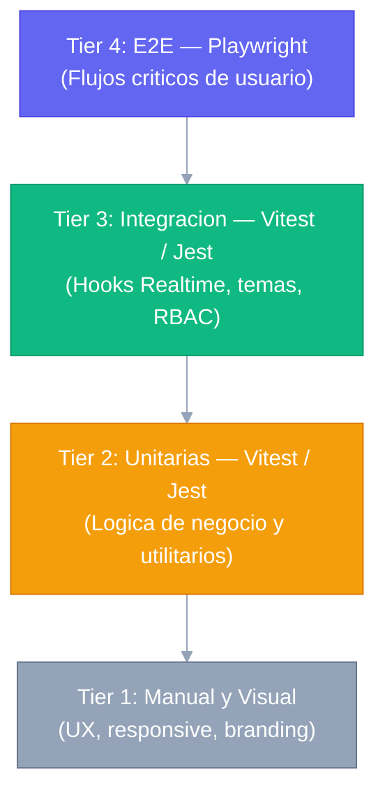
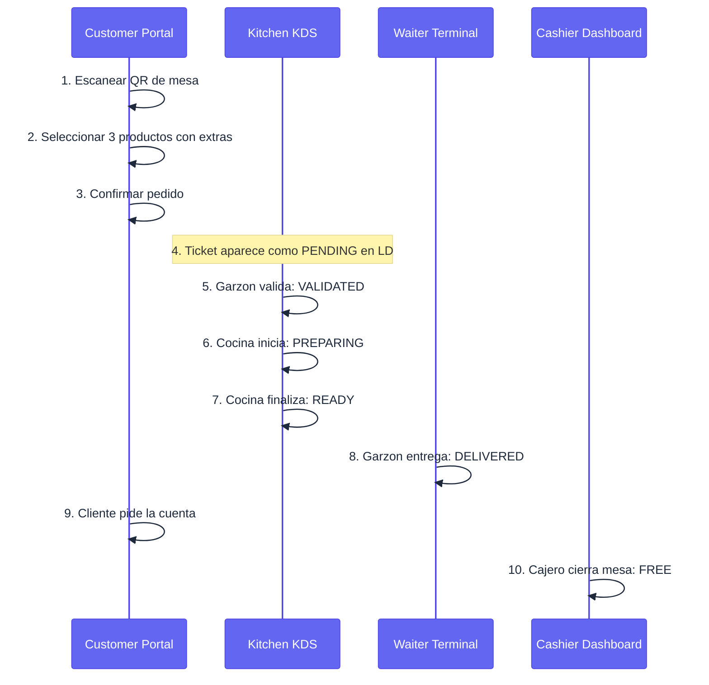

# Plan de Pruebas Maestro — Menu Bites

**Propósito:** Estrategia QA del sistema. Define la pirámide de pruebas, herramientas, responsables, criterios de PASS/FAIL y el checklist de regresión pre-release. Para el catálogo detallado de casos de prueba individuales con criterios de aceptación, ver [SUGGESTED_TESTS.md](SUGGESTED_TESTS.md).

---

## 1. ESTRATEGIA DE PRUEBAS

El sistema utiliza una pirámide de pruebas balanceada para garantizar la estabilidad de la arquitectura multi-tenant:



| Nivel | Enfoque | Herramienta | Responsable |
|---|---|---|---|
| **Unitarias** | Funciones puras, formateadores, cálculos | Vitest / Jest + RTL | Desarrollador |
| **Integración** | Hooks Realtime, temas dinámicos, RBAC | Vitest / Jest | Desarrollador / QA |
| **E2E Funcional** | Flujos críticos de usuario completos | Playwright | QA Engineer |
| **Manual / Visual** | Estética, UX, responsive, accesibilidad | Browser Testing | QA / Diseñador |

### 1.1 Comandos de Ejecución

```bash
# Ejecutar todos los tests del monorepo (12 workspaces via Turborepo)
cd Producto && npm test

# Ejecutar tests de un workspace específico
npx turbo test --filter="@menu-bites/auth"
npx turbo test --filter="@menu-bites/ui"
npx turbo test --filter="@menu-bites/store"

# Pruebas E2E con Playwright (requiere apps corriendo)
npm run test:e2e
npm run test:e2e:ui
```

---

## 2. CRITERIOS DE PASS / FAIL

### Criterio de PASS (Release autorizado)

- [ ] 100% de pruebas unitarias pasando (`cd Producto && npm test`).
- [ ] 0 fallos en pruebas de integración de RLS (tenant leakage = 0).
- [ ] Todos los flujos E2E críticos (Sección 3) pasan en Chromium y WebKit.
- [ ] Sin errores de consola en rutas críticas.
- [ ] Tiempo de carga del Customer Portal < 3s en red simulada 4G.

### Criterio de FAIL (Release bloqueado)

- [ ] Cualquier prueba de seguridad (tenant leakage, IDOR) falla.
- [ ] El flujo E2E de creación de pedido falla.
- [ ] El flujo E2E de cierre de mesa falla.
- [ ] Una API crítica retorna 500 en el happy path.

---

## 3. FLUJOS E2E CRÍTICOS (Obligatorios antes de Release)

### 3.1 Flujo Completo de Pedido (Happy Path)



**Verificaciones en cada paso:**
1. La URL contiene el `restaurant_id` y `table_id` correctos.
2. El carrito refleja precio × cantidad correctamente.
3. El pedido aparece en el Local Dashboard con estado `PENDING`.
4. El KDS recibe el ticket sin refrescar (Realtime).
5–8. Cada cambio de estado propaga por Realtime a todos los dashboards abiertos.
9. El badge de cuenta aparece en Cashier Dashboard.
10. La mesa vuelve a estado `FREE` en el mapa del Waiter Terminal.

### 3.2 Aislamiento Multi-Tenant (Seguridad Crítica)

1. Autenticar como ADMIN del `Restaurante A`.
2. Intentar acceder a `/restaurante-b/dashboard` → esperar redirección o 403.
3. Intentar llamar a `GET /api/local/orders` con el JWT de Restaurante A → esperar lista vacía o 403 (nunca datos de B).
4. **Verificar que RLS retorna 0 filas**, no error 500.

### 3.3 Flujo de Branding en Tiempo Real

1. ADMIN cambia el color primario en Branding Lab.
2. Guardar y activar el tema.
3. Abrir el Customer Portal en otra pestaña.
4. **Verificar** que el color cambió sin recargar la página.

Los specs E2E se encuentran en `Producto/e2e/`:

- `admin-login.spec.ts` — flujo de autenticación del administrador
- `customer-portal.spec.ts` — portal público de cliente (sin autenticación requerida)

---

## 4. PRUEBAS DE INTEGRACIÓN (Hooks y Servicios)

Las pruebas de integración están implementadas como suites Vitest/Jest en `packages/auth/src/__tests__/` y cubren la lógica de negocio que depende de la comunicación con Supabase.

```bash
npx turbo test --filter="@menu-bites/auth"
```

### 4.1 Aislamiento de Datos (RLS)

Casos cubiertos por los tests existentes:

- Usuario de Restaurante A no puede leer datos de órdenes de Restaurante B (validado via hooks con cliente autenticado).
- Usuario `anon` puede leer `menu_items` con `is_active=true` (validado en tests de portal público).
- `service_role` tiene acceso irrestricto para procesos administrativos.
- El hook `useRealtimeSync` setea correctamente el token de auth antes de suscribirse al canal Realtime.

### 4.2 Sincronización Realtime

Los hooks de Realtime (`useRealtimeOrders`, `useRealtimeStats`, `useRealtimeSync`) son probados en `packages/auth/src/__tests__/`. Casos cubiertos:

- Al hacer INSERT en `orders`, el callback del subscriber es invocado correctamente.
- Al hacer UPDATE de `table.help_requested`, el estado local del hook se actualiza sin refresco de página.
- Al desconectar el canal y reconectar, el estado se reconcilia correctamente vía re-suscripción.

### 4.3 Temas, Alertas y RBAC

- Los tests de temas verifican que `useThemeSync` aplica las variables CSS correctas según el tema activo del restaurante.
- Los tests de alertas verifican el comportamiento cuando una orden supera el umbral de tiempo configurado.
- Los tests de RBAC verifican que los roles `GARZON`, `COCINA`, `CAJERO` y `BAR` acceden únicamente a las rutas autorizadas.

---

## 5. PRUEBAS DE RENDIMIENTO

| Escenario | Herramienta | Umbral aceptable |
|---|---|---|
| Carga del Customer Portal (4G simulado) | Lighthouse / WebPageTest | < 3s LCP |
| 50 pedidos simultáneos desde diferentes mesas | Artillery / k6 | Sin pérdida de eventos Realtime |
| Carga de imágenes de menú | Lighthouse | < 200KB por imagen (WebP) |
| Tiempo de respuesta de API local | Postman / k6 | < 300ms p95 en BD no cargada |

---

## 6. CHECKLIST QA MANUAL (Pre-Release)

### Experiencia Móvil (Customer Portal / Waiter Terminal)

- [ ] Menú navegable con una sola mano en iPhone SE (375px de ancho).
- [ ] Botones de "Agregar al carrito" con área táctil >= 44×44px.
- [ ] Texto legible en exterior (contraste WCAG AA mínimo).
- [ ] El formulario de pedido no queda tapado por el teclado virtual.

### Experiencia Desktop (Admin / Local Dashboard)

- [ ] Tablas de datos con scroll horizontal en pantallas < 1280px.
- [ ] Gráficos de reportes no se solapan con textos.
- [ ] El simulador de marca en Branding Lab refleja el Customer Portal fielmente.

### Estética y Consistencia

- [ ] Iconos Lucide consistentes en tamaño y grosor en todas las apps.
- [ ] Efecto glassmorphism visible en modales y cards en tema oscuro.
- [ ] Transiciones de página suaves (no flashes de contenido).
- [ ] El tema del restaurante se aplica correctamente en Customer Portal al cargar.

---

## 7. PRUEBAS DE ESTRÉS

- **Concurrencia Realtime:** 50 suscriptores simultáneos al canal `orders` durante 5 minutos. Verificar 0 eventos perdidos.
- **Latencia 3G:** Simular conexión 3G (50kbps down) en Customer Portal. Los skeletons de carga deben aparecer y el menú cargar en < 8s.

---

## 8. PLAN DE PRUEBAS — NUEVAS FUNCIONALIDADES v2.0

### 8.1 Flujo Completo de Órdenes

| ID | Caso | App | Resultado Esperado |
|---|---|---|---|
| F-01 | Cliente crea orden | Customer Portal | Mesa pasa a OCCUPIED; orden aparece en Waiter Terminal |
| F-02 | Garzón valida orden | Waiter Terminal | Orden pasa a VALIDATED; aparece en KDS columna "Pedidos Nuevos" |
| F-03 | Garzón rechaza única orden activa | Waiter Terminal | Mesa vuelve a FREE automáticamente |
| F-04 | KDS mueve a PREPARING | Kitchen KDS | Waiter Terminal refleja estado; Cashier no ve aún |
| F-05 | KDS mueve a READY | Kitchen KDS | Cashier ve la orden; garzón recibe alerta sonora |
| F-06 | Cashier cobra | Cashier Dashboard | Órdenes → DELIVERED; mesa → CLEANING; comprobante se abre |
| F-07 | Garzón confirma limpieza | Waiter Terminal | Mesa → FREE |

### 8.2 Sistema de Inventario KDS

| ID | Caso | Resultado Esperado |
|---|---|---|
| I-01 | Descargar CSV desde KDS | CSV con columnas id, nombre, stock_actual, unidad para todos los ítems del restaurante |
| I-02 | Subir CSV con stocks actualizados | N ítems actualizados; solo campo `stock` modificado; `nombre` y `unidad` intactos |
| I-03 | CSV con id inválido | Fila ignorada silenciosamente; otras filas procesadas |
| I-04 | Stock ≤ 5 post-upload | Lista de ítems críticos visible en respuesta y en Local Dashboard |

### 8.3 Estado CLEANING de Mesa

| ID | Caso | Resultado Esperado |
|---|---|---|
| C-01 | Pago procesado en cashier | Mesa pasa a CLEANING (no FREE); badge azul en mapa del garzón |
| C-02 | Garzón presiona "Mesa lista ✓" | Mesa → FREE; badge CLEANING desaparece del mapa |
| C-03 | Local Dashboard refleja CLEANING | Grilla de mesas muestra color azul cielo para mesas en limpieza |

### 8.4 Web Push ORDER_READY

| ID | Caso | Resultado Esperado |
|---|---|---|
| P-01 | Garzón abre terminal — permite notificaciones | Suscripción guardada en push_subscriptions; confirmación 200 de /api/push/subscribe |
| P-02 | Garzón rechaza permiso de notificaciones | Terminal funciona normalmente sin push; degradación silenciosa |
| P-03 | KDS marca orden READY | Notificación nativa del OS en dispositivo del garzón con mesa y mensaje |
| P-04 | Suscripción expirada | Servidor elimina suscripción automáticamente; no rompe el flujo de otros garzones |

### 8.5 Fusión de Mesas

| ID | Caso | Resultado Esperado |
|---|---|---|
| M-01 | Seleccionar 2 mesas OCCUPIED y fusionar | session_id compartido en todas las órdenes activas de ambas mesas |
| M-02 | Cashier ve mesas fusionadas | Una sola tarjeta "Mesas fusionadas" con total consolidado |
| M-03 | Comprobante de sesión | /receipt/session/[id] muestra desglose por mesa |
| M-04 | Intentar fusionar mesa FREE | Mesa no seleccionable en modo fusión |

### 8.6 Rating Post-Pago

| ID | Caso | Resultado Esperado |
|---|---|---|
| R-01 | Orden llega a DELIVERED via Realtime | Modal de rating aparece 1.5s después en Customer Portal |
| R-02 | Cliente envía 5 estrellas con comentario | Registro insertado en tabla reviews; modal desaparece |
| R-03 | Cliente presiona "Omitir" | Modal cierra; no se crea registro; flujo continúa normal |
| R-04 | Rating < 1 o > 5 enviado | Servidor rechaza con 400 Bad Request |

### 8.7 Analytics de Cocina

| ID | Caso | Resultado Esperado |
|---|---|---|
| A-01 | Orden completada con timestamps completos | Heatmap muestra tiempos de validación y cocina para la categoría del plato |
| A-02 | Dashboard live con 3 órdenes en PREPARING | Widget "Flujo en Vivo" muestra 3 en columna "Preparando" |
| A-03 | Orden PENDING por 4 minutos sin validar | Banner rojo de escalación aparece en Local Dashboard |
| A-04 | Orden validada antes de 3 minutos | Banner de escalación no aparece o desaparece si ya estaba visible |

### 8.8 Utilidades Compartidas `@menu-bites/auth`

| ID | Caso | Resultado Esperado |
|---|---|---|
| U-01 | `formatCLP(36000)` | Retorna "$36.000" en formato es-CL |
| U-02 | `timeAgo(new Date().toISOString())` | Retorna "Ahora" |
| U-03 | `timeAgo(hace 90 min)` | Retorna "1h" |
| U-04 | `LOW_STOCK_THRESHOLD` | Valor = 5 en todas las apps que lo importan |
| U-05 | `ORDER_STATUS_LABEL["VALIDATED"]` | Retorna "Confirmado" |

---

## 9. INVENTARIO DE ARCHIVOS DE PRUEBA

La suite total comprende **651 pruebas distribuidas en 12 workspaces**.

| Workspace | Ruta | Archivos de test |
|---|---|---|
| `@menu-bites/auth` | `packages/auth/src/__tests__/` | 9 archivos |
| `@menu-bites/ui` | `packages/ui/src/__tests__/` | 33 archivos |
| `@menu-bites/store` | `packages/store/src/__tests__/` | 1 archivo |
| apps (6 web apps) | `apps/*/src/__tests__/` | 7 archivos |
| cashier proxy | `apps/cashier-dashboard/src/__tests__/` | 1 archivo |
| mobile | `apps/mobile/__tests__/` | 3 archivos |
| Supabase Edge Fn | `supabase/functions/__tests__/` | 1 archivo |
| E2E | `Producto/e2e/` | 2 specs |
| **Total** | | **651 pruebas, 12 workspaces** |

Dominios cubiertos por workspace:

- **`@menu-bites/auth` (9 archivos):** Hooks de Realtime, sincronización de temas, alertas de escalación, RBAC, utilidades (`formatCLP`, `timeAgo`, `diffMinutes`), constantes de estado.
- **`@menu-bites/ui` (33 archivos):** Pruebas unitarias y de renderizado de cada componente compartido.
- **`@menu-bites/store` (1 archivo):** Store Zustand con persistencia AES-encriptada en localStorage.
- **Apps web (7 archivos):** Rutas protegidas y lógica específica de cada aplicación.
- **Cashier proxy (1 archivo):** Proxy de autenticación de `cashier-dashboard` (`src/proxy.ts`).
- **Mobile (3 archivos):** Componentes React Native de la app móvil.
- **Supabase Edge Fn (1 archivo):** Edge Function `manage-users` — gestión de usuarios y roles via `service_role`.
- **E2E (2 specs):** `admin-login.spec.ts` y `customer-portal.spec.ts` con Playwright.
