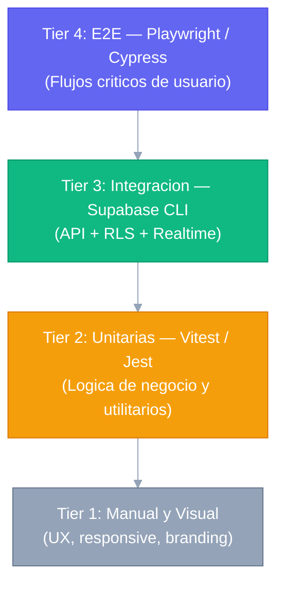
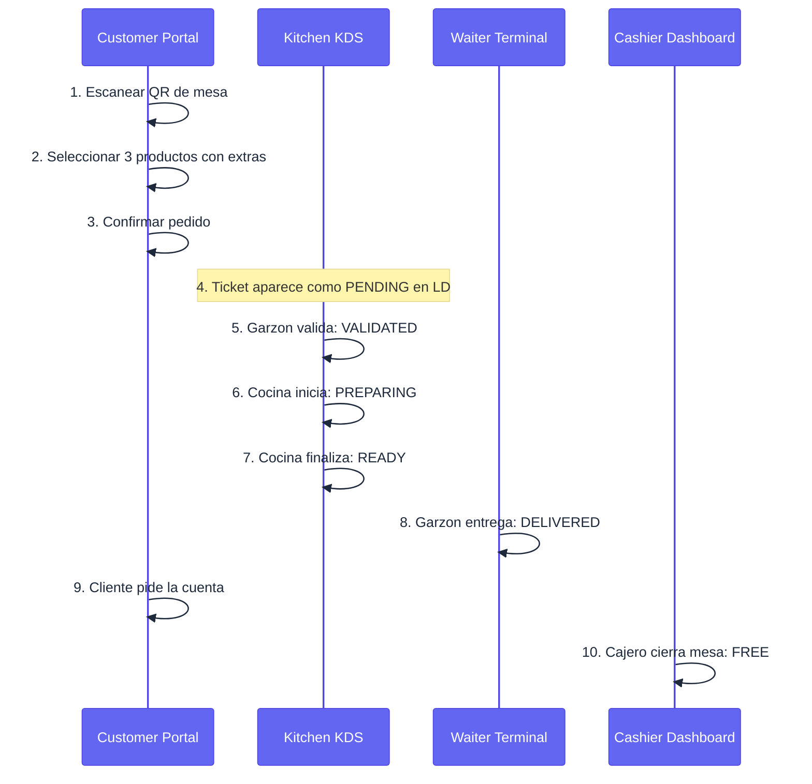

# Plan de Pruebas Maestro — Menu Bites

**Propósito:** Estrategia QA del sistema. Define la pirámide de pruebas, herramientas, responsables, criterios de PASS/FAIL y el checklist de regresión pre-release. Para el catálogo detallado de casos de prueba individuales con criterios de aceptación, ver [SUGGESTED_TESTS.md](SUGGESTED_TESTS.md).

---

## 1. ESTRATEGIA DE PRUEBAS

El sistema utiliza una pirámide de pruebas balanceada para garantizar la estabilidad de la arquitectura multi-tenant:



| Nivel | Enfoque | Herramienta | Responsable |
|---|---|---|---|
| **Unitarias** | Funciones puras, formateadores, cálculos | Vitest / Jest + RTL | Desarrollador |
| **Integración** | Comunicación con Supabase, RLS, Realtime | Supabase CLI Test | Desarrollador / QA |
| **E2E Funcional** | Flujos críticos de usuario completos | Playwright / Cypress | QA Engineer |
| **Manual / Visual** | Estética, UX, responsive, accesibilidad | Browser Testing | QA / Diseñador |

---

## 2. CRITERIOS DE PASS / FAIL

### Criterio de PASS (Release autorizado)

- [ ] 100% de pruebas unitarias pasando (`npm run test`).
- [ ] 0 fallos en pruebas de integración de RLS (tenant leakage = 0).
- [ ] Todos los flujos E2E críticos (Sección 3) pasan en Chromium y WebKit.
- [ ] Sin errores de consola en rutas críticas.
- [ ] Tiempo de carga del Customer Portal < 3s en red simulada 4G.

### Criterio de FAIL (Release bloqueado)

- [ ] Cualquier prueba de seguridad (tenant leakage, IDOR) falla.
- [ ] El flujo E2E de creación de pedido falla.
- [ ] El flujo E2E de cierre de mesa falla.
- [ ] Una API crítica retorna 500 en el happy path.

---

## 3. FLUJOS E2E CRÍTICOS (Obligatorios antes de Release)

### 3.1 Flujo Completo de Pedido (Happy Path)



**Verificaciones en cada paso:**
1. La URL contiene el `restaurant_id` y `table_id` correctos.
2. El carrito refleja precio × cantidad correctamente.
3. El pedido aparece en el Local Dashboard con estado `PENDING`.
4. El KDS recibe el ticket sin refrescar (Realtime).
5–8. Cada cambio de estado propaga por Realtime a todos los dashboards abiertos.
9. El badge de cuenta aparece en Cashier Dashboard.
10. La mesa vuelve a estado `FREE` en el mapa del Waiter Terminal.

### 3.2 Aislamiento Multi-Tenant (Seguridad Crítica)

1. Autenticar como ADMIN del `Restaurante A`.
2. Intentar acceder a `/restaurante-b/dashboard` → esperar redirección o 403.
3. Intentar llamar a `GET /api/local/orders` con el JWT de Restaurante A → esperar lista vacía o 403 (nunca datos de B).
4. **Verificar que RLS retorna 0 filas**, no error 500.

### 3.3 Flujo de Branding en Tiempo Real

1. ADMIN cambia el color primario en Branding Lab.
2. Guardar y activar el tema.
3. Abrir el Customer Portal en otra pestaña.
4. **Verificar** que el color cambió sin recargar la página.

---

## 4. PRUEBAS DE INTEGRACIÓN (Supabase RLS)

Estas pruebas deben ejecutarse contra una instancia de Supabase de staging con datos de fixture.

### 4.1 Aislamiento de Datos

```bash
# Usando Supabase CLI para pruebas de RLS
supabase test db --file tests/rls/tenant-isolation.sql
```

Casos a cubrir:
- Usuario de Restaurante A no puede SELECT en `orders` de Restaurante B.
- Usuario `anon` puede SELECT en `menu_items` con `is_active=true`.
- Usuario `anon` NO puede INSERT en `orders` sin pasar por la API.
- `service_role` puede SELECT sin filtros (para procesos administrativos).

### 4.2 Sincronización Realtime

- Al hacer INSERT en `orders`, todos los subscribers reciben el evento en < 500ms.
- Al hacer UPDATE de `table.help_requested`, el Waiter Terminal actualiza el mapa de mesas.
- Al desconectar el canal y reconectar, el estado se reconcilia correctamente.

---

## 5. PRUEBAS DE RENDIMIENTO

| Escenario | Herramienta | Umbral aceptable |
|---|---|---|
| Carga del Customer Portal (4G simulado) | Lighthouse / WebPageTest | < 3s LCP |
| 50 pedidos simultáneos desde diferentes mesas | Artillery / k6 | Sin pérdida de eventos Realtime |
| Carga de imágenes de menú | Lighthouse | < 200KB por imagen (WebP) |
| Tiempo de respuesta de API local | Postman / k6 | < 300ms p95 en BD no cargada |

---

## 6. CHECKLIST QA MANUAL (Pre-Release)

### Experiencia Móvil (Customer Portal / Waiter Terminal)

- [ ] Menú navegable con una sola mano en iPhone SE (375px de ancho).
- [ ] Botones de "Agregar al carrito" con área táctil >= 44×44px.
- [ ] Texto legible en exterior (contraste WCAG AA mínimo).
- [ ] El formulario de pedido no queda tapado por el teclado virtual.

### Experiencia Desktop (Admin / Local Dashboard)

- [ ] Tablas de datos con scroll horizontal en pantallas < 1280px.
- [ ] Gráficos de reportes no se solapan con textos.
- [ ] El simulador de marca en Branding Lab refleja el Customer Portal fielmente.

### Estética y Consistencia

- [ ] Iconos Lucide consistentes en tamaño y grosor en todas las apps.
- [ ] Efecto glassmorphism visible en modales y cards en tema oscuro.
- [ ] Transiciones de página suaves (no flashes de contenido).
- [ ] El tema del restaurante se aplica correctamente en Customer Portal al cargar.

---

## 7. PRUEBAS DE ESTRÉS

- **Concurrencia Realtime:** 50 suscriptores simultáneos al canal `orders` durante 5 minutos. Verificar 0 eventos perdidos.
- **Latencia 3G:** Simular conexión 3G (50kbps down) en Customer Portal. Los skeletons de carga deben aparecer y el menú cargar en < 8s.
- **Volumen de datos:** Restaurante con 500 pedidos históricos. Verificar que la vista de reportes carga en < 2s con paginación.
