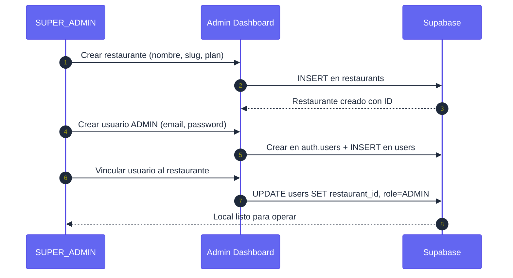
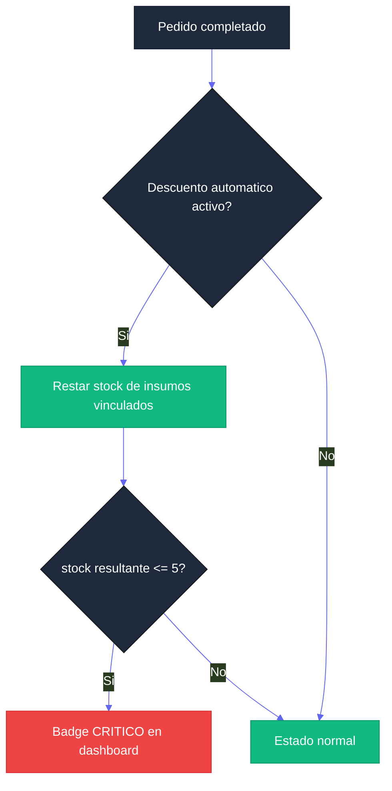
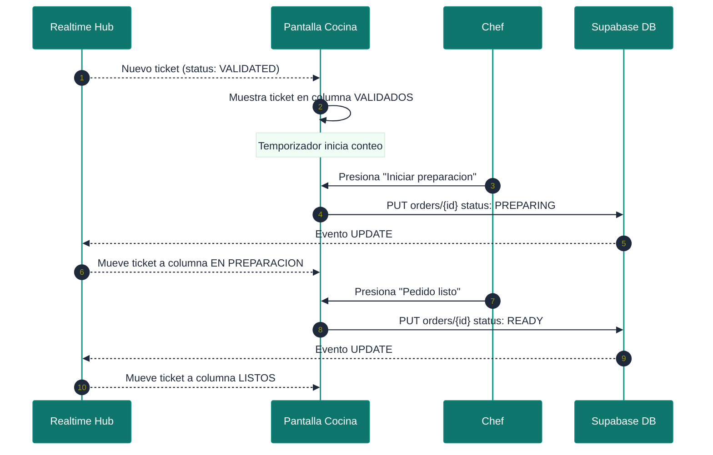
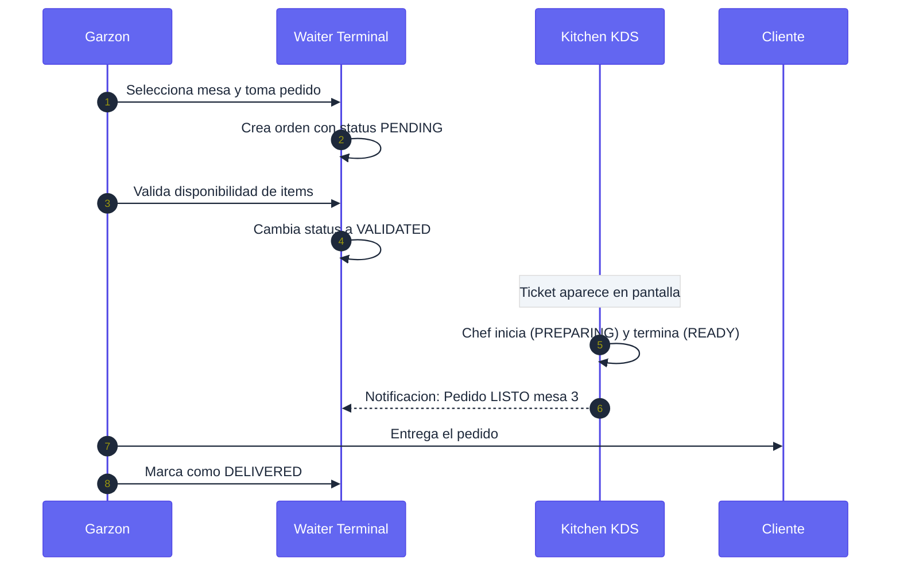
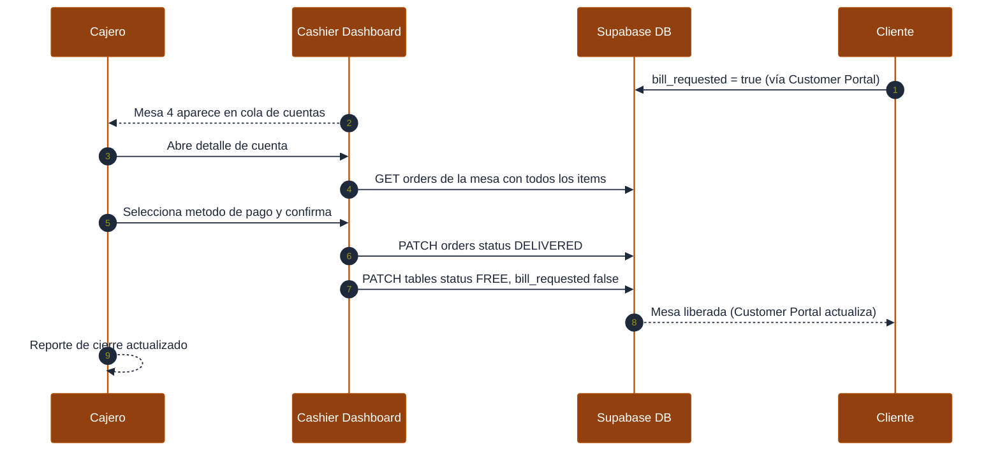
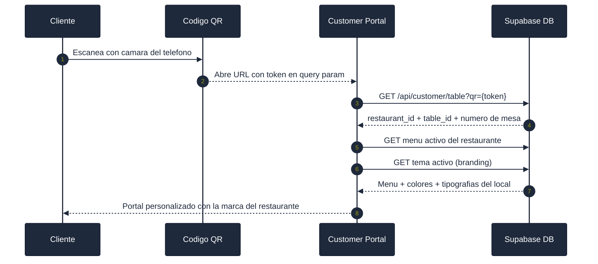

# Manual de Usuario Maestro — Sistema Menu Bites

**Versión:** 2.0.0 | **Audiencia:** Administradores globales, operadores de restaurante y personal operativo.

Este manual describe cada pantalla, flujo de trabajo y lógica de negocio de todas las aplicaciones de la plataforma Menu Bites.

---

## ÍNDICE DE APLICACIONES

| Aplicación | Rol Principal | Sección |
|---|---|---|
| Admin Dashboard | SUPER_ADMIN | [Sección 1](#1-panel-de-administración-global-admin-dashboard) |
| Local Dashboard | ADMIN | [Sección 2](#2-dashboard-operativo-local-local-dashboard) |
| Kitchen KDS | COCINA | [Sección 3](#3-pantalla-de-cocina-kitchen-kds) |
| Waiter Terminal | GARZON | [Sección 4](#4-terminal-de-garzón-waiter-terminal) |
| Cashier Dashboard | CAJERO | [Sección 5](#5-terminal-de-caja-cashier-dashboard) |
| Customer Portal | CLIENTE | [Sección 6](#6-portal-del-cliente-customer-portal) |

---

## 1. PANEL DE ADMINISTRACIÓN GLOBAL (Admin Dashboard)

Centro de control para la gestión del ecosistema multitenant. Accesible exclusivamente por usuarios con rol `SUPER_ADMIN`.

### 1.1 Resumen Ejecutivo (KPIs Globales)

Vista consolidada con métricas de salud de la plataforma:

- **Total Organizaciones:** Número de restaurantes registrados.
- **Locales Activos vs Suspendidos:** Estado de la red de tenants.
- **Usuarios Totales:** Suma de usuarios registrados en todos los locales.
- **Actividad Reciente:** Log cronológico de nuevos restaurantes y registros.

### 1.2 Directorio de Restaurantes

- **Registro de Tenants:** Creación de nuevos restaurantes con `name` y `slug` (generado automáticamente desde el nombre).
- **Gestión de Slugs:** Identificadores únicos para URLs (`/pizzeria-napoli/dashboard`). El slug no puede modificarse una vez creado sin afectar los QRs generados.
- **Estado de Suscripción:** Cambio manual entre `ACTIVE`, `SUSPENDED` y `CANCELLED`.
- **Asignación de Planes:** Vinculación de un restaurante con un tier de servicio (Básico, Pro, Premium).

### 1.3 Gestión de Planes de Servicio

- **Configuración de Tiers:** Definición de planes con nombre, precio, periodicidad y descripción.
- **Matriz de Funcionalidades:** Array de features habilitadas por plan (ej: `["Inventario", "Reportes", "Branding avanzado"]`).
- **Flag Popular:** Marca un plan como destacado para la vista de pricing.

### 1.4 Gestión Global de Usuarios

- **Directorio Maestro:** Búsqueda y filtrado por rol o por restaurante.
- **Asignación de Roles:** Cambio de rol de cualquier usuario en la plataforma.
- **Vinculación de Local:** Proceso crítico para asignar un usuario `ADMIN` a su restaurante, habilitando su acceso al Local Dashboard.

### 1.5 Flujo de Alta de un Restaurante



---

## 2. DASHBOARD OPERATIVO LOCAL (Local Dashboard)

Interfaz de control completo para el ADMIN de un restaurante. Accede por `/{slug}/dashboard`.

### 2.1 Overview (Vista General)

- **Monitor de Ventas:** Ingresos acumulados del día con comparativa respecto al día anterior.
- **Estado de Comandas:** Contadores en tiempo real de pedidos por estado (`PENDING`, `PREPARING`, `READY`).
- **Ocupación de Salón:** Porcentaje de mesas con estado `OCCUPIED` sobre el total.

### 2.2 Gestión de Pedidos (Orders)

Vista centralizada de todas las comandas activas con actualización en tiempo real vía Supabase Realtime.

**Ciclo de vida del pedido:**

| Estado | Significado | Quién lo asigna |
|---|---|---|
| `PENDING` | Recién ingresado | Sistema |
| `VALIDATED` | Confirmado, pasa a cocina | GARZON |
| `PREPARING` | En preparación | COCINA (KDS) |
| `READY` | Listo para servir | COCINA (KDS) |
| `DELIVERED` | Entregado al cliente | GARZON |
| `REJECTED` | Rechazado | GARZON |

**Detalle por pedido:** Muestra número de mesa, hora de ingreso, items con extras y notas especiales.

### 2.3 Control de Inventario

- **Registro de Insumos:** Nombre, cantidad (`stock`) y unidad (`kg`, `units`, `liters`).
- **Alerta de Stock Crítico:** Badge rojo cuando `stock <= 5` (en cualquier unidad). El sistema monitorea en tiempo real.
- **Vinculación con Recetas:** Asocia insumos a platos (`menu_item_ingredients`) para descuento automático al procesar pedidos.
- **Lógica de alerta:**



### 2.4 Gestión de Menú y Categorías

- **Estructura Jerárquica:** Organización por categorías (`Entradas`, `Platos de Fondo`, `Postres`, `Bar`).
- **Ficha de Producto:** Nombre, descripción, precio, imagen (Supabase Storage), disponibilidad (`is_active`).
- **Modificadores (Extras):** Adiciones opcionales con precio extra (ej: "Extra Queso +$500"), vinculables a inventario.
- **Switch de disponibilidad:** Desactiva un ítem del menú instantáneamente sin eliminarlo.

### 2.5 Gestión de Mesas y QR

- **Mapeo de Planta:** Definición de mesas con número y etiqueta personalizada (ej: "Mesa VIP", "Terraza 1").
- **Generador de QR:** Al crear una mesa se genera automáticamente un `qr_data` único. El QR apunta al Customer Portal con la mesa pre-seleccionada.
- **Estado visual:** Color por estado de mesa (`FREE` → verde, `OCCUPIED` → rojo, `RESERVED` → amarillo).
- **Alertas activas:** Indicadores visuales cuando `help_requested` o `bill_requested` están activos.

### 2.6 Inteligencia de Negocio (Reportes)

El sistema genera 5 tipos de análisis exportables a Excel (`.xlsx`):

| Reporte | Descripción |
|---|---|
| Ventas Diarias | Transacciones por fecha con total acumulado |
| Top Productos | Ranking de items más vendidos por período |
| Desempeño de Personal | Pedidos y ventas por garzón |
| Eficiencia de Mesas | Tiempo promedio de ocupación y rotación |
| Reporte Consolidado | Resumen de cierre de caja para contabilidad |

### 2.7 Laboratorio de Marca (Branding Lab)

- **Templates Predefinidos:** 12 paletas de colores profesionales listas para usar.
- **Editor Granular:** Control de 6 variables CSS: `primary`, `secondary`, `background`, `accent`, `text`, `card`.
- **Tipografías:** Selección de Google Fonts para `font_title` y `font_body`.
- **Preview en Tiempo Real:** Vista previa del Customer Portal con el tema antes de guardar.
- **Propagación Instantánea:** Al activar un tema, el Customer Portal y las terminales lo reflejan sin necesidad de recargar.

---

## 3. PANTALLA DE COCINA (Kitchen KDS)

Sistema de Display de Cocina para gestión de tickets en tiempo real. Accede por `/{slug}/kds`. Rol: `COCINA`.

### 3.1 Vista Principal

La pantalla muestra columnas Kanban organizadas por estado del pedido:

```
| VALIDADOS       | EN PREPARACIÓN  | LISTOS          |
|-----------------|-----------------|-----------------|
| Mesa 3 - 10:31  | Mesa 1 - 10:15  | Mesa 7 - 10:05  |
| - 2x Pizza      | - 1x Pasta      | - 3x Empanada   |
| - 1x Ensalada   | - 2x Hamburgesa |                 |
|-----------------|-----------------|-----------------|
| Mesa 5 - 10:35  |                 |                 |
| - 1x Sopa       |                 |                 |
```

### 3.2 Funcionamiento

- **Actualización en tiempo real:** El KDS usa **Supabase Realtime** para recibir nuevos tickets sin refrescar. Cada INSERT o UPDATE en `orders` dispara la actualización de la pantalla.
- **Indicador de tiempo:** Cada ticket muestra el tiempo transcurrido desde que entró. El color del indicador cambia según urgencia:
  - Verde: < 10 minutos
  - Amarillo: 10–20 minutos
  - Rojo: > 20 minutos

### 3.3 Transiciones de Estado Disponibles para COCINA

| Acción | Transición | Descripción |
|---|---|---|
| "Iniciar" | `VALIDATED → PREPARING` | El chef comienza a preparar el pedido |
| "Listo" | `PREPARING → READY` | El pedido está terminado y listo para servir |

> El KDS no puede rechazar pedidos ni marcarlos como `DELIVERED`. Esas acciones pertenecen al rol `GARZON`.

### 3.4 Flujo de Ticket en KDS



### 3.5 Filtros Disponibles

- **Por categoría:** Mostrar solo tickets con items de una categoría específica (ej: solo "Platos de Fondo").
- **Por estado:** Mostrar solo `VALIDATED`, solo `PREPARING`, o la vista combinada.
- **Silenciar alertas:** Toggle para activar/desactivar sonido de nuevo ticket.

---

## 4. TERMINAL DE GARZÓN (Waiter Terminal)

Interfaz móvil para la atención de mesas y toma de pedidos. Accede por `/{slug}/waiter`. Rol: `GARZON`.

### 4.1 Vista de Planta (Mapa de Mesas)

Vista en grilla del estado de todas las mesas del restaurante con indicadores visuales:

- **Verde (FREE):** Mesa disponible para nuevos clientes.
- **Rojo (OCCUPIED):** Mesa con pedido activo.
- **Amarillo (RESERVED):** Mesa reservada.
- **Icono de alerta:** Aparece cuando `help_requested = true` (el cliente pide asistencia).
- **Icono de cuenta:** Aparece cuando `bill_requested = true` (el cliente pide la cuenta).

### 4.2 Toma de Pedidos

1. El garzón selecciona una mesa.
2. Navega por el catálogo de menú organizado por categorías.
3. Agrega items al carrito con quantity y extras opcionales.
4. Puede añadir notas por item (ej: "sin gluten") y notas generales del pedido.
5. Confirma el pedido → se crea con estado `PENDING`.
6. El garzón valida disponibilidad y cambia a `VALIDATED` → el ticket aparece en el KDS.

### 4.3 Gestión de Pedidos Activos

- **Vista de mis pedidos:** Lista de pedidos asignados durante el turno con su estado actual.
- **Actualización en tiempo real:** Cuando el KDS cambia un pedido a `READY`, el garzón recibe una notificación visual.

### 4.4 Transiciones de Estado Disponibles para GARZON

| Acción | Transición | Cuándo usarla |
|---|---|---|
| "Confirmar pedido" | `PENDING → VALIDATED` | Después de verificar disponibilidad |
| "Rechazar pedido" | `PENDING → REJECTED` | Item no disponible u otro motivo |
| "Entregar" | `READY → DELIVERED` | Al llevar el pedido a la mesa |

### 4.5 Flujo Completo de Atención



### 4.6 Atención de Solicitudes de Asistencia

Cuando un cliente presiona "Pedir asistencia" en el Customer Portal, `help_requested = true` en la mesa. El garzón ve el indicador en su mapa de mesas, atiende al cliente, y luego desmarca la alerta desde la terminal.

---

## 5. TERMINAL DE CAJA (Cashier Dashboard)

Interfaz para el procesamiento de pagos y cierre de mesas. Accede por `/{slug}/cashier`. Rol: `CAJERO`.

### 5.1 Cola de Cuentas Pendientes

Vista principal que muestra exclusivamente las mesas con `bill_requested = true`. Ordenadas por tiempo de espera.

Cada tarjeta de mesa muestra:
- Número y nombre de la mesa.
- Tiempo desde que el cliente solicitó la cuenta.
- Total estimado de los pedidos activos.

### 5.2 Vista Detalle de Cuenta

Al seleccionar una mesa, el cajero ve el desglose completo:

```
Mesa 4 — Terraza
─────────────────────────────
2x Pizza Margarita    $19.980
   └─ Extra Queso     $ 1.000
1x Limonada Frozen    $ 3.990
─────────────────────────────
TOTAL                $24.970
```

- Los precios se toman del **snapshot** (`unit_price` en `order_items`), no del precio actual del menú.
- Si la mesa tiene múltiples pedidos (ej: rondas adicionales), todos se consolidan en una sola cuenta.

### 5.3 Proceso de Cobro y Cierre

1. El cajero revisa el detalle de la cuenta.
2. Selecciona el método de pago: `Efectivo`, `Tarjeta` o `Transferencia`.
3. Confirma el cobro → el sistema ejecuta en secuencia:
   - `order.status → DELIVERED` (todos los pedidos de la mesa).
   - `table.status → FREE`.
   - `table.bill_requested → false`.



### 5.4 Reporte de Turno

Vista de resumen al final del turno del cajero:

- Total de ventas procesadas en el turno.
- Desglose por método de pago (efectivo / tarjeta / transferencia).
- Número de mesas atendidas y ticket promedio.
- Botón de cierre de turno.

---

## 6. PORTAL DEL CLIENTE (Customer Portal)

Aplicación web pública accedida vía código QR de la mesa. No requiere creación de cuenta. Accede por `/{slug}?qr={token}`.

### 6.1 Acceso vía Código QR



### 6.2 Navegación del Menú

- El menú se presenta organizado por categorías con scroll horizontal o vertical.
- Cada item muestra imagen, nombre, descripción y precio.
- Al presionar un item se abre una ficha con extras disponibles y campo de notas.

### 6.3 Carrito y Proceso de Pedido

1. El cliente agrega items al carrito con cantidad, extras y notas por item.
2. Revisa el resumen del carrito con el total calculado.
3. Confirma el pedido → `POST /api/customer/orders` con `restaurant_id` y `table_id` embebidos.
4. El pedido aparece en el Local Dashboard y en el KDS como `PENDING`.

### 6.4 Seguimiento del Estado del Pedido

Después de confirmar, el cliente puede seguir el estado de su pedido en tiempo real:

| Estado mostrado | Estado interno | Mensaje al cliente |
|---|---|---|
| "Recibido" | `PENDING` | Tu pedido fue recibido |
| "Confirmado" | `VALIDATED` | Tu pedido está confirmado |
| "En preparación" | `PREPARING` | Tu pedido está siendo preparado |
| "Listo" | `READY` | Tu pedido está listo, el garzón lo llevará pronto |
| "Entregado" | `DELIVERED` | Disfruta tu pedido |

### 6.5 Solicitudes desde la Mesa

Dos acciones disponibles que el cliente puede activar en cualquier momento:

- **"Pedir asistencia":** Activa `help_requested = true` en la mesa → el garzón recibe alerta visual.
- **"Pedir la cuenta":** Activa `bill_requested = true` → la mesa aparece en la cola del Cashier Dashboard.

### 6.6 Personalización de Marca

El Customer Portal aplica automáticamente el tema activo del restaurante:
- Colores (`primary`, `secondary`, `background`, `accent`, `text`, `cardBackground`) inyectados como CSS Custom Properties.
- Tipografías cargadas dinámicamente desde Google Fonts.
- Logotipo del restaurante si está configurado en el tema.

Cada restaurante ve su propio Customer Portal con su identidad visual única.

---

## 7. TABLA MAESTRA DE ROLES Y PERMISOS

| Rol | App Principal | Puede crear pedidos | Puede cambiar estado pedido | Puede editar menú | Puede ver reportes |
|---|---|---|---|---|---|
| `SUPER_ADMIN` | Admin Dashboard | No | No | No | Solo globales |
| `ADMIN` | Local Dashboard | Si | Todos los estados | Si | Si |
| `GARZON` | Waiter Terminal | Si | VALIDATED, REJECTED, DELIVERED | No | No |
| `COCINA` | Kitchen KDS | No | PREPARING, READY | No | No |
| `CAJERO` | Cashier Dashboard | No | No (solo cierre) | No | Solo turno |
| `CLIENTE` | Customer Portal | Si (propio) | No | No | No |
