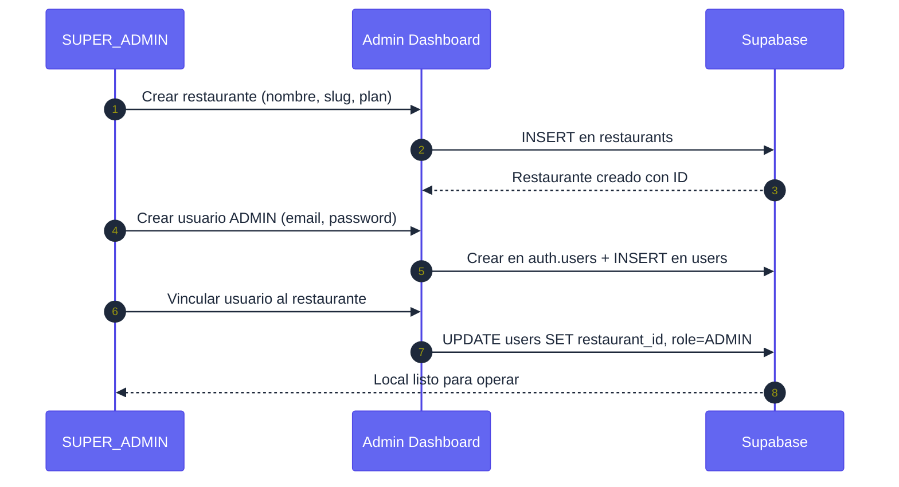
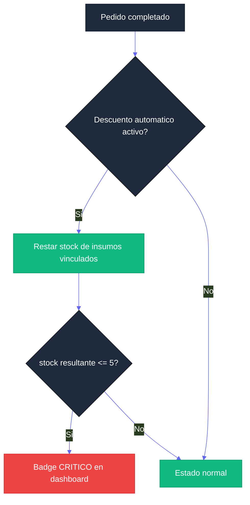
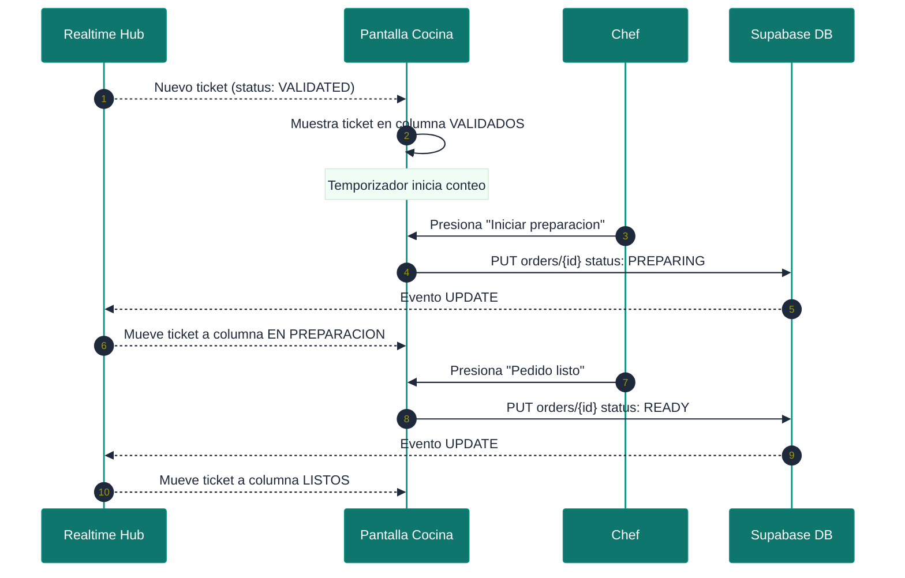
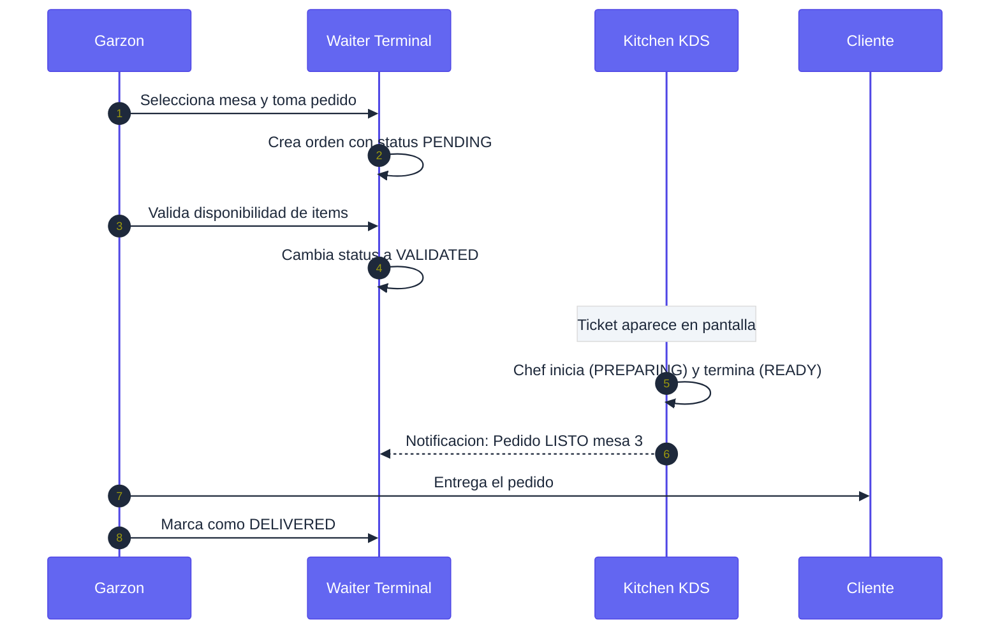
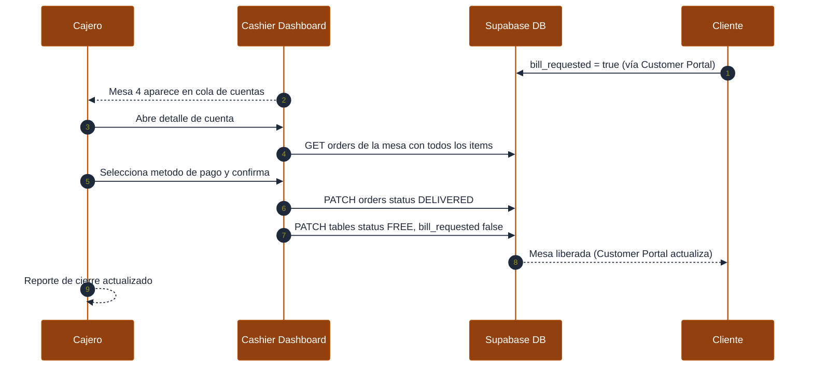
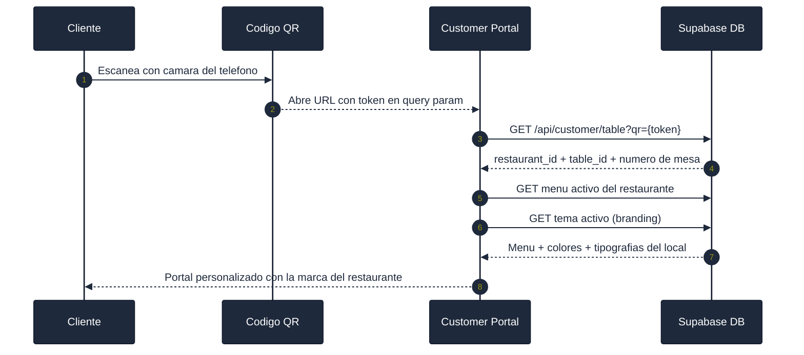

# Manual de Usuario Maestro — Sistema Menu Bites

**Versión:** 2.0.0 | **Audiencia:** Administradores globales, operadores de restaurante y personal operativo.

Este manual describe cada pantalla, flujo de trabajo y lógica de negocio de todas las aplicaciones de la plataforma Menu Bites.

---

## ÍNDICE DE APLICACIONES

| Aplicación | Rol Principal | Sección |
|---|---|---|
| Admin Dashboard | SUPER_ADMIN | [Sección 1](#1-panel-de-administración-global-admin-dashboard) |
| Local Dashboard | ADMIN | [Sección 2](#2-dashboard-operativo-local-local-dashboard) |
| Kitchen KDS | COCINA | [Sección 3](#3-pantalla-de-cocina-kitchen-kds) |
| Waiter Terminal | GARZON | [Sección 4](#4-terminal-de-garzón-waiter-terminal) |
| Cashier Dashboard | CAJERO | [Sección 5](#5-terminal-de-caja-cashier-dashboard) |
| Customer Portal | CLIENTE | [Sección 6](#6-portal-del-cliente-customer-portal) |

---

## 1. PANEL DE ADMINISTRACIÓN GLOBAL (Admin Dashboard)

Centro de control para la gestión del ecosistema multitenant. Accesible exclusivamente por usuarios con rol `SUPER_ADMIN`.

### 1.1 Resumen Ejecutivo (KPIs Globales)

Vista consolidada con métricas de salud de la plataforma:

- **Total Organizaciones:** Número de restaurantes registrados.
- **Locales Activos vs Suspendidos:** Estado de la red de tenants.
- **Usuarios Totales:** Suma de usuarios registrados en todos los locales.
- **Actividad Reciente:** Log cronológico de nuevos restaurantes y registros.

### 1.2 Directorio de Restaurantes

- **Registro de Tenants:** Creación de nuevos restaurantes con `name` y `slug` (generado automáticamente desde el nombre).
- **Gestión de Slugs:** Identificadores únicos para URLs (`/pizzeria-napoli/dashboard`). El slug no puede modificarse una vez creado sin afectar los QRs generados.
- **Estado de Suscripción:** Cambio manual entre `ACTIVE`, `SUSPENDED` y `CANCELLED`.
- **Asignación de Planes:** Vinculación de un restaurante con un tier de servicio (Básico, Pro, Premium).

### 1.3 Gestión de Planes de Servicio

- **Configuración de Tiers:** Definición de planes con nombre, precio, periodicidad y descripción.
- **Matriz de Funcionalidades:** Array de features habilitadas por plan (ej: `["Inventario", "Reportes", "Branding avanzado"]`).
- **Flag Popular:** Marca un plan como destacado para la vista de pricing.

### 1.4 Gestión Global de Usuarios

- **Directorio Maestro:** Búsqueda y filtrado por rol o por restaurante.
- **Asignación de Roles:** Cambio de rol de cualquier usuario en la plataforma.
- **Vinculación de Local:** Proceso crítico para asignar un usuario `ADMIN` a su restaurante, habilitando su acceso al Local Dashboard.

### 1.5 Flujo de Alta de un Restaurante



---

## 2. DASHBOARD OPERATIVO LOCAL (Local Dashboard)

Interfaz de control completo para el ADMIN de un restaurante. Accede por `/{slug}/dashboard`.

### 2.1 Overview (Vista General)

**KPIs principales:**
- Ingresos del día y del mes con ticket promedio
- Pedidos activos en cocina y sala

**Flujo en Vivo:** Widget con contadores en tiempo real de órdenes por estado:

| Estado | Color | Quién actúa |
|---|---|---|
| Pendiente | Amarillo | Esperando validación del garzón |
| Validado | Azul | En tránsito hacia cocina |
| Preparando | Primario | Cocina trabajando |
| Listo | Verde | Esperando ser servido |

**Tiempo Promedio Hoy:** Muestra el ciclo completo `created_at -> ready_at` en minutos, basado en pedidos ya entregados del día. Indicador de rendimiento: Óptimo (< 15 min), Normal (15–30 min), Lento (> 30 min).

**Escalación de alertas:** Si una o más órdenes llevan más de 3 minutos en estado `PENDING` sin que el garzón las valide, aparece un banner de alerta rojo con el número de mesa y el tiempo transcurrido. Se recalcula automáticamente cada 30 segundos.

**Estado de Mesas:** Grilla visual con colores por estado:
- Verde (`FREE`), Rojo (`OCCUPIED`), Amarillo (`RESERVED`), Azul claro (`CLEANING`)

### 2.2 Gestión de Pedidos (Orders)

Vista centralizada de todas las comandas activas con actualización en tiempo real vía Supabase Realtime.

**Ciclo de vida del pedido:**

| Estado | Significado | Quién lo asigna |
|---|---|---|
| `PENDING` | Recién ingresado | Sistema |
| `VALIDATED` | Confirmado, pasa a cocina | GARZON |
| `PREPARING` | En preparación | COCINA (KDS) |
| `READY` | Listo para servir | COCINA (KDS) |
| `DELIVERED` | Entregado al cliente | GARZON |
| `REJECTED` | Rechazado | GARZON |

**Detalle por pedido:** Muestra número de mesa, hora de ingreso, items con extras y notas especiales.

### 2.3 Control de Inventario

- **Registro de Insumos:** Nombre, cantidad (`stock`) y unidad (`kg`, `units`, `liters`).
- **Alerta de Stock Crítico:** Badge rojo cuando `stock <= 5` (en cualquier unidad). El sistema monitorea en tiempo real.
- **Vinculación con Recetas:** Asocia insumos a platos (`menu_item_ingredients`) para descuento automático al procesar pedidos.
- **Lógica de alerta:**



### 2.4 Gestión de Menú y Categorías

- **Estructura Jerárquica:** Organización por categorías (`Entradas`, `Platos de Fondo`, `Postres`, `Bar`).
- **Ficha de Producto:** Nombre, descripción, precio, imagen (Supabase Storage), disponibilidad (`is_active`).
- **Modificadores (Extras):** Adiciones opcionales con precio extra (ej: "Extra Queso +$500"), vinculables a inventario.
- **Switch de disponibilidad:** Desactiva un ítem del menú instantáneamente sin eliminarlo.

### 2.5 Gestión de Mesas y QR

- **Mapeo de Planta:** Definición de mesas con número y etiqueta personalizada (ej: "Mesa VIP", "Terraza 1").
- **Generador de QR:** Al crear una mesa se genera automáticamente un `qr_data` único. El QR apunta al Customer Portal con la mesa pre-seleccionada.
- **Estado visual:** Color por estado de mesa (`FREE` -> verde, `OCCUPIED` -> rojo, `RESERVED` -> amarillo).
- **Alertas activas:** Indicadores visuales cuando `help_requested` o `bill_requested` están activos.

### 2.6 Inteligencia de Negocio (Reportes)

El sistema genera análisis exportables a Excel (`.xls` SpreadsheetML):

| Reporte | Descripción |
|---|---|
| Ventas Diarias | Transacciones por fecha con ingresos y ticket promedio |
| Top Productos | Ranking de los 10 items más vendidos por período |
| Desempeño de Personal | Pedidos y ventas por garzón |
| Ocupación por Mesa | Ingresos totales y pedidos por número de mesa |

**Filtros de período:** 7D, 14D, 30D, 90D o rango personalizado.

**Heatmap de Tiempos de Cocina:** Sección de análisis de tiempos operativos por categoría de plato:

| Métrica | Cálculo | Significado |
|---|---|---|
| Tiempo de Validación | `validated_at - created_at` | Cuánto tarda el garzón en aprobar el pedido |
| Tiempo de Cocina | `ready_at - validated_at` | Tiempo neto de preparación en cocina |
| Tiempo Total | `ready_at - created_at` | Ciclo completo desde el pedido hasta estar listo |

Los tiempos se muestran como barras horizontales con código de color: verde (< 10 min), amarillo (10–20 min), rojo (> 20 min). Solo aparece para órdenes que tienen `validated_at` y `ready_at` registrados.

> **Nota:** Los timestamps se escriben automáticamente al transicionar el estado de la orden.
| Eficiencia de Mesas | Tiempo promedio de ocupación y rotación |
| Reporte Consolidado | Resumen de cierre de caja para contabilidad |

### 2.7 Laboratorio de Marca (Branding Lab)

- **Templates Predefinidos:** 12 paletas de colores profesionales listas para usar.
- **Editor Granular:** Control de 6 variables CSS: `primary`, `secondary`, `background`, `accent`, `text`, `card`.
- **Tipografías:** Selección de Google Fonts para `font_title` y `font_body`.
- **Preview en Tiempo Real:** Vista previa del Customer Portal con el tema antes de guardar.
- **Propagación Instantánea:** Al activar un tema, el Customer Portal y las terminales lo reflejan sin necesidad de recargar.

---

## 3. PANTALLA DE COCINA (Kitchen KDS)

Sistema de Display de Cocina para gestión de tickets en tiempo real. Accede por `/{slug}/kds`. Rol: `COCINA`.

### 3.1 Vista Principal

La pantalla muestra columnas Kanban organizadas por estado del pedido:

```
| VALIDADOS       | EN PREPARACIÓN  | LISTOS          |
|-----------------|-----------------|-----------------|
| Mesa 3 - 10:31  | Mesa 1 - 10:15  | Mesa 7 - 10:05  |
| - 2x Pizza      | - 1x Pasta      | - 3x Empanada   |
| - 1x Ensalada   | - 2x Hamburgesa |                 |
|-----------------|-----------------|-----------------|
| Mesa 5 - 10:35  |                 |                 |
| - 1x Sopa       |                 |                 |
```

### 3.2 Funcionamiento

- **Actualización en tiempo real:** El KDS usa **Supabase Realtime** para recibir nuevos tickets sin refrescar. Cada INSERT o UPDATE en `orders` dispara la actualización de la pantalla.
- **Indicador de tiempo:** Cada ticket muestra el tiempo transcurrido desde que entró. El color del indicador cambia según urgencia:
  - Verde: < 10 minutos
  - Amarillo: 10–20 minutos
  - Rojo: > 20 minutos

### 3.3 Transiciones de Estado Disponibles para COCINA

| Acción | Transición | Descripción |
|---|---|---|
| "Iniciar" | `VALIDATED -> PREPARING` | El chef comienza a preparar el pedido |
| "Listo" | `PREPARING -> READY` | El pedido está terminado y listo para servir |

> El KDS no puede rechazar pedidos ni marcarlos como `DELIVERED`. Esas acciones pertenecen al rol `GARZON`.

### 3.4 Flujo de Ticket en KDS



### 3.5 Filtros Disponibles

- **Por categoría:** Mostrar solo tickets con items de una categoría específica (ej: solo "Platos de Fondo").
- **Por estado:** Mostrar solo `VALIDATED`, solo `PREPARING`, o la vista combinada.
- **Silenciar alertas:** Toggle para activar/desactivar sonido de nuevo ticket.

---

## 4. TERMINAL DE GARZÓN (Waiter Terminal)

Interfaz móvil para la atención de mesas y toma de pedidos. Accede por `/{slug}/waiter`. Rol: `GARZON`.

### 4.1 Vista de Planta (Mapa de Mesas)

Vista en grilla del estado de todas las mesas con indicadores visuales en tiempo real:

| Badge | Color | Significado |
|---|---|---|
| `FREE` | Verde | Mesa disponible |
| `OCCUPIED` | Rojo | Mesa con clientes activos |
| `RESERVED` | Amarillo | Mesa reservada |
| `CLEANING` | Azul cielo | Mesa pagada, pendiente de limpieza |
| `LISTO` | Verde oscuro | Hay pedidos READY en esa mesa listos para servir |
| `CUENTA` | Amarillo | El cliente solicitó la cuenta desde el portal |

**Alertas automáticas con sonido:** Cuando el KDS marca una orden como READY, el terminal emite una alerta sonora para notificar al garzón que debe llevar el plato.

**Sección "Limpieza pendiente":** Aparece automáticamente sobre el mapa de mesas cuando alguna mesa está en estado CLEANING. El garzón presiona "Mesa lista" para marcarla como FREE una vez limpia.

**Sección "Listos para servir":** Lista de órdenes en estado READY con el número de mesa correspondiente.

**Sección "Cuenta solicitada":** Destaca las mesas con `bill_requested = true` para que el garzón coordine con caja.

### 4.2 Tab "Pedidos Pendientes"

Muestra todas las órdenes en estado `PENDING` que esperan validación del garzón. El badge del tab indica el número de pedidos sin atender.

Acciones por pedido:
- **Nota de cocina:** Campo de texto para agregar instrucciones especiales (alergias, preparación) antes de validar. Se guarda en `orders.notes` y el KDS lo muestra en el ticket.
- **Rechazar:** Cambia el status a `REJECTED`. Si no quedan pedidos activos en la mesa, la mesa vuelve a `FREE` automáticamente.
- **Validar:** Cambia el status a `VALIDATED`. La orden aparece en el KDS para que cocina la prepare.

### 4.2 Toma de Pedidos

1. El garzón selecciona una mesa.
2. Navega por el catálogo de menú organizado por categorías.
3. Agrega items al carrito con quantity y extras opcionales.
4. Puede añadir notas por item (ej: "sin gluten") y notas generales del pedido.
5. Confirma el pedido -> se crea con estado `PENDING`.
6. El garzón valida disponibilidad y cambia a `VALIDATED` -> el ticket aparece en el KDS.

### 4.3 Gestión de Pedidos Activos

- **Vista de mis pedidos:** Lista de pedidos asignados durante el turno con su estado actual.
- **Actualización en tiempo real:** Cuando el KDS cambia un pedido a `READY`, el garzón recibe una notificación visual.

### 4.4 Transiciones de Estado Disponibles para GARZON

| Acción | Transición | Cuándo usarla |
|---|---|---|
| "Confirmar pedido" | `PENDING -> VALIDATED` | Después de verificar disponibilidad |
| "Rechazar pedido" | `PENDING -> REJECTED` | Item no disponible u otro motivo |
| "Entregar" | `READY -> DELIVERED` | Al llevar el pedido a la mesa |

### 4.5 Flujo Completo de Atención



### 4.6 Atención de Solicitudes de Asistencia

Cuando un cliente presiona "Pedir asistencia" en el Customer Portal, `help_requested = true` en la mesa. El garzón ve el indicador en su mapa de mesas, atiende al cliente, y luego desmarca la alerta desde la terminal.

---

## 5. TERMINAL DE CAJA (Cashier Dashboard)

Interfaz para el procesamiento de pagos y cierre de mesas. Accede por `/{slug}/cashier`. Rol: `CAJERO`.

### 5.1 Vista de Cuentas Pendientes — Agrupada por Mesa

La vista principal muestra **tarjetas agrupadas por mesa** (o por sesión si las mesas están fusionadas). Cada tarjeta representa una cuenta cobrable completa.

**Tarjeta de mesa normal:**
```
Mesa 7 — CUENTA SOLICITADA
  2 pedidos consolidados
  Hace 12 min
  -----------------------------
  2x Lomo Saltado      $28.000
  1x Postre             $8.000
  -----------------------------
  Total Cuenta:        $36.000
  [Revisar y Cobrar]
```

**Tarjeta de mesas fusionadas:**
```
Mesas fusionadas
  3 pedidos consolidados
  -----------------------------
  TOTAL SESIÓN:        $74.000
  [Revisar y Cobrar]
```

La agrupación funciona así: si los pedidos comparten `session_id`, se muestran juntos como una sola unidad cobrable. Si no, se agrupan por `table_id`.

### 5.2 Vista Detalle de Cuenta

Al hacer clic en "Revisar y Cobrar", se abre un panel lateral con el desglose completo de **todos los pedidos** del grupo:

```
Mesa 7  |  2 Comandas consolidadas
-------------------------------------
Pedido 1:
  2x Lomo Saltado        $28.000
Pedido 2:
  1x Postre               $8.000
-------------------------------------
Neto Consumo:            $36.000
Propina sugerida (10%):   $3.600
TOTAL FINAL:             $39.600
-------------------------------------
Ref. Pago: [______________]
[Confirmar Pago y Liberar Mesa]
```

Los precios se toman del **snapshot** (`unit_price` en `order_items`), no del precio actual del menú.

### 5.3 Proceso de Cobro y Cierre

1. El cajero revisa el detalle consolidado de todos los pedidos.
2. Ingresa la referencia de comprobante (número de voucher, transferencia, etc.).
3. Confirma el cobro -> el sistema ejecuta en secuencia:
   - `orders.status -> DELIVERED` para todos los pedidos del grupo.
   - `table.status -> CLEANING`: la mesa no queda libre inmediatamente; el garzón confirma la limpieza desde su terminal.
   - `table.bill_requested -> false`.
4. Se abre automáticamente el comprobante digital en una nueva pestaña.

> **Ciclo completo de mesa:** `FREE -> OCCUPIED -> CLEANING -> FREE`. El estado `CLEANING` garantiza que no se asignen clientes nuevos a una mesa que aún no fue preparada.

### 5.4 Comprobante Digital

Tras confirmar el pago, el sistema abre automáticamente una página de comprobante imprimible en una nueva pestaña.

**Rutas de comprobante:**
- Mesa normal: `/receipt/table/[tableId]?rid=[restaurantId]`
- Mesas fusionadas: `/receipt/session/[sessionId]?rid=[restaurantId]`

**El comprobante muestra:**
- Nombre del restaurante
- Número(s) de mesa
- Fecha y hora del cobro
- Desglose de todos los ítems (con cantidad y precio unitario)
- Subtotal, propina sugerida (10%) y total final
- Referencia de pago si fue ingresada

**Para imprimir:** El cajero presiona el botón "Imprimir" en la página del comprobante, o usa `Ctrl+P` / `Cmd+P`. La versión impresa oculta automáticamente los botones de acción (CSS `@media print`).



### 5.4 Reporte de Turno

Vista de resumen al final del turno del cajero:

- Total de ventas procesadas en el turno.
- Desglose por método de pago (efectivo / tarjeta / transferencia).
- Número de mesas atendidas y ticket promedio.
- Botón de cierre de turno.

---

## 6. PORTAL DEL CLIENTE (Customer Portal)

Aplicación web pública accedida vía código QR de la mesa. No requiere creación de cuenta. Accede por `/{slug}?qr={token}`.

### 6.1 Acceso vía Código QR



### 6.2 Navegación del Menú

- El menú se presenta organizado por categorías con scroll horizontal o vertical.
- Cada item muestra imagen, nombre, descripción y precio.
- Al presionar un item se abre una ficha con extras disponibles y campo de notas.

### 6.3 Carrito y Proceso de Pedido

1. El cliente agrega items al carrito con cantidad, extras y notas por item.
2. Revisa el resumen del carrito con el total calculado.
3. Confirma el pedido -> `POST /api/customer/orders` con `restaurant_id` y `table_id` embebidos.
4. El pedido aparece en el Local Dashboard y en el KDS como `PENDING`.

### 6.4 Tracker de Pedido en Tiempo Real

Inmediatamente después de confirmar, aparece una barra de progreso en la parte superior de la pantalla con el estado en tiempo real del último pedido realizado:

```
[Solicitado] -> [Confirmado] -> [En preparación] -> [Listo]
```

El tracker usa Supabase Realtime para actualizarse sin recargar la página. Desaparece automáticamente cuando el pedido pasa a `DELIVERED`.

| Paso visible | Estado interno |
|---|---|
| Solicitado | `PENDING` — esperando validación del garzón |
| Confirmado | `VALIDATED` — el garzón aprobó, va a cocina |
| En preparación | `PREPARING` — cocina está trabajando en el pedido |
| Listo | `READY` — el garzón llevará el plato a la mesa |

### 6.5 Mi Cuenta (Consumo Acumulado)

El cliente puede ver el total acumulado de todos sus pedidos activos desde el botón flotante **"Mi Cuenta"** en la esquina inferior izquierda. Aparece automáticamente después del primer pedido confirmado.

El panel muestra:
- Cada pedido del turno con sus items, cantidades y precios.
- Estado de cada pedido (Solicitado / Confirmado / En preparación / Listo).
- **Total acumulado** sumando todos los pedidos activos de la mesa.

> Este total es de referencia. El cajero calcula el total oficial al cerrar la cuenta.

### 6.5 Solicitudes desde la Mesa

Dos acciones disponibles que el cliente puede activar en cualquier momento:

- **"Pedir asistencia":** Activa `help_requested = true` en la mesa -> el garzón recibe alerta visual.
- **"Solicitar Cuenta":** Activa `bill_requested = true` -> badge en waiter terminal y cashier dashboard. El botón aparece como flotante (esquina inferior derecha) después del primer pedido confirmado.

### 6.6 Rating Post-Pago

Cuando el cajero procesa el pago y la orden pasa a `DELIVERED`, el cliente ve automáticamente un modal de calificación:

1. Sistema de 1 a 5 estrellas.
2. Campo de comentario opcional.
3. Botón "Omitir" para saltar.
4. La calificación se guarda en la tabla `reviews` con `order_id`, `table_id` y `restaurant_id`.

El admin puede ver el promedio de calificaciones en el widget del Local Dashboard overview.

### 6.7 Menú Fine Dining

Mejoras visuales al explorar el menú:

- Cards de platos con animación de entrada escalonada (stagger) al cambiar de categoría.
- Imagen con efecto zoom suave al pasar el cursor.
- Contador inline por ítem (+/-) cuando ya está en el carrito, sin necesidad de abrir el bottom sheet.
- Gradiente sobre la imagen para mejor legibilidad del precio.

### 6.8 Personalización de Marca

El Customer Portal aplica automáticamente el tema activo del restaurante:
- Colores inyectados como CSS Custom Properties.
- Tipografías cargadas dinámicamente desde Google Fonts.
- Logotipo del restaurante si está configurado en el tema.

Cada restaurante ve su propio Customer Portal con identidad visual única.

---

## GUÍA DE CONFIGURACIÓN: Web Push

> Requiere HTTPS en producción. En desarrollo local las notificaciones se muestran solo cuando el tab está abierto.

### Generar claves VAPID

```bash
# Desde el directorio del waiter-terminal
npx web-push generate-vapid-keys
```

El comando genera:

```
Public Key:  BNxxx...  (agregar a .env como NEXT_PUBLIC_VAPID_PUBLIC_KEY)
Private Key: xxx...    (agregar a .env como VAPID_PRIVATE_KEY)
```

### Variables de entorno requeridas (waiter-terminal)

```
NEXT_PUBLIC_VAPID_PUBLIC_KEY=BNxxx...
VAPID_PRIVATE_KEY=xxx...
VAPID_EMAIL=mailto:tu@email.com
```

### Flujo completo

1. Garzón abre el Terminal -> el browser solicita permiso de notificaciones.
2. Si acepta -> la suscripción VAPID se guarda en `push_subscriptions` via `POST /api/push/subscribe`.
3. Cuando el KDS mueve una orden a `READY` -> el Waiter Terminal detecta el cambio via Realtime -> llama `POST /api/push/notify`.
4. El servidor envía Web Push a todas las suscripciones activas del restaurante.
5. El Service Worker (`/sw.js`) muestra la notificación del OS aunque el tab esté cerrado.

---

## GUÍA DE CONFIGURACIÓN: Fusión de Mesas

### Flujo para el Garzón

1. En el Terminal de Garzón, tab "Mesas" -> presionar el ícono de fusión.
2. El mapa entra en **modo selección**: solo mesas `OCCUPIED` son seleccionables.
3. Hacer tap en 2 o más mesas -> aparece un checkmark azul en cada una.
4. Presionar "Fusionar N mesas seleccionadas".
5. El sistema genera un `session_id` UUID compartido y lo asigna a todas las órdenes activas de esas mesas.
6. En el Cashier Dashboard, esas órdenes aparecen como una sola tarjeta "Mesas fusionadas" con el total consolidado.
7. El comprobante de pago usa la ruta `/receipt/session/[sessionId]` que desglosa por mesa.

### Separar mesas

El `session_id` solo aplica a órdenes activas. Al pagar y cerrar la cuenta, el `session_id` queda en las órdenes históricas como referencia pero las mesas vuelven a operar independientemente.

---

## GUÍA: KDS Modo Offline

El Kitchen KDS registra un Service Worker (`/sw.js`) al cargar. Estrategia de caché:

| Tipo de recurso | Estrategia |
|---|---|
| Assets estáticos (`_next/static/`) | Cache-First — sirve inmediatamente del caché |
| Páginas y API | Network-First — intenta red, usa caché si falla |

**En caso de corte de internet:**
- Las órdenes activas permanecen visibles (última carga cacheada).
- El Realtime de Supabase se desconecta — no habrá actualizaciones en tiempo real.
- Al reconectar, la página se refresca automáticamente y sincroniza el estado.

El Service Worker se actualiza automáticamente en cada nueva build del proyecto.

---

## 7. TABLA MAESTRA DE ROLES Y PERMISOS

| Rol | App Principal | Puede crear pedidos | Puede cambiar estado pedido | Puede editar menú | Puede ver reportes |
|---|---|---|---|---|---|
| `SUPER_ADMIN` | Admin Dashboard | No | No | No | Solo globales |
| `ADMIN` | Local Dashboard | Si | Todos los estados | Si | Si |
| `GARZON` | Waiter Terminal | Si | VALIDATED, REJECTED, DELIVERED | No | No |
| `COCINA` | Kitchen KDS | No | PREPARING, READY | No | No |
| `CAJERO` | Cashier Dashboard | No | No (solo cierre) | No | Solo turno |
| `CLIENTE` | Customer Portal | Si (propio) | No | No | No |
