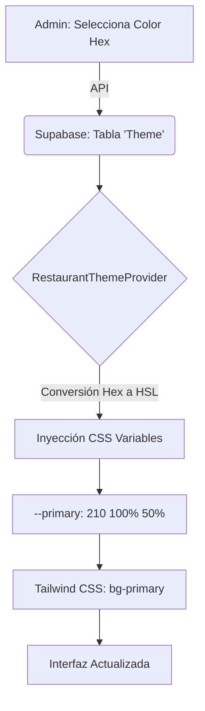

# Historia Técnica: Sistema de Branding Dinámico V3

## 1. Introducción
La necesidad de ofrecer una experiencia personalizada para cada restaurante dentro de una infraestructura monorepo única impulsó el desarrollo del **Sistema de Branding V3**. Este motor permite que los colores de marca definidos por un administrador se propaguen instantáneamente a todas las interfaces (Admin, KDS, Garzón, Cliente) sin necesidad de recompilación o despliegue.

## 2. Arquitectura del Sistema
El sistema se basa en la inyección dinámica de variables CSS en el nivel raíz del DOM (`:root`), permitiendo que Tailwind CSS consuma estos valores de forma reactiva.



## 3. Desafíos Técnicos y Soluciones

### Soporte Dual Tailwind (3 y 4)
Uno de los mayores retos fue asegurar la compatibilidad con diferentes versiones de Tailwind presentes en el monorepo:
- **Tailwind 3:** Requiere valores HSL puros (ej. `210 100% 50%`) para que la opacidad funcione correctamente con la sintaxis `<alpha-value>`.
- **Tailwind 4:** Utiliza variables nativas de CSS. El sistema detecta y genera ambos formatos automáticamente.

### Conversión Hexadecimal a HSL
Para garantizar que los colores se apliquen correctamente en las utilidades de color de Tailwind, el `RestaurantThemeProvider` realiza una conversión en tiempo de ejecución de los valores almacenados en la base de datos.

```typescript
// Lógica simplificada de conversión
const hexToHsl = (hex: string) => {
  // Conversión matemática de RGB a HSL
  // Retorna cadena: "H S% L%"
};
```

## 4. Implementación en el Admin Dashboard
El `LocalShell` del administrador local escucha el evento `theme-updated` emitido por el panel de configuración de marca, permitiendo que el propio administrador vea los cambios de su identidad visual en tiempo real mientras configura su local.

## 5. Impacto
- **Personalización:** 100% de los elementos semánticos son personalizables.
- **Rendimiento:** Cero impacto en el bundle size tras la configuración inicial.
- **Mantenibilidad:** Se eliminó el uso de clases hardcoded como `bg-blue-600` en favor de `bg-primary`.
