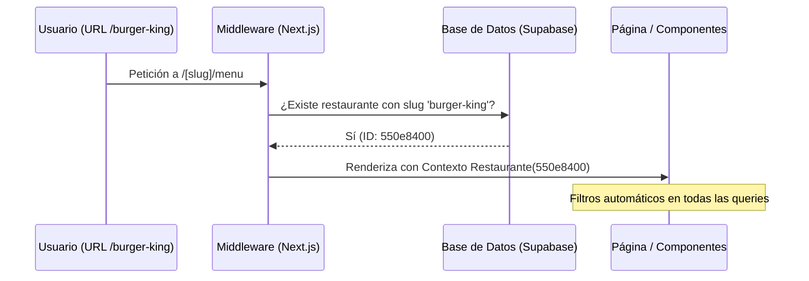

# Historia Técnica: Arquitectura Multitenant por Slug

## 1. Introducción
Para escalar el software a múltiples establecimientos sin comprometer la seguridad ni la simplicidad de la URL, se implementó una arquitectura **Multitenant basada en Slugs**. Esto permite que cada restaurante tenga su propio espacio virtual (ej. `app.com/mi-restaurante`) compartiendo la misma lógica de negocio y base de datos.

## 2. Flujo de Resolución de Identidad
El sistema identifica al restaurante mediante el primer segmento de la URL y propaga esta identidad a través de todo el árbol de componentes.



## 3. Seguridad: Row Level Security (RLS)
La seguridad no depende únicamente de la aplicación; se refuerza a nivel de base de datos. Cada tabla operativa (Pedidos, Productos, Mesas) tiene políticas RLS que aseguran que un usuario solo pueda leer/escribir datos que pertenezcan a su `restaurant_id`.

### Ejemplo de Política RLS
```sql
CREATE POLICY "Aislamiento por Restaurante" 
ON orders FOR ALL 
USING (restaurant_id = auth.jwt() ->> 'restaurant_id');
```

## 4. Routing Dinámico y App Router
Utilizando el `slug` como parámetro dinámico de ruta en Next.js, logramos:
1.  **SEO Amigable:** URLs descriptivas y fáciles de recordar.
2.  **Caché Eficiente:** Posibilidad de cachear menús por restaurante de forma independiente.
3.  **Simplicidad de Desarrollo:** Los desarrolladores acceden al `restaurant_id` mediante un hook centralizado `useRestaurant()`.

## 5. Casos de Uso Especiales
- **QR Dinámico:** Los códigos QR generados contienen la URL con el slug y el número de mesa, permitiendo que el sistema identifique automáticamente ambos al ser escaneados.
- **Redirección de Admin:** Si un administrador con acceso a "Restaurante A" intenta ingresar al slug de "Restaurante B", el Middleware detecta la discrepancia de permisos y deniega el acceso.

## 6. Conclusión
Esta arquitectura permite una escalabilidad horizontal masiva, manteniendo la base de código limpia y garantizando que los datos de los clientes estén estrictamente aislados.
