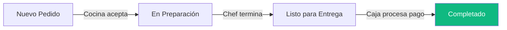
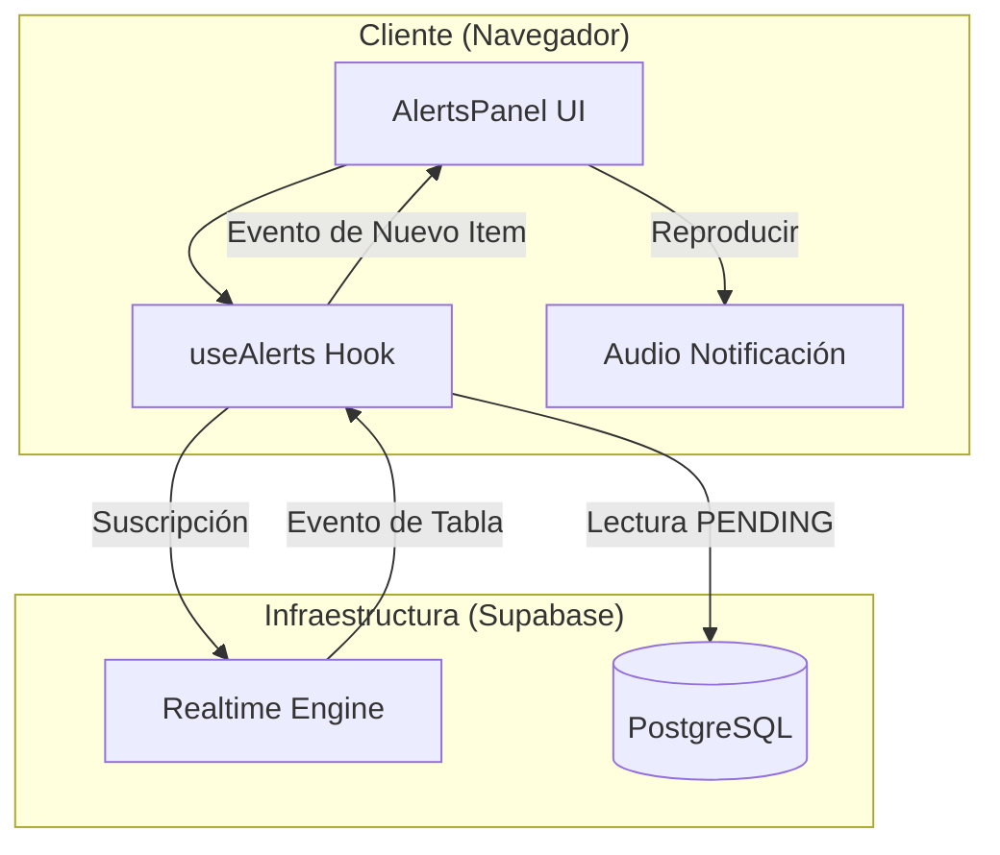
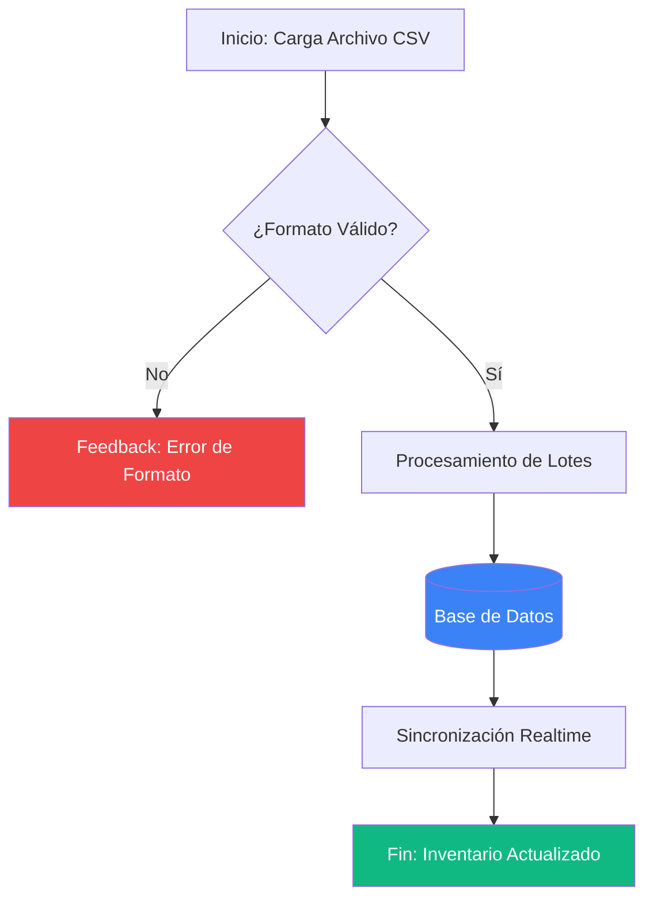
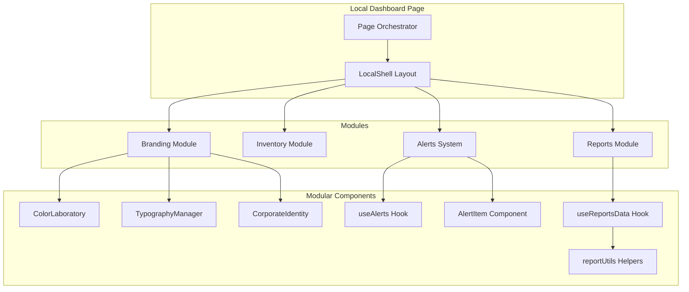
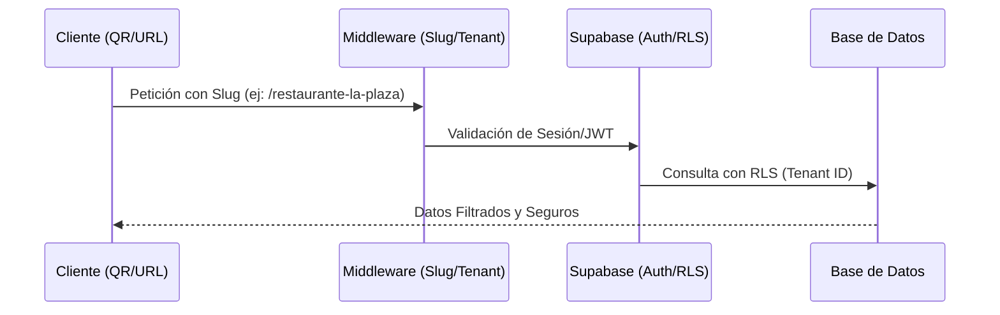
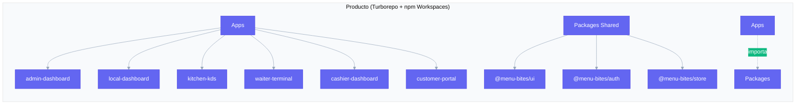

# Menu Bites — Sistema de Gestión Gastronómica Inteligente

Menu Bites es una plataforma SaaS multitenant de vanguardia diseñada para transformar la experiencia operativa en la industria gastronómica. Desde la administración centralizada hasta la interacción digital en mesa, el sistema ofrece una solución integral, rápida y reactiva en tiempo real.

---

## Características Principales

### Ecosistema Multitarea
*   **Customer Portal:** Acceso instantáneo mediante QR. Pedidos en mesa, seguimiento en tiempo real y solicitud de cuenta sin esperas.
*   **Waiter Terminal:** Gestión ágil de mesas, toma de pedidos optimizada y notificaciones push para platos listos.
*   **Kitchen KDS (Kitchen Display System):** Visualización inteligente de tickets por prioridad, tiempos de preparación y comunicación directa con sala.
*   **Cashier Dashboard:** Cierre de cuentas, gestión de métodos de pago y facturación rápida.
*   **Local Dashboard:** Control total del restaurante: gestión de menú, inventario, reportes de ventas y configuración de marca.
*   **Admin Dashboard:** Panel global para la gestión de suscripciones, soporte y monitoreo de la plataforma SaaS.

### Tecnología Realtime
Olvídese de las recargas manuales. Gracias al **Realtime Sync Engine** basado en Supabase, cada cambio de estado (Pedido recibido -> En preparación -> Listo -> Pagado) se refleja instantáneamente en todos los dispositivos conectados.

### Diseño Premium & UX
*   **Branding Dinámico:** Personalización total de colores y estilos para cada restaurante.
*   **Interfaz Pro Max:** Animaciones fluidas con framer-motion y un diseño responsivo que se adapta a tablets, móviles y desktops.
*   **Web Push Notifications:** Notificaciones directas al dispositivo para alertas críticas.

---

## Flujos de Operación

### Ciclo de Vida del Pedido


### Arquitectura de Alertas (Realtime)


### Proceso de Importación de Inventario


### Estructura Modular del Local Dashboard (Clean Code)


### Flujo de Datos Multi-tenant


---

## Estructura del Repositorio

El proyecto sigue una organización estandarizada para facilitar la auditoría y el mantenimiento:

*   **`Documentacion/`**: Especificaciones técnicas, manuales de usuario y reportes de QA.
*   **`Gestion/`**: Planificación del proyecto, integrantes y reportes de avance.
*   **`Producto/`**: Código fuente del sistema (Monorepo Turborepo).

### Arquitectura del Sistema (Monorepo)



### Stack Tecnológico
*   **Frontend:** React 19, Next.js 15, TailwindCSS v4, Framer Motion.
*   **Backend & DB:** Supabase (PostgreSQL, Auth, Realtime, Storage).
*   **ORM:** Prisma.
*   **Monorepo:** Turborepo, npm Workspaces.
*   **Notificaciones:** Web Push API (VAPID).

---

## Configuración y Desarrollo

### Requisitos Previos
*   Node.js v20+
*   npm v10+
*   Instancia de Supabase configurada.

### Instalación

1. Clonar el repositorio:
   ```bash
   git clone <repository-url>
   cd Software-Restaurantes/Producto
   ```

2. Instalar dependencias:
   ```bash
   npm install
   ```

3. Configurar variables de entorno:
   Copie el archivo `.env.example` a `.env` en la raíz de Producto y rellene las credenciales de Supabase.

4. Iniciar el entorno de desarrollo:
   ```bash
   npm run dev
   ```

### Scripts Disponibles
*   `npm run build`: Compila todas las aplicaciones para producción.
*   `npm run lint`: Ejecuta el análisis estático de código.
*   `npm run clean`: Limpia las cachés de build y node_modules.

---

## Seguridad y Privacidad
El sistema implementa **Row Level Security (RLS)** a nivel de base de datos, garantizando que cada restaurante solo pueda acceder a su propia información mediante tokens JWT validados por Supabase Auth.

---

## Notas de Versión
*   **v2.2.0 (Estable):** Refactorización arquitectónica modular. Sistema de alertas de asistencia en mesa, optimización de sonidos realtime y analítica avanzada de tiempos de cocina.
*   **v2.0 (Histórico):** Implementación completa de sincronización en tiempo real y flujo E2E.

---

Para una guía técnica detallada sobre la infraestructura y el motor de sincronización, consulte el archivo [TECHNICAL_SAD.md](Documentacion/TECHNICAL_SAD.md).

---
© 2026 Menu Bites Team. Todos los derechos reservados.
